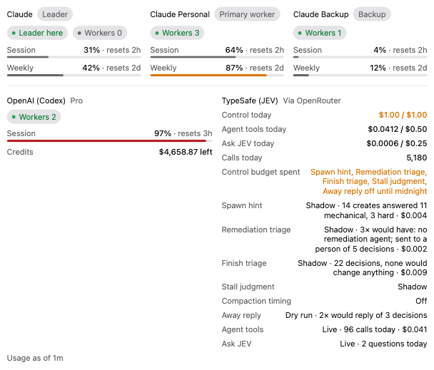

<p align="center">
  
</p>

<h1 align="center">Bozeo</h1>

<p align="center">A fork of <a href="https://github.com/getpaseo/paseo">Paseo</a> that runs your coding agents across several Claude accounts.</p>

[Paseo](https://github.com/getpaseo/paseo) is Mohamed Boudra's app for running Claude Code, Codex, Copilot, OpenCode and Pi agents on your own machine and driving them from your desk, your phone or a terminal. Everything this fork builds on is his work: the app, the daemon, the CLI and the relay. [paseo.sh](https://paseo.sh) has the docs and signed downloads, and [getpaseo/paseo](https://github.com/getpaseo/paseo) is where the project lives. If you like what you see here, star it there.

This fork adds a layer for people who run many agents on more than one Claude subscription. The app calls itself Bozeo. The CLI is still `paseo`, and the fork keeps Paseo's data directory, `~/.paseo`.

## What this fork adds

You sign in to each of your Claude accounts once and give them roles: one leader, the rest workers. For every new agent, one classifier decides its model, thinking level, account and allowed tools from a role policy you edit in Settings. The classifier is a set of rules, not a model call, and it records why it chose each part. Agents you start yourself stay on the account you pick. Agents they spawn go to worker accounts, ranked by how much room each has left in its session and weekly windows, so the account you work in keeps its budget. When an account hits its cap, failover moves its stuck agents to an account with room, conversation included. Setup and the full policy are in [plugins/claude-account-pool/README.md](plugins/claude-account-pool/README.md) and [docs/account-failover.md](docs/account-failover.md).

<p align="center">
  
</p>

Also in this fork:

- **Orchestration panel.** Every agent and subagent in one tree, with each account's usage and where its agents run. [docs/orchestration-panel.md](docs/orchestration-panel.md)
- **Restart recovery.** Agents a daemon stop cut off mid-turn are listed in the app, and **Resume all** brings them back, leaders first. With `agents.restartRecovery.mode: "resume"` that happens at boot. `paseo recover --apply` does the same from a terminal. [docs/restart-recovery.md](docs/restart-recovery.md)
- **`paseo doctor`.** Read-only checks for signed-out accounts, plugins that did not load, a stale daemon and more. Each finding prints the command that fixes it. [docs/doctor.md](docs/doctor.md)
- **MCP gateway.** The daemon signs in to OAuth MCP servers once and hands the login to every account, with a status strip in the sidebar. [docs/mcp-gateway.md](docs/mcp-gateway.md)
- **Pinned grid and context meter.** Open every pinned chat side by side, and see what fills each agent's context. [docs/pinned-grid.md](docs/pinned-grid.md), [docs/context-usage.md](docs/context-usage.md)
- **Daemon housekeeping.** Per-agent token burn, CPU and memory, usage history with a projection of when each window caps, nudges for stalled agents, and a [remediation ladder](docs/remediation.md) that tries a fix before it notifies you.
- **Cleanup.** A disk sweeper, on by default, deletes Paseo worktrees that have been archived or orphaned for 7 days, and only when they are clean and fully pushed. The janitors that delete anything else or stop processes are off until you turn them on.

## Should you use this fork?

Use [upstream Paseo](https://github.com/getpaseo/paseo) instead if any of these is true:

- **You have one Claude account.** The pool routes work between accounts, so with one account it has nothing to do.
- **You want a signed download that updates itself.** This fork has no releases yet, and its builds are not signed.
- **You want the phone apps.** The App Store and Play Store apps are built from upstream and do not have this fork's screens.
- **You want upstream's latest release.** This fork is based on Paseo 0.8.0 and does not pick up every upstream release.

Use this fork if you run agents on two or more Claude accounts, want spawned agents kept off the account you work in, and can build from source.

Run Paseo or Bozeo, not both at once: they share `~/.paseo` and port 6767 ([details](docs/install.md#before-you-start)).

## Install

There are no releases yet, so you build the desktop app from source. If the [Releases page](https://github.com/funkmastert/paseo/releases) lists one when you read this, download it instead. [docs/install.md](docs/install.md) has every step, the Windows differences and troubleshooting. Or run `/install` in Claude Code to be walked through it.

You need Git, Node.js 22, and [Claude Code](https://docs.anthropic.com/en/docs/claude-code) installed and signed in. On Windows, run these commands in Git Bash.

```bash
git clone --branch multi-account-orchestrator https://github.com/funkmastert/paseo.git
cd paseo
GIT_CONFIG_GLOBAL=/dev/null GIT_CONFIG_NOSYSTEM=1 npm ci
npm run build:desktop -- --publish never
```

Clone with `--branch multi-account-orchestrator`. The repo's default branch, `main`, is an unmodified copy of upstream. The two variables on `npm ci` stop its hook installer from replacing your global git hooks ([why](docs/install.md#build)).

The installer lands in `packages/desktop/release/`: a `.dmg` on macOS, a `Paseo-Setup-<version>-<arch>.exe` on Windows. Then set up the account pool with the plugin's [operator setup](plugins/claude-account-pool/README.md#operator-setup), as [docs/install.md](docs/install.md#set-up-the-account-pool) describes.

## Docs

- [docs/install.md](docs/install.md): build, install, first run, Windows notes, troubleshooting.
- [plugins/claude-account-pool/README.md](plugins/claude-account-pool/README.md): pool setup, account routing, role policy, thinking levels, tool profiles.
- [docs/](docs/): this fork's design notes. [CLAUDE.md](CLAUDE.md) has the index.
- [paseo.sh/docs](https://paseo.sh/docs): upstream's docs for everything this fork does not change, including the [CLI](https://paseo.sh/docs/cli), [connectivity](https://paseo.sh/docs/connectivity) and [configuration](https://paseo.sh/docs/configuration).

This fork has no issue tracker. Report a problem to [upstream](https://github.com/getpaseo/paseo/issues) only if it also happens on an upstream release.

## License

Apache-2.0, the same as upstream. Paseo is copyright Mohamed Boudra; see [LICENSE](LICENSE). This fork's changes are recorded in its git history.
