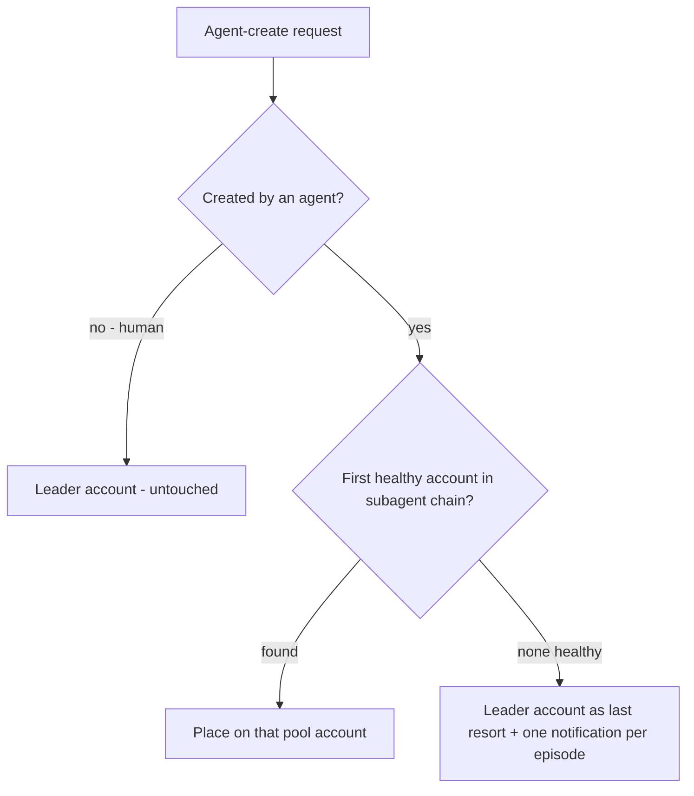
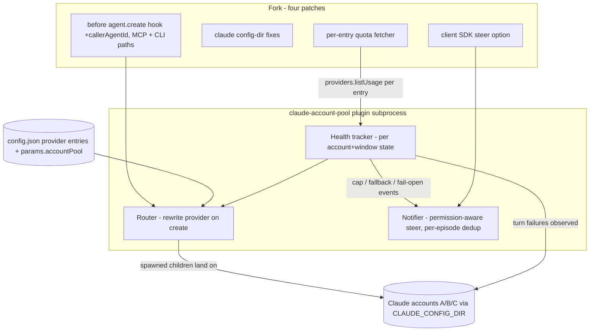
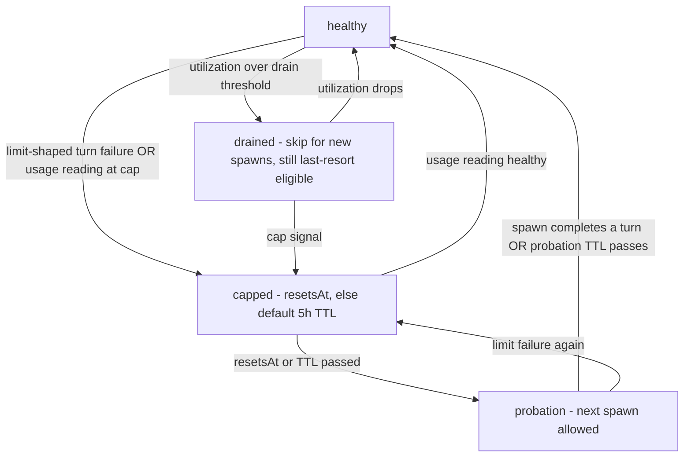

# Claude Account Pool Routing - Plan

## Goal Capsule

- **Objective:** Orchestrator leader agents run on a protected Claude account while every agent-spawned subagent is automatically placed on a pooled account chain with cap detection and failover, so usage caps land on cheap-to-restart workers and the leader's budget survives. Delivered as an external Paseo plugin plus four small upstreamable patches in this fork.
- **Authority:** This plan governs scope and behavior; repo conventions (CLAUDE.md, docs/protocol-compatibility.md) govern how code lands. Tyler owns product decisions. Deferred areas (leader handoff tooling, auto-respawn) are not active scope.
- **Execution profile:** macOS only; develop and smoke against the checkout-local dev daemon (`.dev/paseo-home`) first, then install on the production daemon (`~/.paseo`). Never restart the production daemon on port 6767 without permission.
- **Stop conditions:** Stop and surface if implementation contradicts a session-settled decision (plugin-over-core, reroute+notify, leader-last-resort), if the before-hook cannot receive caller identity without protocol breakage, or if rewriting a child's provider breaks session resume.
- **Tail ownership:** The executor owns commits, pushes to `funkmastert/paseo` branch `multi-account-orchestrator`, and the plugin's own repository/directory; fork patches stay separable commits for later upstream PRs.

---

## Product Contract

### Summary

A routing plugin gives Paseo Claude account pools: agents created by other agents are placed on the first healthy account in a configured subagent chain (account B, then optional backup C), the plugin tracks each account's cap state from outside any Claude budget and flips the chain on exhaustion, notifies the leader, and spills to the leader's account only when the whole pool is dry. The fork carries only four small upstreamable patches; all policy lives in the plugin.

### Problem Frame

Orchestrated swarms run a frontier-model leader with a large context and many cheaper subagents. Today all of them draw from one Claude account, so the subagents' volume exhausts the window and takes the leader down with it. Recovering means a very expensive leader handoff (rebuilding frontier-model context) plus respawning workers — and at the exact moment recovery is needed, no account has budget left to run the agent doing the recovering. The recurring cost is the leader handoff; the recurring cause is subagent burn on the leader's account.

### Key Decisions

- **Plugin + micro-patches over a first-class core feature.** (session-settled: user-directed — chosen over building account pools into the daemon: keeps the fork delta near zero so upstream Paseo updates keep flowing; the patches are individually upstreamable.)
- **Reroute + notify the leader over auto-respawning failed workers.** (session-settled: user-approved — chosen over daemon-driven respawn: the leader's protected budget makes it the right actor to decide what restarts; auto-respawn risks duplicated work.)
- **Leader account as last resort over strict reservation.** (session-settled: user-directed — chosen over failing fast or queueing until reset: work keeps flowing when every pool account is capped, accepting some leader-budget risk.)
- **Claude accounts only; macOS only.** (session-settled: user-directed — chosen over multi-provider/multi-platform generality: it is the environment actually in use.)
- **Leader vs subagent is determined by creator, not marking.** An agent created by a human is a leader (untouched by routing); an agent created by another agent — via the MCP tool or the CLI — is pool-routed, recursively. No profile flags or prompt conventions required.
- **Routing is enforcement, not advice.** The account dimension of an agent-created child's provider choice is rewritten even when the caller names an account explicitly; the caller's model and mode choices are preserved. No per-spawn escape hatch in v1.

### Actors

- A1. **Operator (Tyler)** — configures accounts and chains; creates leader agents.
- A2. **Leader agent** — orchestrator on the protected account; fans out work via Paseo agent creation; receives failover notifications and decides respawns.
- A3. **Pool-routed subagent** — worker created by another agent; runs on whichever pool account the plugin assigned.
- A4. **Routing plugin** — daemon-side; owns the pool policy, account health state, rewrite-on-create, and leader notification. Runs outside any Claude budget.

### Requirements

**Accounts and routing**

- R1. Multiple Claude accounts are configured as claude-derived provider entries (one per Claude Code config dir), and a pool policy assigns them ordered roles: a leader chain and a subagent chain, supporting at least three accounts.
- R2. Any agent created by another agent is placed on the first healthy account in the subagent chain, preserving the model and mode the caller chose.
- R3. Routing applies recursively: agents created by pool-routed subagents are themselves pool-routed.
- R4. Agents created by a human are never rerouted.

**Health and failover**

- R5. The plugin tracks per-account health (healthy vs capped, with reset time when knowable) without consuming any Claude budget.
- R6. When the active subagent account caps, subsequent spawns route to the next healthy account in the chain with no leader involvement.
- R7. When every pool account is capped, spawns fall back to the leader's account instead of failing.
- R8. When a capped account recovers (reset time or cap TTL passes, or a health reading clears it), routing returns to the chain's preferred order.

**Leader notification**

- R9. On failover, the leader agent receives a message naming the capped account, its reset time if known, and which of its children were running on that account; the leader owns any respawning. One message per cap event.
- R10. The leader is also notified when spawns land on its own account without routing protection — both the pool-dry fallback (R7) and fail-open passthroughs (pool unconfigured, config unreadable, rewrite target missing) — so it can throttle deliberately. At most one notification per episode, re-armed when a pool account returns to healthy (or the fail-open condition clears).

**Fork discipline**

- R11. All policy logic lives in a plugin outside this repository. The fork carries exactly four kinds of change, each shaped as a standalone upstreamable patch: (a) caller identity exposed to the plugin agent-create hook on every agent-initiated create path (MCP and CLI/session), (b) config-dir correctness fixes so claude-derived provider entries read their own account's sessions, history, and settings, (c) the existing steer send option exposed in the typed client SDK so a plugin can message a busy leader without cancelling its turn, (d) the existing Claude quota fetcher instantiated per claude-derived provider entry so per-account usage is served through the normal provider-usage API.

### Key Flows

- F1. **Routine subagent spawn**
  - **Trigger:** A leader (or any agent) creates a child agent (MCP `create_agent` or CLI `paseo run`).
  - **Steps:** Creation request carries caller identity; plugin sees a caller is present; plugin rewrites the account to the first healthy subagent-chain entry, keeping model/mode; child launches on the pool account and appears in the subagents track under the pool provider.
  - **Covers:** R2, R3, R4.
- F2. **Cap failover**
  - **Trigger:** Plugin detects the active pool account is capped (usage reading, or a cap-shaped turn failure on a child).
  - **Steps:** Account marked capped with reset time when known (default TTL otherwise); new spawns go to the next healthy chain entry; leader receives the R9 notification.
  - **Covers:** R5, R6, R9.
- F3. **Pool dry**
  - **Trigger:** A spawn arrives while every pool account is capped.
  - **Steps:** Child is placed on the leader's account; leader receives one R10 notification for the episode; when any pool account recovers, routing reverts (R8) and the notification re-arms.
  - **Covers:** R7, R8, R10.

### Acceptance Examples

- AE1. **Covers R2, R4.** Given the pool is configured, when the operator creates an agent choosing the leader provider and a model, it runs on the leader account; when that agent creates a child naming any Claude provider and model, the child runs on account B with the named model.
- AE2. **Covers R3.** Given a child running on account B, when it spawns its own helper, the helper is placed by the same chain rule (account B while healthy).
- AE3. **Covers R6.** Given account B is capped and C is healthy, when the leader spawns a child, it runs on account C without the leader doing anything differently.
- AE4. **Covers R7, R10.** Given B and C are both capped, when the leader spawns children, they run on the leader's account and the leader receives exactly one fallback warning for the episode.
- AE5. **Covers R9.** Given three children are mid-task on account B when B caps, the leader receives one message naming account B, the reset time, and those three children.
- AE6. **Covers R8.** Given B capped earlier and its reset time (or default cap TTL) has passed, when the next child is spawned, it runs on B again.

### Success Criteria

- The leader account is never consumed by pool-routed children while any pool account is healthy.
- A cap on a pool account requires zero Claude-budget-consuming intervention to keep new work flowing.
- The fork rebases onto upstream Paseo releases with near-zero conflict surface (each carried patch touches only a few files).

### Scope Boundaries

**Deferred for later**

- Native leader handoff tooling for the rare case the leader itself caps.
- Auto-respawning children that died on a capped account.
- Distinct provider icons for pool entries (custom entries render a generic icon today).
- Upstreaming the full account-pool feature to Paseo proper.
- Leader-account health tracking at the last-resort path (distinguishing "last resort available" from "nothing left anywhere").

**Outside this work's identity**

- Routing Claude Code's in-process Task-tool subagents: they execute inside the leader's CLI process on the leader's account and cannot be re-routed externally. The economics of this feature depend on leaders fanning out via Paseo agent creation.
- Routing schedule- and heartbeat-created agents: the schedule service creates agents with no caller identity and pins the provider chosen at schedule-creation time, so they classify as human-created and pass through untouched. Configure schedules on a pool provider directly if their spend should land there.
- Non-Claude providers and non-macOS platforms.

_(Per-account usage rows in the Host Usage screen — previously deferred — are now substantially delivered by patch (d): the app renders one row per providerId the daemon returns, so per-entry fetchers surface there and in the context-window tooltip without app changes.)_

### Dependencies / Assumptions

- Each pooled account is already authenticated in its own Claude Code config dir on this machine.
- Per-account usage readings need each account's OAuth credentials. On this machine credentials live in per-config-dir macOS Keychain items (`Claude Code-credentials-<hash>` generic passwords); U5 verifies both accounts are addressable before the proactive path is relied on. If an account's credentials are not addressable, its health is reactive-only with the default cap TTL bounding recovery.
- Leaders fan out via Paseo agent creation (operator/skill discipline); in-process Task subagents remain leader-account spend by design.
- Repo facts underpinning feasibility were verified against this tree at 0.8.0 (`d7c7044df`): provider env (including the Claude config-dir selector) reaches the spawned CLI unmodified; the plugin agent-create hook can rewrite the provider and fires for agent-initiated creates; provider config hot-reloads.

---

## Planning Contract

**Product Contract preservation:** changed R9/R10 (per-event and per-episode notification bounds; R10 extended to fail-open passthroughs), R11 (two patch kinds → four: the client-SDK steer option, user-approved 2026-09-10; the per-entry quota fetcher, added after document review — see KTD8), Key Decisions (creator rule names the CLI path explicitly), Scope Boundaries (schedule/heartbeat exclusion named; per-account usage rows moved from deferred to delivered-by-patch-(d); leader-health-at-last-resort explicitly deferred), AE4/AE6 and the Definition of Done live-proof wording. The brainstorm's four deferred Outstanding Questions resolved into KTD2-KTD5; KTD6-KTD8 are planning-phase additions.

**Target repos:** this fork (`funkmastert/paseo`, branch `multi-account-orchestrator`) for the four patches, plus a new plugin project outside the repo at `~/paseo-plugins/claude-account-pool` (referred to below as `<plugin>/`; paths under it are plugin-relative).

### Key Technical Decisions

- KTD1. **All policy in the external plugin; the fork carries four micro-patches.** (session-settled: user-directed — inherits the Product Contract's plugin-over-core decision: keeps the fork rebase-trivial; each patch is a standalone upstream PR candidate.)
- KTD2. **Routing trigger is caller identity on the create request — on both create paths.** The wire request already carries `callerAgentId` (packages/protocol/src/messages.ts:1690) and CLI `paseo run` auto-resolves it (packages/cli/src/commands/agent/run.ts); patch (a) widens the before-hook payload pick (packages/server/src/server/plugins/lifecycle/index.ts:31) and the SDK type (packages/plugin/src/server/lifecycle.ts), and threads the id through the session-kind create input (packages/server/src/server/session.ts, create-agent/create.ts `CreateAgentFromSessionInput`), which today reads it only for workspace inheritance. The hook rewrites only `config.provider`; `model`, `modeId`, and `providerOptions` pass through unchanged — all pool entries are claude-derived, so claude-native options and first-party model ids stay valid. Caller identity is validated immutable in the hook result, like `cwd`.
- KTD3. **Pool configuration lives as inert metadata on the provider entries:** `agents.providers.<id>.params.accountPool = { role: "leader" | "worker", priority: <n> }` in `$PASEO_HOME/config.json`. Verified: `params` is schema-valid on claude-derived entries, ignored by the claude factory (provider-registry.ts:196-201), hot-reloads with `agents.providers`, and survives `PaseoApi.config.get()`'s passthrough parsing (messages.ts:120-126). One source of truth, no plugin settings screen. The plugin caches the pool map and refreshes it on an interval and on routing errors.
- KTD4. **Hybrid cap detection with per-window health.** Health is tracked per (account, window), not one boolean: the usage API reports `five_hour`, `seven_day`, and model-scoped windows plus a `limits[]` array (packages/server/src/services/quota-fetcher/providers/claude.ts:38-71), so chain selection consults the windows relevant to the child's requested `config.model` — a weekly-Opus cap must not evacuate Sonnet work, and an Opus child must not route to an Opus-capped account. Reactive signal: an `agent.turn_ended` observer classifies `outcome.kind === "failed"` messages on pool-provider agents with the repo's de facto limit pattern (`/hit your limit|rate limit|quota|credits/i`, as used in packages/server/src/server/daemon-e2e/send-during-tool-call-claude.real.e2e.test.ts:134-136), parsing a reset time from the text when present; classification lives in one plugin module so pattern drift is a one-file fix; a reactive cap without window attribution caps the account conservatively. Proactive signal: the plugin reads per-entry usage through the daemon's provider-usage API (patch (d)) on an interval; a window at/over cap marks that window capped with `resets_at`, and a configurable drain threshold (default ~90% utilization) skips the account for new spawns before it hard-caps — a drained account still counts as available for the R7 last-resort path and crossing the threshold triggers no R9 notification. When no reset time is knowable, a capped window carries a default TTL of 5 hours (the Claude session-window length). Read paths never log or persist tokens; credential handling stays inside the daemon's quota fetcher.
- KTD5. **Leader notification via steer, fire-and-forget, permission-aware.** Patch (c) exposes the existing `activeTurnBehavior` wire field (messages.ts:1240-1241, 1402) in `PaseoAgentSendOptions` (packages/client/src/index.ts:257-261) and the `send()` passthrough. The plugin sends notifications with `"steer"` so a mid-turn leader gets the message injected into its live turn instead of having the turn cancelled (server default is `"interrupt"` — session.ts:7600-7619, agent-prompt.ts:39-82). Steer has one side effect the interrupt default lacks: the daemon's send handler hardcodes `clearPendingPermissions: true` (session.ts:7608) and Claude's steer path then denies pending permissions superseded by the steer (providers/claude/agent.ts:2333-2339) — so the notifier checks the leader for pending permission requests first and diverts to the queue-until-idle path when any are pending. Observer callbacks never await sends into agents (deadlock rule, docs/plugins.md); notifications are queued and dispatched outside the hook path. (session-settled: user-approved — chosen over hold-until-idle-only: immediate awareness during long leader turns; hold-until-idle remains the coded fallback when steering is unsafe or a steer send fails.)
- KTD6. **Health state is in-memory, rebuilt after restart, and always time-bounded.** A daemon or plugin restart loses cap state; the next usage reading or cap-shaped failure reconverges it, and for reactive-only accounts the default cap TTL bounds both directions — a capped account re-enters probation when its TTL expires even with no poll, and a restart's optimistic "healthy" presumption is corrected by the first limit failure. No persistence file — the state's authoritative sources are always re-observable.
- KTD7. **The plugin fails open — loudly.** If the pool is unconfigured, config unreadable, or the rewrite target is missing from the provider registry (which would make `createAgentInternal` throw — agent-manager.ts:5127-5136), the hook returns the request untouched, logs, and queues an R10 fail-open notification to the caller's root leader (deduplicated per fail-open episode). A broken plugin must never block agent creation, and it must never spend the leader's budget silently.
- KTD8. **Reuse the daemon's quota fetcher per account instead of hand-rolling credential discovery in the plugin.** `ClaudeQuotaProvider` already accepts a `claudeHome` override, does file-then-Keychain credential discovery, and parses `resets_at` (quota-fetcher/providers/claude.ts:83-89, 298-302, 352-353, 438-479); it is single-account only because the static manifest binds one instance (manifest.ts:15-62) constructed without registry knowledge (websocket-server.ts:739-741). Patch (d) makes `providerId`/`displayName`/`claudeHome` constructor-settable, instantiates one fetcher per claude-derived provider entry (claudeHome from the entry's `env.CLAUDE_CONFIG_DIR`), and extends credential lookup for per-config-dir Keychain items (`Claude Code-credentials-<hash>`). The plugin then consumes usage via `paseo.providers.listUsage()` and never touches OAuth tokens. Chosen over hand-rolled plugin discovery after document review: deletes the riskiest plugin unit, reuses tested credential code, and delivers per-account Host Usage rows as a side effect. The cost is a fourth carried patch — accepted because each patch remains individually upstreamable and patch (d) is itself the seed of the deferred usage-visibility feature.

### High-Level Technical Design

Account health state machine (per pool account and window, in the health tracker):

---

## Implementation Units

### U1. Fork patch: caller identity in the agent-create hook (all create paths)

- **Goal:** The `before('agent.create')` plugin hook payload carries `callerAgentId`, read-only, for every agent-initiated create — MCP tool and CLI/session paths alike.
- **Requirements:** R2, R3, R4, R11(a); KTD2.
- **Dependencies:** none.
- **Files:** packages/server/src/server/plugins/lifecycle/index.ts (beforeSchemas pick + validateBeforeResult immutability), packages/plugin/src/server/lifecycle.ts (PluginBeforeRequests type), packages/server/src/server/agent/agent-manager.ts (thread the id into the `before()` call at the createAgentInternal site), packages/server/src/server/agent/create-agent/create.ts (add `callerAgentId` to `CreateAgentFromSessionInput` ~56-78 and set it on `createOptions` in resolveSessionCreateAgent ~282-291; source it in the MCP branch too), packages/server/src/server/session.ts (thread `request.callerAgentId` at the session create call site ~3699-3715), plus the owning tests (packages/server/src/server/plugins/lifecycle/ tests and agent-configuration.e2e.test.ts siblings).
- **Approach:** Additive, optional field — absent for human-initiated creates, present for agent-initiated ones. Mutating it in the hook result is rejected the same way `cwd` mutation is (lifecycle/index.ts:131-158). No protocol/wire change: the value already exists on the request (messages.ts:1690); this widens what the plugin process is shown and fixes the session-path gap where it is read only for workspace inheritance today. Keep the patch a single commit titled for upstreaming.
- **Test scenarios:** hook receives `callerAgentId` for an MCP agent-initiated create (Covers R2 precondition); hook receives it for a CLI/session-kind create mirroring cli-run-workspace-precedence.e2e.test.ts's `callerAgentId` usage (Covers R2/R3 on the CLI path); field absent for a client-initiated create (Covers R4 precondition); hook result attempting to change `callerAgentId` is rejected; existing agent-configuration e2e still passes unchanged.
- **Verification:** targeted vitest on the lifecycle tests; `npm run typecheck && npm run lint`.

### U2. Fork patch: config-dir correctness for claude-derived providers

- **Goal:** A claude-derived provider entry reads sessions, history, and settings.json model discovery from its own `CLAUDE_CONFIG_DIR`, not the daemon's.
- **Requirements:** R1, R11(b).
- **Dependencies:** none.
- **Files:** packages/server/src/server/agent/provider-registry.ts (factory passes a `configDir` resolved from `runtimeSettings.env.CLAUDE_CONFIG_DIR`), packages/server/src/server/agent/providers/claude/agent.ts (listImportableSessions ~1616 and resolveHistoryPath ~5021-5043 use the instance config dir with the current env fallback), packages/server/src/server/agent/providers/claude/models.ts, plus owning tests.
- **Approach:** `this.configDir` already exists on `ClaudeAgentClient` but is never populated (provider-registry.ts:197-201); populate it and route the three call sites through it. Behavior for the base `claude` provider is unchanged (falls back to `process.env.CLAUDE_CONFIG_DIR ?? ~/.claude` exactly as today). Single upstreamable commit — this is a pre-existing bug fix independent of routing.
- **Test scenarios:** derived entry with `env.CLAUDE_CONFIG_DIR=/tmp/alt` resolves history paths under `/tmp/alt/projects/...`; importable-session listing for that entry scans `/tmp/alt`; base provider behavior unchanged with and without the daemon env var; settings.json model discovery reads the derived entry's dir.
- **Verification:** targeted vitest on providers/claude tests; `npm run typecheck && npm run lint`.

### U3. Fork patch: steer option in the typed client SDK

- **Goal:** `PaseoAgentSendOptions` accepts `activeTurnBehavior: "interrupt" | "steer"` and `PaseoAgentHandle.send()` passes it through to the wire request.
- **Requirements:** R9, R10, R11(c); KTD5.
- **Dependencies:** none.
- **Files:** packages/client/src/index.ts (options type ~257-261 and send implementation ~742-744), plus the owning client tests.
- **Approach:** Pure passthrough of an existing optional wire field (messages.ts:1402); omitting it preserves today's server default. Single upstreamable commit.
- **Test scenarios:** send with `"steer"` puts `activeTurnBehavior: "steer"` on the wire request; omitted option sends no field; type surface accepts only the two enum values.
- **Verification:** targeted vitest on client tests; `npm run typecheck && npm run lint`. Requires `npm run build:client` before dependent-package typechecks.

### U4. Plugin scaffold and pool-config contract

- **Goal:** A typechecking `claude-account-pool` plugin project with the pool-config schema and its loader.
- **Requirements:** R1; KTD3.
- **Dependencies:** none (parallel with U1-U3).
- **Files:** `<plugin>/paseo-plugin.json`, `<plugin>/index.server.ts`, `<plugin>/index.client.tsx` (minimal no-op client entry), `<plugin>/shared/pool-config.ts` (Zod schema for `params.accountPool`), `<plugin>/server/pool.ts` (loader: `paseo.config.get()` → ordered leader/worker chains; cache + interval refresh), `<plugin>/server/pool.test.ts`, `<plugin>/README.md` (operator setup: the provider entries with `env.CLAUDE_CONFIG_DIR` and `params.accountPool`, per docs/custom-providers.md).
- **Approach:** Scaffold with `paseo plugin init`; keep runtime code behind the `server/`-`shared/` boundaries the plugin compiler enforces (docs/plugins.md). Chain resolution: workers sorted by `priority`; the `leader` role entry is the last-resort target and the notification anchor.
- **Test scenarios:** config with leader + two workers yields the ordered chain; missing/malformed `accountPool` yields an empty pool (fail-open flag set); duplicate priorities and unknown roles rejected by the schema with clear messages.
- **Verification:** `npm run typecheck` and `npx vitest run` inside `<plugin>/`.

### U5. Fork patch: per-entry quota fetcher + accounts live

- **Goal:** The daemon serves per-account usage rows — one per claude-derived provider entry — through the normal provider-usage API, and both real accounts' credentials are verified addressable.
- **Requirements:** R1, R5, R11(d); KTD8; Dependencies/Assumptions (Keychain).
- **Dependencies:** none (parallel with U1-U3; U6 consumes its output).
- **Files:** packages/server/src/services/quota-fetcher/providers/claude.ts (constructor-settable `providerId`/`displayName`/`claudeHome`; per-config-dir Keychain item lookup added to the file-then-Keychain discovery chain; never log or persist tokens — preserve the existing read-only, non-logging discipline), packages/server/src/services/quota-fetcher/manifest.ts (accept the resolved claude-derived entries and instantiate one fetcher per entry), packages/server/src/server/websocket-server.ts (pass provider config into `ProviderUsageService` construction ~739-741), plus owning tests; operator config in `$PASEO_HOME/config.json` (dev home first — not a repo file).
- **Approach:** Keep the fetcher's existing behavior for the base `claude` entry byte-identical when no derived entries exist. Per-entry `claudeHome` comes from the entry's `env.CLAUDE_CONFIG_DIR`. Keychain lookup order per account: `<claudeHome>/.credentials.json`, else the per-config-dir generic-password item (`Claude Code-credentials-<hash>` — determine the hash scheme empirically; if ambiguous, support an explicit `params.accountPool.keychainService` mapping), else the legacy username-keyed item only for the daemon's own config dir. An unaddressable account yields a clean `unavailable` usage row, not an error loop. This unit is the go/no-go gate for the proactive health path.
- **Execution note:** Verify against both real accounts on this machine early; if only one is addressable, record the degradation (reactive-only + TTL for the other) in the plugin README and proceed.
- **Test scenarios:** file-based discovery wins when present; per-config-dir Keychain item resolves for a mapped service name; unaddressable account → `unavailable` row; two derived entries produce two `ProviderUsage` rows keyed by their provider ids (Host Usage renders them without app changes); base-claude behavior unchanged when no derived entries are configured; no token or Authorization header appears in any log output.
- **Verification:** targeted vitest on quota-fetcher tests; manual `security find-generic-password` cross-check on this machine; Host Usage screen shows both accounts against the dev daemon.

### U6. Health tracker

- **Goal:** Per-(account, window) health state (healthy / drained / capped-with-TTL / probation) driven by reactive failure classification and the per-entry usage rows from U5.
- **Requirements:** R5, R6, R8; KTD4, KTD6.
- **Dependencies:** U4, U5.
- **Files:** `<plugin>/server/health.ts`, `<plugin>/server/classify.ts` (the one limit-pattern module), `<plugin>/server/usage-poll.ts` (consumes `paseo.providers.listUsage()`), tests for each.
- **Approach:** `server.on('agent.turn_ended')` observer: for agents whose `provider` is a pool entry, a `failed` outcome matching the limit pattern caps that account (window-attributed when the text allows, conservative whole-account otherwise; reset time parsed from text when present, default 5h TTL otherwise). Usage consumer: refresh per-entry windows every ~5 min; at/over cap → capped with `resets_at`; above drain threshold → drained; healthy readings clear. State machine per the HTD diagram; probation admits one spawn after reset/TTL and re-caps on another limit failure, with its own TTL so an idle probe cannot pin the account out of order forever.
- **Test scenarios:** limit-shaped failure text caps the account (AE-precondition for AE3/AE5); non-limit failures don't; reset-time parse from both text and usage payload; default TTL applies when no reset time is knowable, and expiry moves capped → probation (Covers AE6); probation → healthy on a completed turn, → capped on repeat failure, → healthy on probation-TTL expiry; drained skips new spawns but stays last-resort eligible and triggers no notification; usage-read failure leaves state untouched; restart rebuilds state within one refresh cycle and a reactive-only account still recovers via TTL. Empirical gate: confirm a real Claude usage cap surfaces as a failed turn outcome (not assistant text on a completed turn) and record the observed message shape in classify.ts's test fixtures.
- **Verification:** plugin unit tests with fake clock and canned usage payloads.

### U7. Routing hook + failover + leader notification

- **Goal:** The end-to-end behavior: rewrite on create, window-aware chain failover, pool-dry fallback, and permission-aware steer notifications to leaders with per-episode dedup.
- **Requirements:** R2, R3, R4, R6, R7, R9, R10; KTD2, KTD5, KTD7; F1-F3.
- **Dependencies:** U1, U3, U4, U6.
- **Files:** `<plugin>/server/router.ts`, `<plugin>/server/notify.ts`, tests for each; `<plugin>/index.server.ts` wiring.
- **Approach:** `server.before('agent.create')`: no `callerAgentId` → untouched (R4, including schedule/heartbeat creates); otherwise rewrite `config.provider` to the first account healthy for the child's requested model (R2; R3 falls out since children of workers also carry callers); all workers capped → leader entry + queue one R10 episode notification (F3); fail-open per KTD7 also queues one R10 episode notification. Affected children for R9 are resolved with a live `paseo.agents` listing at notification time (filter by pool provider, walk `parentAgentId` to the root leader) — cap events are rare, so a live query beats maintaining an event-driven cache. Notifier: before steering, check the leader for pending permission requests and divert to queue-until-idle when any are pending; send one steer message per leader per cap event naming the account, reset time, and affected children (R9); fire-and-forget outside hook dispatch; per-episode dedup for R10 re-arms on recovery. Assert inherited `providerOptions` (copied pre-rewrite from a claude caller) launch cleanly on a worker entry.
- **Test scenarios:** Covers AE1: human create untouched, agent create rewritten to worker with model preserved. Covers AE2: worker-spawned child routed by the same rule. Covers AE3: B capped → child on C. Covers AE4: B+C capped → leader entry; a burst of spawns during the dry pool produces exactly one leader message. Covers AE5: one message naming account, reset time, three children (children resolved via live listing). Model-window awareness: B capped only on the Opus window → Sonnet child lands on B, Opus child lands on C. Schedule-labeled create with no `callerAgentId` passes through untouched. Pending-permission case: leader has an open permission request → notification is held, permission survives, message delivered after resolution. Rewrite to a missing provider id never happens (pool validated against `paseo.providers` snapshot); unconfigured pool → passthrough + one fail-open notification; notification path never runs inside the hook await; child created with leader-inherited `providerOptions` launches on the worker entry.
- **Verification:** plugin unit tests; e2e in U8.

### U8. End-to-end tests and live rollout

- **Goal:** The AEs proven against a real daemon, then the plugin running on the dev daemon with both real accounts.
- **Requirements:** AE1-AE6; Success Criteria.
- **Dependencies:** U1-U7.
- **Files:** packages/server/src/server/plugins/account-pool-routing.e2e.test.ts (in the fork — it exercises the U1 patch surface with the plugin installed), `<plugin>/README.md` rollout section.
- **Approach:** Follow agent-configuration.e2e.test.ts: `createPaseoDaemon` (not the Test variant — custom provider entries need `providerOverrides`, per docs/ad-hoc-daemon-testing.md), register `FakeAgentClient`s for the leader and **three** pool provider ids so chain advance (AE3/AE6) is proven with a real B→C hop, install the plugin directory, enable plugins, create agents with and without `callerAgentId` (both MCP-shaped and session-shaped), and assert stored `config.provider` plus notification sends. Live smoke on the dev daemon with the two real accounts: leader spawns a child via `create_agent`, confirm the child's provider; force a simulated cap on the single worker and confirm the pool-dry fallback plus the single R10 notification.
- **Execution note:** Never run broad suites locally; run only the new e2e file with `--bail=1` piped to a file, and rely on fork CI for the rest.
- **Test scenarios:** the six AEs as e2e assertions (AE3/AE6 against the three-entry chain); plugin reload keeps routing working; daemon restart with plugin enabled comes back routing (state reconverges).
- **Verification:** `npx vitest run packages/server/src/server/plugins/account-pool-routing.e2e.test.ts --bail=1 > /tmp/test-output.txt 2>&1` then read the file; live smoke on the dev daemon; `npm run typecheck && npm run lint && npm run format` before each commit.

---

## Verification Contract

| Gate               | Command                                                                                                                                                                        | Applies to    |
| ------------------ | ------------------------------------------------------------------------------------------------------------------------------------------------------------------------------ | ------------- |
| Types (fork)       | `npm run typecheck` (after `npm run build:client` when client/protocol changed)                                                                                                | U1-U3, U5, U8 |
| Lint/format (fork) | `npm run lint` / `npm run format`                                                                                                                                              | U1-U3, U5, U8 |
| Unit tests (fork)  | `npx vitest run <changed test file> --bail=1`                                                                                                                                  | U1-U3, U5     |
| Plugin types/tests | `npm run typecheck` and `npx vitest run` in `<plugin>/`                                                                                                                        | U4, U6-U7     |
| E2E                | `npx vitest run packages/server/src/server/plugins/account-pool-routing.e2e.test.ts --bail=1 > /tmp/test-output.txt 2>&1`                                                      | U8            |
| Full suite         | fork CI on push (never locally)                                                                                                                                                | all           |
| Live proof         | dev-daemon smoke: leader spawn lands on worker account; simulated cap on the single worker proves pool-dry fallback (F3) with one notification; Host Usage shows both accounts | U5, U8        |

## Definition of Done

- All eight units landed; the four fork patches are separable, individually revertable commits on `multi-account-orchestrator`, each written to stand alone as an upstream PR.
- The six Acceptance Examples pass as e2e assertions — chain advance (AE3/AE6) proven by the U8 e2e with three registered pool provider entries; the two-account live smoke proves F1 and F3 (routing to the worker; pool-dry fallback with a single notification) plus per-account Host Usage rows.
- Live on the dev daemon with both real accounts: a leader's `create_agent` child runs on the worker account; the steer notification arrives without cancelling the leader's turn or denying a pending permission.
- Typecheck, lint, and fork CI are green.
- `<plugin>/README.md` documents operator setup end-to-end; abandoned experimental code is removed from both repos.
- Production rollout (installing on `~/.paseo`) is a deliberate operator step documented in the README — not performed automatically by the executor.

---

## Risks & Dependencies

- **Keychain mapping ambiguity (U5).** Only one `Claude Code-credentials-<hash>` item surfaced in a quick scan; if the second account's token isn't addressable, its health is reactive-only with TTL-bounded recovery until the explicit `keychainService` mapping is configured. Mitigated by U5's go/no-go check and the documented degradation.
- **Cap-error text drift.** Classification is free-text matching; Anthropic can change wording. Confined to `<plugin>/server/classify.ts`; the usage rows provide an independent signal. U6's empirical gate confirms caps actually surface as failed turn outcomes before relying on the reactive path.
- **Steer semantics under providers other than Claude leaders.** In scope leaders are Claude; steer for Claude pushes into the live SDK query (docs/providers.md). The notifier already avoids steering into pending permissions; if a steer send rejects, it falls back to queue-until-idle.
- **Upstream drift on patched files.** The four patches touch small, stable surfaces; keeping them as clean commits makes rebase conflicts local and mechanical.

## Sources / Research

- docs/custom-providers.md — multiple provider entries extending `claude` with independent env (the account mechanism).
- docs/plugins.md and plugin-examples/agent-configuration (+ packages/server/src/server/plugins/agent-configuration.e2e.test.ts) — the agent-create rewrite hook pattern and its e2e template.
- packages/plugin/src/server/lifecycle.ts — hook and event payload types; `agent.turn_ended` failure outcomes and `PluginHookAgent.parentAgentId`.
- packages/server/src/server/agent/agent-manager.ts — hook fire site (createAgentInternal) and provider validation after rewrite.
- packages/server/src/server/agent/tools/paseo-tools.ts — create_agent tool; caller resolution; providerOptions inheritance runs pre-rewrite.
- packages/server/src/server/session.ts and packages/server/src/server/agent/create-agent/create.ts — the session-kind create path where callerAgentId is read for workspace inheritance but not yet threaded to the hook (the U1 gap); send default is interrupt with `clearPendingPermissions: true` (session.ts:7608).
- packages/cli/src/commands/agent/run.ts — `paseo run` auto-resolves callerAgentId from `PASEO_AGENT_ID`.
- packages/client/src/index.ts — `PaseoAgentSendOptions` (no steer today), `PaseoApi.config.get()` passthrough, `PaseoApi.providers` snapshot/listUsage.
- packages/server/src/server/agent/agent-prompt.ts:39-82 — steer is the only non-cancelling mid-turn path.
- packages/server/src/server/agent/providers/claude/agent.ts:2333-2339 — steer denies pending permissions superseded by the steer (the KTD5 side effect).
- packages/server/src/services/quota-fetcher/ — usage API schema (`resets_at`, per-window utilization), credential file path, Keychain fallback shape, static manifest (the patch (d) surface).
- packages/server/src/server/daemon-e2e/send-during-tool-call-claude.real.e2e.test.ts:134-136 — the repo's limit-text classification regex.
- docs/ad-hoc-daemon-testing.md — `createPaseoDaemon` harness gotchas (providerOverrides, snapshot readiness, fetchAgents-first).
- docs/protocol-compatibility.md — additive-only constraints on anything protocol-visible.
