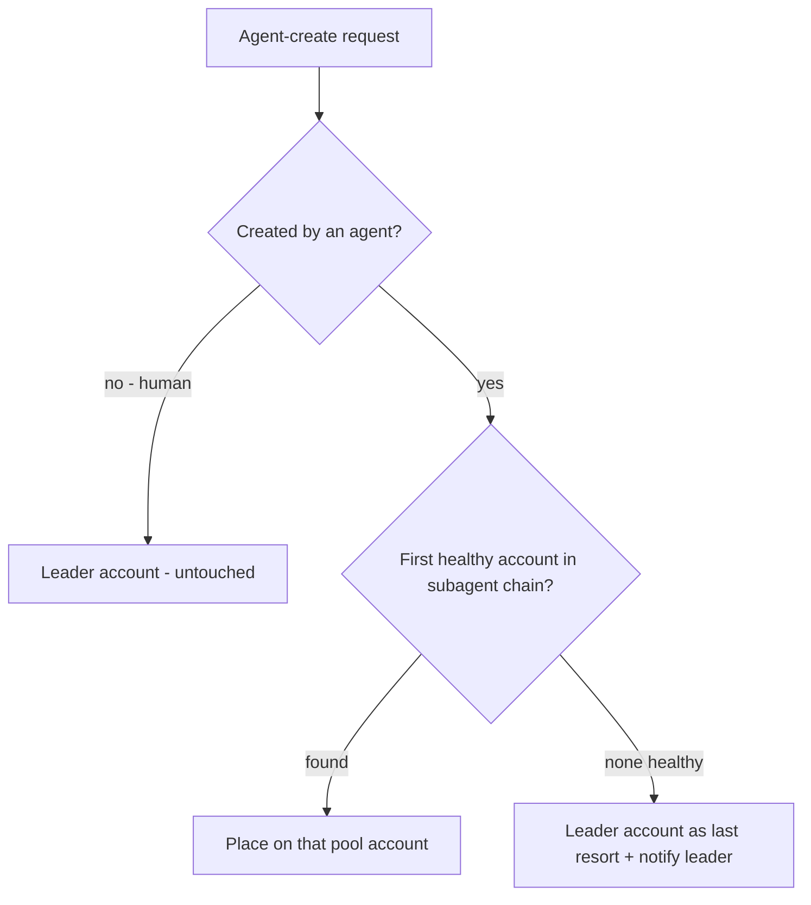

# Claude Account Pool Routing - Plan

## Goal Capsule

- **Objective:** Orchestrator leader agents run on a protected Claude account while every agent-spawned subagent is automatically placed on a pooled account chain with cap detection and failover, so usage caps land on cheap-to-restart workers and the leader's budget survives. Delivered as an external Paseo plugin plus two small upstreamable patches in this fork.
- **Product authority:** Tyler. Deferred areas (per-account usage UI, leader handoff tooling, auto-respawn) are not active scope.
- **Open blockers:** none.

---

## Product Contract

### Summary

A routing plugin gives Paseo Claude account pools: agents created by other agents are placed on the first healthy account in a configured subagent chain (account B, then optional backup C), the plugin tracks each account's cap state from outside any Claude budget and flips the chain on exhaustion, notifies the leader, and spills to the leader's account only when the whole pool is dry. The fork carries only two upstreamable patches; all policy lives in the plugin.

### Problem Frame

Orchestrated swarms run a frontier-model leader with a large context and many cheaper subagents. Today all of them draw from one Claude account, so the subagents' volume exhausts the window and takes the leader down with it. Recovering means a very expensive leader handoff (rebuilding frontier-model context) plus respawning workers — and at the exact moment recovery is needed, no account has budget left to run the agent doing the recovering. The recurring cost is the leader handoff; the recurring cause is subagent burn on the leader's account.

### Key Decisions

- **Plugin + micro-patches over a first-class core feature.** (session-settled: user-directed — chosen over building account pools into the daemon: keeps the fork delta near zero so upstream Paseo updates keep flowing; the two patches are individually upstreamable.)
- **Reroute + notify the leader over auto-respawning failed workers.** (session-settled: user-approved — chosen over daemon-driven respawn: the leader's protected budget makes it the right actor to decide what restarts; auto-respawn risks duplicated work.)
- **Leader account as last resort over strict reservation.** (session-settled: user-directed — chosen over failing fast or queueing until reset: work keeps flowing when every pool account is capped, accepting some leader-budget risk.)
- **Claude accounts only; macOS only.** (session-settled: user-directed — chosen over multi-provider/multi-platform generality: it is the environment actually in use.)
- **Leader vs subagent is determined by creator, not marking.** An agent created by a human is a leader (untouched by routing); an agent created by another agent is pool-routed, recursively. No profile flags or prompt conventions required.
- **Routing is enforcement, not advice.** The account dimension of an agent-created child's provider choice is rewritten even when the caller names an account explicitly; the caller's model and mode choices are preserved. No per-spawn escape hatch in v1.

### Actors

- A1. **Operator (Tyler)** — configures accounts and chains; creates leader agents.
- A2. **Leader agent** — orchestrator on the protected account; fans out work via Paseo agent creation; receives failover notifications and decides respawns.
- A3. **Pool-routed subagent** — worker created by another agent; runs on whichever pool account the plugin assigned.
- A4. **Routing plugin** — daemon-side; owns the pool policy, account health state, rewrite-on-create, and leader notification. Runs outside any Claude budget.

### Requirements

**Accounts and routing**

- R1. Multiple Claude accounts are configured as claude-derived provider entries (one per Claude Code config dir), and a pool policy assigns them ordered roles: a leader chain and a subagent chain, supporting at least three accounts.
- R2. Any agent created by another agent is placed on the first healthy account in the subagent chain, preserving the model and mode the caller chose.
- R3. Routing applies recursively: agents created by pool-routed subagents are themselves pool-routed.
- R4. Agents created by a human are never rerouted.

**Health and failover**

- R5. The plugin tracks per-account health (healthy vs capped, with reset time when knowable) without consuming any Claude budget.
- R6. When the active subagent account caps, subsequent spawns route to the next healthy account in the chain with no leader involvement.
- R7. When every pool account is capped, spawns fall back to the leader's account instead of failing.
- R8. When a capped account recovers (reset time passes or health check succeeds), routing returns to the chain's preferred order.

**Leader notification**

- R9. On failover, the leader agent receives a message naming the capped account, its reset time if known, and which of its children were running on that account; the leader owns any respawning.
- R10. The leader is also notified when spawns begin falling back to its own account (R7), so it can throttle deliberately.

**Fork discipline**

- R11. All policy logic lives in a plugin outside this repository. The fork carries exactly two kinds of change, each shaped as a standalone upstreamable patch: (a) caller/parent identity exposed to the plugin agent-create hook, (b) config-dir correctness fixes so claude-derived provider entries read their own account's sessions, history, and settings.

### Key Flows

- F1. **Routine subagent spawn**
  - **Trigger:** A leader (or any agent) creates a child agent.
  - **Steps:** Creation request carries caller identity; plugin sees a caller is present; plugin rewrites the account to the first healthy subagent-chain entry, keeping model/mode; child launches on the pool account and appears in the subagents track under the pool provider.
  - **Covers:** R2, R3, R4.
- F2. **Cap failover**
  - **Trigger:** Plugin detects the active pool account is capped (health check, or a cap-shaped turn failure on a child).
  - **Steps:** Account marked capped with reset time when known; new spawns go to the next healthy chain entry; leader receives the R9 notification.
  - **Covers:** R5, R6, R9.
- F3. **Pool dry**
  - **Trigger:** A spawn arrives while every pool account is capped.
  - **Steps:** Child is placed on the leader's account; leader receives the R10 notification; when any pool account recovers, routing reverts (R8).
  - **Covers:** R7, R8, R10.

### Acceptance Examples

- AE1. **Covers R2, R4.** Given the pool is configured, when the operator creates an agent choosing the leader provider and a model, it runs on the leader account; when that agent creates a child naming any Claude provider and model, the child runs on account B with the named model.
- AE2. **Covers R3.** Given a child running on account B, when it spawns its own helper, the helper is placed by the same chain rule (account B while healthy).
- AE3. **Covers R6.** Given account B is capped and C is healthy, when the leader spawns a child, it runs on account C without the leader doing anything differently.
- AE4. **Covers R7, R10.** Given B and C are both capped, when the leader spawns a child, it runs on the leader's account and the leader receives a fallback warning.
- AE5. **Covers R9.** Given three children are mid-task on account B when B caps, the leader receives one message naming account B, the reset time, and those three children.
- AE6. **Covers R8.** Given B capped earlier and its reset time has passed, when the next child is spawned, it runs on B again.

### Success Criteria

- The leader account is never consumed by pool-routed children while any pool account is healthy.
- A cap on a pool account requires zero Claude-budget-consuming intervention to keep new work flowing.
- The fork rebases onto upstream Paseo releases with near-zero conflict surface (each carried patch touches only a few files).

### Scope Boundaries

**Deferred for later**

- Per-account usage rows in the Host Usage screen (the current usage fetcher is single-account and would need daemon changes).
- Native leader handoff tooling for the rare case the leader itself caps.
- Auto-respawning children that died on a capped account.
- Distinct provider icons for pool entries (custom entries render a generic icon today).
- Upstreaming the full account-pool feature to Paseo proper.

**Outside this work's identity**

- Routing Claude Code's in-process Task-tool subagents: they execute inside the leader's CLI process on the leader's account and cannot be re-routed externally. The economics of this feature depend on leaders fanning out via Paseo agent creation.
- Non-Claude providers and non-macOS platforms.

### Dependencies / Assumptions

- Each pooled account is already authenticated in its own Claude Code config dir on this machine.
- Per-account health checks need each account's OAuth credentials. On this machine both accounts store credentials only in the macOS Keychain keyed by OS username (no credentials file on disk), so direct per-account usage polling may not be able to distinguish accounts; if so, detection falls back to classifying cap-shaped turn failures, which today surface only as free text.
- Leaders fan out via Paseo agent creation (operator/skill discipline); in-process Task subagents remain leader-account spend by design.
- Repo facts underpinning feasibility were verified against this tree at 0.8.0 (`d7c7044df`): provider env (including the Claude config-dir selector) reaches the spawned CLI unmodified; the plugin agent-create hook can rewrite the provider and fires for agent-initiated creates; provider config hot-reloads.

### Outstanding Questions

**Deferred to Planning**

- Detection mechanism mix and cadence: usage-API polling per account vs cap-shaped turn-failure classification vs both, and how reset times are obtained.
- Notification delivery: how the plugin messages a leader that is mid-turn without disrupting it.
- Pool/chain configuration surface: plugin settings vs entries in the daemon config, and how the plugin identifies which provider entries are pool members.
- Whether the caller-identity patch should also expose the caller's provider (useful for chain-aware policies) or only its id.

### Sources / Research

- docs/custom-providers.md — multiple provider entries extending `claude` with independent env (the account mechanism).
- docs/plugins.md and plugin-examples/agent-configuration — the agent-create rewrite hook pattern this feature builds on, with its e2e test.
- packages/server/src/server/agent/tools/paseo-tools.ts — agent-creation tool; caller identity resolution.
- packages/server/src/server/agent/agent-manager.ts — the single funnel where the plugin hook fires for every non-internal create.
- packages/server/src/server/plugins/lifecycle/index.ts and packages/plugin/src/server/lifecycle.ts — current hook payload (the patch site for caller identity).
- packages/server/src/server/agent/providers/claude/agent.ts, packages/server/src/server/agent/provider-launch-config.ts — env precedence proving the config-dir selector reaches the spawned CLI; the config-dir bug sites.
- packages/server/src/services/quota-fetcher/providers/claude.ts — current single-account usage fetcher and its Keychain fallback (why per-account polling is at risk).
- docs/protocol-compatibility.md — constraints on any protocol-visible additions.
