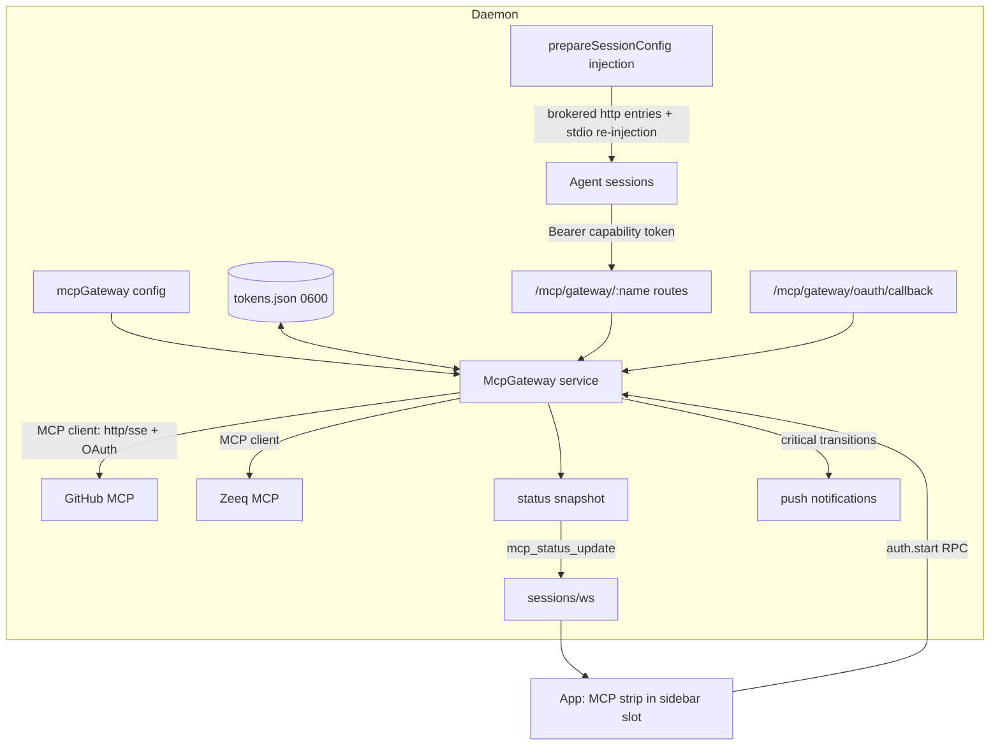

# MCP Auth Gateway - Plan

## Goal Capsule

- **Objective:** Make MCP authentication survive the multi-account pool — authenticate each external MCP once at the Paseo daemon (this fork ships branded as "Bozeo"; every code identifier remains `Paseo`), have every agent session on every account receive working MCPs automatically, and keep auth state visible in a persistent global UI with one-click re-auth.
- **Product authority:** Tyler (fork owner), settled in the 2026-09-12 brainstorm dialogue. Sibling ideas from the same conversation (steer-without-interrupt, rapid-mode toggle, leaders-always-orchestrate) are not active scope.
- **Stop conditions:** Never restart the daemon on port 6767 or the Paseo desktop app (branded "Bozeo"); daemon-side code activates at the owner's next manual relaunch (staging built bundles is allowed). If evidence invalidates a session-settled KTD, stop and report rather than silently overriding.
- **Execution profile:** worker-agent implementation per unit; targeted vitest only; `npm run build:client` after protocol edits before dependent typechecks; a concurrent agent owns `worktree-disk-monitor*`, `workspace-directory.ts`, `bootstrap.ts` disk-monitor wiring, and the app sidebar meta-row — sequence U-edits to `bootstrap.ts` and sidebar files after that agent lands or coordinate hunks carefully.
- **Product Contract preservation:** Product Contract unchanged.

---

## Product Contract

### Summary

The Paseo daemon becomes the single authentication authority and gateway for external MCP servers. Each MCP is authorized once at the daemon; agent sessions on any account get those servers injected and working without per-config-dir auth. A persistent global strip shows every MCP's auth state with one-click auth/re-auth, and per-session MCP health is surfaced instead of dropped.

### Problem Frame

MCP OAuth state lives per `CLAUDE_CONFIG_DIR`. The account pool deliberately runs sessions across three config dirs, and the owner's login churn means each dir's MCP auth strands independently — his MCPs "never seem to be connected" while single-account coworkers stay authenticated for weeks. The two config dirs on this machine already show real drift (different `mcpNeedsAuthNoticed` state, different server sets). Today the failure is also invisible: the Claude Agent SDK reports per-server MCP status in its init message, and the daemon's Claude adapter discards it — an agent can silently lose tools mid-task with nothing surfacing anywhere.

### Key Decisions

- **Gateway proxy, not token sync.** The daemon connects upstream to each MCP with tokens it holds, and re-exposes the servers to sessions; it does not copy tokens into config dirs. (session-settled: user-approved — chosen over per-dir token sync: sync fights Claude's internal token storage and refresh behavior; the gateway owns auth in exactly one place.)
- **Brokered servers replace per-dir definitions for agent sessions.** One source of truth; sessions stop connecting directly with per-dir auth. (session-settled: user-approved — chosen over mixed direct-plus-proxied auth: mixed mode preserves the drift the feature exists to kill.)
- **One global gateway now; per-project segregation later.** All projects share the gateway's server set; splitting work vs personal server sets is a future evolution. (session-settled: user-directed — "we can use the same one for everything but some day I'll segregate things into work and personal projects.")
- **Persistent global status UI.** MCP auth state lives in an always-visible, persistent global surface, not a settings page — the owner's verbatim ask: "as like a header or persistent global UI". Compact/collapsible given contested chrome real estate. (session-settled: user-directed. **Placement note:** KTD10 mounts the strip in the always-visible sidebar slot — the "persistent global UI" arm of the ask — rather than literal header chrome; called out prominently here so the owner can redirect to header placement if that was the intent.)
- **Remote OAuth-class servers are the target; local stdio servers pass through untouched in v1.** (session-settled: user-approved — the stdio class is not what breaks on account swaps.)
- **Zeeq and agent-gateway are critical-tier.** Their unavailability is treated as materially more serious than other servers' — louder surfacing, immediate notification. (session-settled: user-directed.)
- **Broker availability spans accounts by design.** A server previously authed in only one dir (e.g. slack) becomes available to every account's sessions. (session-settled: user-approved via call-out — treated as the point, not a leak.)

### Requirements

**Gateway core**

- R1. An MCP server authorized once at the daemon is usable by every agent session the daemon creates, on every configured account, without any per-config-dir authentication.
- R2. The daemon owns token lifecycle for brokered servers, including refresh; tokens never leave the daemon.
- R3. An account swap, re-login, or new provider entry requires no MCP re-authentication.
- R4. A re-auth completed at the daemon becomes effective for already-running sessions without restarting them.

**Status and UI**

- R5. A persistent, globally visible strip lists every configured MCP with its current auth state (connecting / healthy / needs auth / erroring) at a glance. Satisfied by the strip as a whole: the collapsed row is a health summary (aggregate dot; unhealthy critical servers named), and the always-available one-tap expanded view lists every server — the collapsed row alone is not required to enumerate all servers.
- R6. Authenticating or re-authenticating any MCP is a one-click action from that strip.
- R7. Per-session MCP server status reported by the provider SDK is captured and surfaced instead of discarded.
- R8. When a brokered MCP loses authentication, the strip state changes and the owner is notified per the server's criticality tier (R11), using the existing monitor notification path.

**Coverage**

- R9. The initial brokered set covers the owner's active MCPs: GitHub, Linear, Notion, Figma, Zeeq, Slack, and agent-gateway; adding another MCP requires configuration only, not code.
- R11. Servers carry a configurable criticality tier. Critical servers (initially Zeeq and agent-gateway) get prominent strip treatment and an immediate push notification on auth loss or unavailability; non-critical servers surface in the strip without a push.
- R10. Workspaces that use no MCPs are unaffected in behavior and performance.

### Key Flows

- F1. First-time auth
  - **Trigger:** Owner opens the MCP strip and clicks auth on a needs-auth server.
  - **Steps:** Browser OAuth completes; daemon stores tokens; strip flips to healthy; all sessions can use the server.
  - **Covers:** R1, R5, R6.
- F2. Account swap continuity
  - **Trigger:** The pool routes a new agent to a different account.
  - **Steps:** Session receives brokered servers; MCP tools work immediately; no auth prompt anywhere.
  - **Covers:** R1, R3.
- F3. Expiry and recovery
  - **Trigger:** An upstream provider invalidates a token mid-day.
  - **Steps:** Strip shows needs-auth; push notification fires; owner re-auths in one click; running sessions regain the server without restart.
  - **Covers:** R4, R5, R6, R8.

### Acceptance Examples

- AE1. **Covers R1, R3.** Given GitHub was authed once at the daemon, when a worker agent on the backup account calls a GitHub MCP tool, then the call succeeds with no auth prompt and no per-dir setup.
- AE5. **Covers R11.** Given Zeeq loses auth while GitHub also loses auth, then Zeeq produces an immediate push and prominent strip state while GitHub changes strip state only.
- AE2. **Covers R4, R8.** Given Zeeq's token expired while an agent is mid-task, when the owner re-auths from the strip, then the same running agent's next Zeeq call succeeds and exactly one expiry notification was sent.
- AE3. **Covers R7.** Given a session whose SDK reports a failed MCP server at init, then that state is visible in the UI rather than silently absent.
- AE4. **Covers R10.** Given a workspace that uses no MCP tools, then its agent sessions show no MCP-related latency, prompts, or errors introduced by the gateway.

### Scope Boundaries

**Deferred for later**

- Work/personal segregation: per-project or per-workspace MCP server sets over the shared gateway.
- Manual stdio/local server brokering beyond pass-through.
- The auth-aware handoff tier (move a task to an authed session) — superseded by the gateway.
- Non-Claude providers' brokered injection (Codex/OpenCode/etc. accept `mcpServers` via the shared session config, but their per-dir suppression semantics differ; v1 targets the Claude adapter and leaves other providers on their current behavior).
- Aligning the `injectIntoAgents` default mismatch (`config.ts` resolves unset to `false`; `bootstrap.ts`'s `?? true` is dead code) — pre-existing, unrelated cleanup.
- Bulk token rotation/revocation for `tokens.json` beyond per-server re-auth from the strip (single-user posture accepts this for v1).

**Outside this product's identity**

- Multi-user/team token security hardening — this is a single-user daemon holding its owner's tokens.

### Dependencies and Assumptions

- Single-user machine; daemon-held tokens are an accepted trust posture.
- The strip must reach every fork client surface (desktop, self-hosted web on phone).
- Verified inventory (2026-09-12): EtsyBot and DayTrader use no MCP servers; the only project-scoped server on the machine is `zeeq` (mobile repo), already in R9's set. All other MCP usage is the session-global set, so R9 covers the machine and non-MCP projects need no migration.
- `@modelcontextprotocol/sdk` 1.29.0 is already a dependency of `packages/server` with client transports and `OAuthClientProvider` installed (`packages/server/package.json:80`; `node_modules/@modelcontextprotocol/sdk/dist/esm/client/`), currently unused in production code.
- Upstream MCP servers for R9 speak HTTP or SSE transports with OAuth or static-token auth; per-server transport/auth details are configured, not hardcoded.

---

## Planning Contract

### Key Technical Decisions

- KTD1. **Reverse-proxy routes per brokered server, following the `/mcp/agents` pattern with a distinct gateway token.** Sessions receive `{type:"http", url:"http://<listen>/mcp/gateway/<name>", headers:{Authorization:"Bearer <gateway capability token>"}}` entries; the daemon relays MCP traffic to the upstream with its stored credentials. Mirrors `runtime-mcp-config.ts:45-57` (entry shape) and `bootstrap.ts:1546-1558` (capability-token route auth) — but mints a **separate** `randomUUID` token for `/mcp/gateway/*` rather than reusing the `/mcp/agents` token, so leaking one secret never grants the other surface (agent orchestration vs brokered external accounts). Bearer-free route exemption: `SELF_AUTHENTICATING_ROUTES` (`server/auth.ts:122`) is an exact-match Set that cannot cover dynamic `/mcp/gateway/<name>` paths — extend `isBearerFreeRoute` with a `/mcp/gateway/` **prefix** match instead of enumerating names. Instantiates the session-settled "gateway proxy, not token sync" decision.
- KTD2. **Daemon-side MCP client via the already-installed `@modelcontextprotocol/sdk` client modules** (streamableHttp + sse transports, `OAuthClientProvider` from `client/auth`). No new dependency; the daemon becomes an MCP client for upstreams while remaining an MCP server toward sessions.
- KTD3. **OAuth: authorization-code + PKCE with a daemon-hosted callback route** (`/mcp/gateway/oauth/callback`), driven through the SDK's `OAuthClientProvider`. No inbound OAuth precedent exists in the daemon (verified) — this is the one genuinely new surface. The `redirect_uri` is the **daemon's own stable reachable base URL** (its listen address as clients reach it; `docs/service-proxy.md`'s `publicBaseUrl` precedent), never a literal `127.0.0.1` loopback: auth may be initiated from the phone's browser (a different device), and the provider's redirect must land on the daemon regardless of which device consented. When the daemon is only loopback-reachable, phone-initiated auth is unsupported and the strip's auth action must say so — complete auth from a device that can reach the daemon. Hardening: `state` values are single-use with a short TTL (~5 min), invalidated on first success or failure; any request logging on gateway routes redacts `code` and `state` query params, not just the `Authorization` header. Auth start is an RPC returning the authorization URL; clients open it via the existing external-URL opener (`desktop/src/main.ts:965-966` IPC; `@/utils/open-external-url` in the app).
- KTD4. **Token storage: private file under `PASEO_HOME`, not Keychain.** `mcp-gateway/tokens.json` written via `writePrivateFileAtomicSync` (0600, `server/private-files.ts:5-41`), matching the daemon-keypair precedent. The repo's Keychain usage is read-only by explicit rule (`quota-fetcher/providers/claude.ts:432`); nothing writes Keychain today, and inventing that has no precedent. Tokens never appear in config, logs, or wire payloads.
- KTD5. **Suppression + stdio pass-through: `strictMcpConfig: true` in the Claude adapter plus daemon-side re-injection of per-dir stdio entries.** `strictMcpConfig` is the only SDK switch that stops per-dir servers (`sdk.d.ts:2080-2087`) but it drops stdio entries too; the adapter cannot receive it via `providerOptions` (schema `.strict()`, `claude/options.ts:45-88`). So: set it in the adapter's base options (`claude/agent.ts:3302-3340`), gated on the gateway being enabled, and have the gateway read the session config dir's `.claude.json` + project `.mcp.json` stdio entries and re-inject them verbatim into `mcpServers`. Honors both session-settled decisions (replace-per-dir; stdio untouched in effect). Conflict note: this is the workable resolution of the flagged tension — per-dir stdio definitions are technically re-read and re-injected by Paseo rather than loaded by the CLI, but their behavior is unchanged.
- KTD6. **Per-launch injection, never persisted.** Brokered entries are added in `prepareSessionConfig` (`agent-manager.ts:5364-5384`) beside `withRuntimePaseoMcpServer`, and stripped from storage the same way the `paseo` entry is (`stripInternalPaseoMcpServer` + `persistence-hooks.ts`). R4 falls out structurally: sessions talk to stable gateway URLs, so re-auth at the daemon transparently restores upstream calls mid-session.
- KTD7. **Status wire surface copies the `providers_snapshot_update` pattern exactly**: new `mcp_status_update` session message (payload: per-server `{name, state, critical, lastChangedAt}` + per-agent init-reported statuses), `SessionEventSubscriptionSchema` entry, `COMPAT(mcpStatus)`-tagged feature flag, `operation-permissions.ts` mapping to `daemon.read`, aot validator regen, app `push-router` → TanStack query keyed hook (`use-providers-snapshot.ts:63-92` is the template). New message type is feature-gated so old clients never receive it — protocol-compatible.
- KTD8. **Per-agent init capture:** `handleSystemMessage` (`claude/agent.ts:4560+`) reads the init message's `mcp_servers: {name,status}[]` (currently unread; verified `sdk.d.ts:4825-4840`) into a live-only agent field following the `lastActivitySummary` conventions. There is no SDK push event for later status changes (verified) — the gateway's own upstream state is authoritative for brokered servers; init capture covers stdio/pass-through ones each turn.
- KTD9. **Config: new top-level `mcpGateway` section in `persisted-config.ts`** (strict schema: `enabled`, `servers: Record<name, {url, transport: "http"|"sse", critical?, auth?: "oauth"|"static"}>`), threaded through the mutable-patch live-toggle pipeline like `titleTracking` (553af7e5e). Criticality lives here (Zeeq + agent-gateway seeded by the operator's config, not hardcoded). Secrets never in config: `MutableDaemonConfig` is broadcast in full to every connected client on change, so static-token header values live in the 0600 token store (KTD4) keyed by server name — config records only _that_ a server uses static auth, never the value.
- KTD10. **Strip placement: the sidebar's platform-split slot region.** Desktop mounts above `SidebarFooter` beside `SidebarCalloutSlot` (`components/left-sidebar.tsx:780-782`); mobile mounts in `MobileSidebar`'s footer region (`:605`). Host-scoped to the active host in v1 (the sidebar spans hosts; aggregation deferred). Collapsed: one compact row (dot summary; critical servers named when unhealthy). Expanded: per-server rows with tone (ProviderUsageTone vocabulary, icon+label per design.md) and an auth/re-auth action; `connecting` maps to a neutral tone (non-warning, distinct from needs-auth/error). Per-session init-reported failures (stdio/pass-through servers — no auth action possible) get a defined home: a "reported by <agent>" annotation on the matching server row, or a session-scoped row without an auth button when no global row matches — never silently dropped (AE3). Instantiates the "persistent global UI" arm of the session-settled decision (see the placement note under Key Decisions).
- KTD11. **Notifications reuse the monitor pattern**: `packages/protocol/src/mcp-notification.ts` builders mirroring `token-burn-notification.ts`; gateway fires on state transitions with per-(server) episode re-arm; critical → immediate push, non-critical → none (R8/R11). Batched when >3 transitions in one sweep.

### High-Level Technical Design

Auth flow (F1/F3): strip button → `mcp_gateway.auth.start.request` → daemon builds PKCE authorization URL via `OAuthClientProvider` → client opens externally → provider redirects to the daemon's reachable callback URL → daemon exchanges code, persists tokens (0600), flips state, emits `mcp_status_update`, upstream client (re)connects → proxy resumes; running sessions' next tool call succeeds (R4).

### Assumptions

- Upstream servers implement standard MCP OAuth (RFC 8414 discovery / dynamic client registration where offered) compatibly with the SDK's `OAuthClientProvider`; servers needing static tokens instead store those header values in the 0600 token store (KTD4), never in config. Whether each R9 provider supports dynamic client registration vs a pre-registered OAuth app is a per-server configuration fact, resolved at setup time.
- The self-hosted web client can open the auth URL in a new tab (no loopback assumption for the browser — the callback lands on the daemon regardless of which device initiated).

---

## Implementation Units

### U1. Gateway core service, config, and token store

- **Goal:** `McpGateway` service managing upstream MCP client connections, per-server state, OAuth token lifecycle, and persisted config.
- **Requirements:** R1, R2, R9, R11 (config seeds criticality). Cites KTD2, KTD3, KTD4, KTD9.
- **Dependencies:** none.
- **Files:** `packages/server/src/server/mcp-gateway/gateway.ts`, `mcp-gateway/token-store.ts`, `mcp-gateway/oauth.ts`, `mcp-gateway/state.ts` (pure state machine), `packages/server/src/server/persisted-config.ts`, `packages/server/src/server/daemon-config-store.ts`, tests beside each (`*.test.ts`).
- **Approach:** per-server state machine `disabled → connecting → connected | needs-auth | error`; upstream clients from `@modelcontextprotocol/sdk` (streamableHttp, sse) with an `OAuthClientProvider` implementation backed by the token store; token store wraps `writePrivateFileAtomicSync`; config section + live-toggle pipeline per KTD9 (mirror the `titleTracking` treatment end-to-end: schema, pick, merge, reload carry-forward).
- **Test scenarios:** state transitions incl. refresh-failure → needs-auth; token round-trip persists with 0600 and survives reload; malformed token file fails closed to needs-auth (never crashes); config live-patch round-trip; static-auth servers connect using header values from the token store (never from config) without OAuth; disabled gateway constructs nothing.
- **Verification:** unit suites green; `npm run typecheck --workspace=@getpaseo/server` clean.

### U2. Proxy and OAuth callback routes

- **Goal:** `/mcp/gateway/:name` relays session MCP traffic to the upstream client; `/mcp/gateway/oauth/callback` completes PKCE.
- **Requirements:** R1, R2. Cites KTD1, KTD3.
- **Dependencies:** U1.
- **Files:** `packages/server/src/server/mcp-gateway/routes.ts`, `packages/server/src/server/bootstrap.ts` (route mount + `/mcp/gateway/` prefix handling in `server/auth.ts`'s `isBearerFreeRoute`), tests (`mcp-gateway/routes.test.ts`, extend `agent-mcp.e2e.test.ts`-style local e2e with a fixture upstream MCP server).
- **Approach:** relay uses a per-server `StreamableHTTPServerTransport` facade forwarding JSON-RPC to the upstream client session (tool list/call passthrough); capability-token check following the `bootstrap.ts:1546-1558` pattern but against the distinct gateway token from KTD1 (do not reuse `isAgentMcpRequestAuthorized`'s agent token); callback validates `state` (single-use, TTL per KTD3), exchanges code via U1's oauth module, redirects to a tiny "you can close this tab" page; gateway-route logging redacts `code`/`state` query params.
- **Execution note:** coordinate the `bootstrap.ts` hunk with the concurrent disk-monitor agent's wiring — land after it or rebase around it.
- **Test scenarios:** unauthorized request → 401; agent-token (non-gateway) bearer on a gateway route → 401; authorized round-trip lists and calls a fixture tool; needs-auth upstream → relay returns a clean MCP error — a generic needs-auth code/message only, no upstream response body, headers, or token fragments passed through (never hangs); callback with bad state → 400, no token write; replayed valid state on a second callback → rejected; happy callback persists tokens and flips state.
- **Verification:** local e2e green with fixture upstream; typecheck clean.

### U3. Session injection, suppression, and stdio re-injection

- **Goal:** Every Claude session receives brokered entries and per-dir stdio entries while per-dir remote definitions stop loading.
- **Requirements:** R1, R3, R4 (structural owner — KTD6's stable gateway URLs are the mechanism; if R4 regresses, this unit is accountable), R10, AE4. Cites KTD5, KTD6.
- **Dependencies:** U1, U2.
- **Files:** `packages/server/src/server/agent/runtime-mcp-config.ts` (gateway sibling of `withRuntimePaseoMcpServer` + strip helper), `packages/server/src/server/agent/agent-manager.ts` (`prepareSessionConfig`), `packages/server/src/server/agent/providers/claude/agent.ts` (`strictMcpConfig` in base options, gateway-gated), `packages/server/src/server/mcp-gateway/per-dir-stdio.ts` (reads `.claude.json` global + project `.mcp.json` stdio entries for the session's resolved config dir), `packages/server/src/server/agent/persistence-hooks.ts`, tests beside each.
- **Approach:** injection mirrors the paseo entry (per-launch, stored-config wins on name collision, stripped from persistence); stdio re-injection resolves the config dir via the existing `resolveClaudeConfigDir` and parses entries verbatim into the canonical `McpServerConfig` stdio shape; everything no-ops byte-identically when `mcpGateway.enabled` is false.
- **Test scenarios:** enabled → brokered entries present with capability header, absent from persisted config; disabled → launch config byte-identical to today; stdio entries from both sources re-injected verbatim; a stdio entry whose config uses a relative path and an env-var reference resolves to the same command/cwd/env whether loaded natively by the CLI or re-injected by the gateway (spawn-semantics parity, not just JSON equality); remote per-dir entries absent under strictMcpConfig (assert the option is set only when enabled); name collision: stored config beats brokered; fixture-upstream local e2e — a live session receives brokered + re-injected stdio entries end-to-end, and after a simulated re-auth at the daemon the same running session's next call succeeds without restart (R4).
- **Verification:** targeted suites green, including the U3 fixture-upstream local e2e; existing `account-pool-routing.local.e2e.test.ts` unaffected.

### U4. Status capture and wire surface

- **Goal:** Gateway state + per-agent init-reported MCP statuses reach clients as `mcp_status_update`.
- **Requirements:** R5 (data), R7. Cites KTD7, KTD8.
- **Dependencies:** U1.
- **Files:** `packages/protocol/src/messages.ts` (message + subscription entry), `packages/server/src/server/agent/providers/claude/agent.ts` (`handleSystemMessage` mcp_servers capture), `packages/server/src/server/agent/agent-manager.ts` (live-only field, conventions of `lastActivitySummary`), `packages/server/src/server/session.ts` + `websocket-server.ts` (emit path + `COMPAT(mcpStatus)` feature flag), `packages/server/src/server/authorization/operation-permissions.ts`, regenerated `packages/protocol/src/generated/validation/ws-outbound.aot.ts`, wire-compat test additions.
- **Approach:** copy the `providers_snapshot_update` flow end to end (`provider-catalog-session.ts:84-95` emit shape, `session.ts:938-943` wantsEvent gating); gateway exposes `getStatusSnapshot()` + change events; agent init statuses ride agent payloads additively only if trivially cheap, else fold into the snapshot payload keyed by agentId.
- **Test scenarios:** legacy-schema replica ignores the new message type (feature-gated — assert it is never emitted to a session without the subscription); snapshot dedupes unchanged emissions; init capture stores and clears per `lastActivitySummary` conventions; permission mapping enforced.
- **Verification:** protocol + server suites green; `npm run build:client` then dependent typechecks clean.

### U5. Criticality notifications

- **Goal:** Critical-server auth loss pushes immediately; non-critical stays strip-only; episodes re-arm.
- **Requirements:** R8, R11, AE2, AE5. Cites KTD11.
- **Dependencies:** U1, U4.
- **Files:** `packages/protocol/src/mcp-notification.ts` (+test), `packages/server/src/server/mcp-gateway/gateway.ts` (transition hook), tests.
- **Test scenarios:** critical → needs-auth fires exactly one push; repeat sweeps don't re-fire; recovery re-arms; non-critical transition fires none; >3 transitions in one pass batch to one push.
- **Verification:** suites green.

### U6. Auth RPCs

- **Goal:** Clients can start auth and query status over the wire.
- **Requirements:** R6, F1, F3. Cites KTD3.
- **Dependencies:** U1, U2.
- **Files:** `packages/protocol/src/messages.ts` (`mcp_gateway.auth.start.request/.response` per docs/rpc-namespacing.md), `packages/server/src/server/session.ts` handler, `packages/client/src/index.ts` client method, tests.
- **Approach:** `auth.start` returns `{authorizationUrl}`; completion arrives via the callback route + `mcp_status_update`, so no long-poll RPC.
- **Test scenarios:** start on unknown server → error response; start on a static-auth server → error (nothing to auth); happy path returns a URL embedding PKCE challenge; permission mapping (`daemon.write`-class) enforced.
- **Verification:** suites green; aot regen clean.

### U7. App: MCP status strip

- **Goal:** Persistent, host-scoped strip in the sidebar with per-server tones and one-click auth.
- **Requirements:** R5, R6, R11 (prominent critical treatment), AE1, AE3, AE5 (visual side). Cites KTD10.
- **Dependencies:** U4, U6.
- **Files:** `packages/app/src/mcp-status/use-mcp-status.ts` (capability-gated `useReplicaQuery` on `mcp_status_update`), `mcp-status/mcp-status-strip.tsx`, `mcp-status/mcp-status-strip-model.ts` (+tests, pure row/tone derivation incl. critical prominence + collapsed summary), `packages/app/src/components/left-sidebar.tsx` (desktop mount by `SidebarCalloutSlot`, mobile mount in `MobileSidebar` footer), `packages/app/src/data/push-router.ts` (event → query), i18n resources ×9, tests.
- **Approach:** collapsed row = aggregate dot + names of unhealthy critical servers; press toggles collapsed/expanded (matching the project-group collapse convention in `left-sidebar.tsx`), expanded state resets on app restart; rows use ProviderUsageTone + icon+label (never color alone) with `connecting` on a neutral tone; per-session init-reported failures render per KTD10's session-scoped treatment; auth button calls the U6 RPC then opens the returned URL (`open-external-url`); show-nothing when the feature flag is absent (old daemon).
- **Execution note:** coordinate `left-sidebar.tsx` edits with the concurrent disk-meta-row agent; land second if it is mid-flight.
- **Test scenarios:** model — tones per state (incl. neutral `connecting`), critical-first ordering, collapsed summary counts, session-reported stdio failure produces a row/annotation with no auth action, absent-data renders nothing; hook gated off when feature flag missing; i18n parity suite.
- **Verification:** app suites green from `packages/app`; full typecheck clean.

---

## Verification Contract

- Per-unit targeted suites: `npx vitest run <file> --bail=1` (app tests from `packages/app`).
- After protocol edits: `npm run build:client`, then `npm run typecheck` (workspace-scoped first, full-tree before final commit).
- Lint/format per touched file: `npm run lint -- <files>`, `npm run format:files -- <files>`.
- Local e2e (fixture upstream MCP server) for U2/U3 following the `*.local.e2e.test.ts` pattern; never against the live daemon.
- Wire-compat: legacy-replica tests for every new message/field (U4, U6).
- No daemon restart, no plugin reload, no app relaunch (the fork's "Bozeo"-branded Paseo app); live verification of the full auth loop is deferred to the owner's next relaunch and explicitly out of the automated gates.

## Definition of Done

- U1–U7 complete with their test scenarios green; full `npm run typecheck` and lint clean on all touched files.
- Zero regressions in existing MCP e2e suites (`agent-mcp.e2e.test.ts`, `mcp-parity.e2e.test.ts` untouched or green if touched).
- Gateway disabled ⇒ behavior byte-identical to today (U3 test proves it); enabled-but-unconfigured ⇒ no injected entries, no strip rows.
- Tokens never appear in config, wire payloads, logs, or test fixtures.
- Abandoned experimental code removed from the diff.
- Docs: `docs/plugins.md`/`docs/architecture.md` untouched unless behavior contradicts them; add a short `docs/mcp-gateway.md` owning setup + auth flow + criticality config, linked from the docs table.
