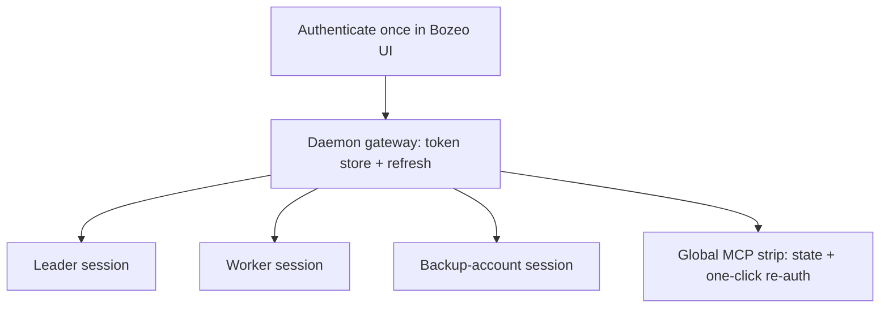

# MCP Auth Gateway - Plan

## Goal Capsule

- **Objective:** Make MCP authentication survive the multi-account pool — authenticate each external MCP once at the Bozeo daemon, have every agent session on every account receive working MCPs automatically, and keep auth state visible in a persistent global UI with one-click re-auth.
- **Product authority:** Tyler (fork owner), settled in the 2026-09-12 brainstorm dialogue. The sibling ideas raised in the same conversation (steer-without-interrupt, rapid-mode toggle, leaders-always-orchestrate) are not active scope here.
- **Open blockers:** none.

---

## Product Contract

### Summary

Bozeo's daemon becomes the single authentication authority and gateway for external MCP servers. Each MCP is authorized once at the daemon; agent sessions on any account get those servers injected and working without per-config-dir auth. A persistent global strip shows every MCP's auth state with one-click auth/re-auth, and per-session MCP health is surfaced instead of dropped.

### Problem Frame

MCP OAuth state lives per `CLAUDE_CONFIG_DIR`. The account pool deliberately runs sessions across three config dirs, and the owner's login churn means each dir's MCP auth strands independently — his MCPs "never seem to be connected" while single-account coworkers stay authenticated for weeks. The two config dirs on this machine already show real drift (different `mcpNeedsAuthNoticed` state, different server sets). Today the failure is also invisible: the Claude Agent SDK reports per-server MCP status in its init message, and the daemon's Claude adapter discards it — an agent can silently lose tools mid-task with nothing surfacing anywhere.

### Key Decisions

- **Gateway proxy, not token sync.** The daemon connects upstream to each MCP with tokens it holds, and re-exposes the servers to sessions; it does not copy tokens into config dirs. (session-settled: user-approved — chosen over per-dir token sync: sync fights Claude's internal token storage and refresh behavior; the gateway owns auth in exactly one place.)
- **Brokered servers replace per-dir definitions for agent sessions.** One source of truth; sessions stop connecting directly with per-dir auth. (session-settled: user-approved — chosen over mixed direct-plus-proxied auth: mixed mode preserves the drift the feature exists to kill.)
- **One global gateway now; per-project segregation later.** All projects share the gateway's server set; splitting work vs personal server sets is a future evolution. (session-settled: user-directed — "we can use the same one for everything but some day I'll segregate things into work and personal projects.")
- **Persistent global status UI.** MCP auth state lives in an always-visible header-level strip, not a settings page. Compact/collapsible given contested header real estate. (session-settled: user-directed.)
- **Remote OAuth-class servers are the target; local stdio servers pass through untouched in v1.** (session-settled: user-approved — the stdio class is not what breaks on account swaps.)
- **Broker availability spans accounts by design.** A server previously authed in only one dir (e.g. slack) becomes available to every account's sessions. (session-settled: user-approved via call-out — treated as the point, not a leak.)

### Requirements

**Gateway core**

- R1. An MCP server authorized once at the daemon is usable by every agent session the daemon creates, on every configured account, without any per-config-dir authentication.
- R2. The daemon owns token lifecycle for brokered servers, including refresh; tokens never leave the daemon.
- R3. An account swap, re-login, or new provider entry requires no MCP re-authentication.
- R4. A re-auth completed at the daemon becomes effective for already-running sessions without restarting them.

**Status and UI**

- R5. A persistent, globally visible strip lists every configured MCP with its current auth state (healthy / needs auth / erroring) at a glance.
- R6. Authenticating or re-authenticating any MCP is a one-click action from that strip.
- R7. Per-session MCP server status reported by the provider SDK is captured and surfaced instead of discarded.
- R8. When a brokered MCP loses authentication, the owner is notified (push, consistent with the existing monitor notifications) in addition to the strip state change.

**Coverage**

- R9. The initial brokered set covers the owner's active MCPs: GitHub, Linear, Notion, Figma, Zeeq, Slack; adding another MCP requires configuration only, not code.
- R10. Workspaces that use no MCPs are unaffected in behavior and performance.

### Key Flows

- F1. First-time auth
  - **Trigger:** Owner opens the MCP strip and clicks auth on a needs-auth server.
  - **Steps:** Browser OAuth completes; daemon stores tokens; strip flips to healthy; all sessions can use the server.
  - **Covers:** R1, R5, R6.
- F2. Account swap continuity
  - **Trigger:** The pool routes a new agent to a different account.
  - **Steps:** Session receives brokered servers; MCP tools work immediately; no auth prompt anywhere.
  - **Covers:** R1, R3.
- F3. Expiry and recovery
  - **Trigger:** An upstream provider invalidates a token mid-day.
  - **Steps:** Strip shows needs-auth; push notification fires; owner re-auths in one click; running sessions regain the server without restart.
  - **Covers:** R4, R5, R6, R8.

### Acceptance Examples

- AE1. **Covers R1, R3.** Given GitHub was authed once at the daemon, when a worker agent on the backup account calls a GitHub MCP tool, then the call succeeds with no auth prompt and no per-dir setup.
- AE2. **Covers R4, R8.** Given Linear's token expired while an agent is mid-task, when the owner re-auths from the strip, then the same running agent's next Linear call succeeds and exactly one expiry notification was sent.
- AE3. **Covers R7.** Given a session whose SDK reports a failed MCP server at init, then that state is visible in the UI rather than silently absent.
- AE4. **Covers R10.** Given a workspace that uses no MCP tools, then its agent sessions show no MCP-related latency, prompts, or errors introduced by the gateway.

### Scope Boundaries

**Deferred for later**

- Work/personal segregation: per-project or per-workspace MCP server sets over the shared gateway.
- Manual stdio/local server brokering beyond pass-through.
- The auth-aware handoff tier (move a task to an authed session) — superseded by the gateway.

**Outside this product's identity**

- Multi-user/team token security hardening — this is a single-user daemon holding its owner's tokens.

### Dependencies and Assumptions

- Single-user machine; daemon-held tokens are an accepted trust posture.
- The strip must reach every fork client surface (desktop, self-hosted web on phone).
- Verified inventory (2026-09-12): EtsyBot and DayTrader use no MCP servers; the only project-scoped server on the machine is `zeeq` (mobile repo), already in R9's set. All other MCP usage is the session-global set, so R9 covers the machine and non-MCP projects need no migration.

### Sources

- The Claude Agent SDK init message carries per-server `mcp_servers` status that the adapter currently drops: `packages/server/src/server/agent/providers/claude/agent.ts` (no status handling; Codex's adapter has an analogous concept Claude's lacks).
- Per-agent MCP injection with bearer capability tokens already exists: `packages/server/src/server/agent/runtime-mcp-config.ts` and the `/mcp/agents` endpoint — the precedent for daemon-provided servers reaching sessions.
- Plugins/daemon can rewrite an agent's `mcpServers` only via `before("agent.create")` — there is no dedicated transform API today.
- Observed per-dir drift: `mcpNeedsAuthNoticed` and server sets differ between the two `.claude.json` files on this machine; MCP OAuth tokens are not stored in the repo-visible config files.
- Existing notification path for owner-facing pushes: `packages/protocol/src/token-burn-notification.ts` and the monitor precedent in `packages/server/src/server/agent-token-burn-monitor.ts`.
