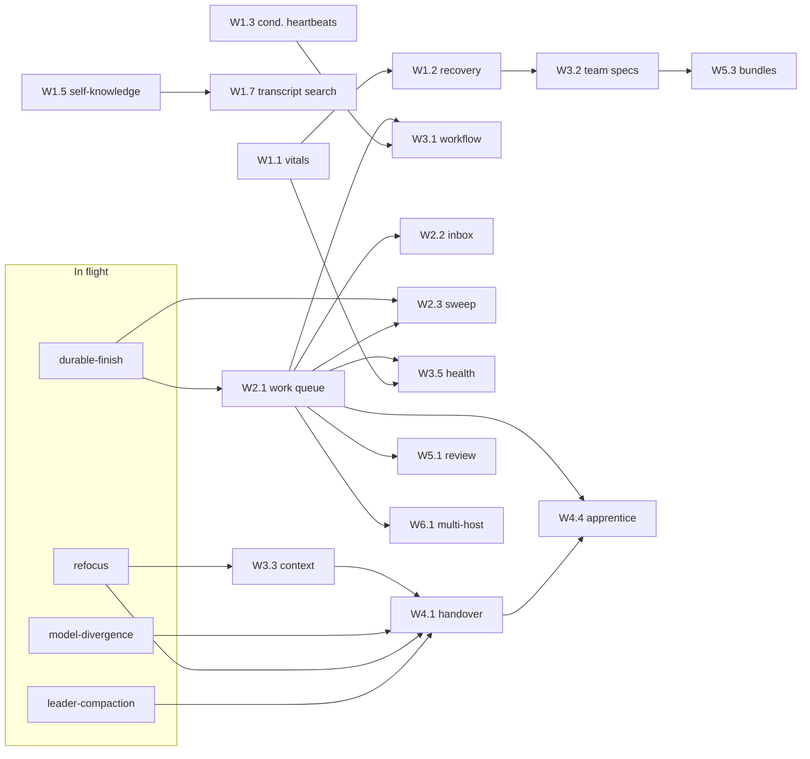

# OpenRig Port - Plan

## Goal Capsule

- **Objective:** Bring essentially every capability OpenRig ships into Bozeo (this fork of Paseo; code identifiers stay `Paseo`). The default verdict is port or adapt. An item is skipped only where Bozeo is already better, shown with file paths on both sides.
- **Product authority:** Tyler (fork owner). His premise is that OpenRig is advanced and well proven. This plan follows that premise and records, per feature, what OpenRig's own release notes admit about reliability.
- **Source:** OpenRig clone at `/tmp/openrig-research` (github.com/mvschwarz/openrig, Apache-2.0, HEAD `cc75efd`, v0.5.14). The earlier high-level research report was not available to this pass, so every verdict below comes from reading source and release notes directly.
- **Already in flight, not re-planned here:** leader context compaction (`claude-compaction-enforcer.ts`), durable finish notifications (`queue-wake-ladder.ts`, `queue-stuck-sweep.ts`, `parked-query.ts`), the actual-model check (`model-divergence-monitor.ts`), and refocus. Their worktrees are `/Users/tylerthackray/.paseo/worktrees/3jvw4yw6/{leader-compaction,durable-finish,model-divergence,refocus}`. Items below that depend on them say so.
- **Also unmerged on side branches:** `failover-return` (3 commits), `flexible-placement` (3), `workspace-titles` (5). Anything touching `account-failover-*` waits for the first two.
- **Stop conditions:** Never restart or disturb the daemon on 6767. Every new monitor ships off by default with a `dryRun` switch, following the done-janitor and reaper pattern. If a verdict here turns out wrong in code (a Bozeo path that does not do what this plan says), stop that unit and report. Do not quietly override.
- **Execution profile:** Bozeo defaults apply. Builds run as Paseo agents in isolated worktrees, one bounded unit each, labelled with `paseo.task-class` so the classifier picks model and account. Rapid mode applies: each wave lists the verification it defers. Run targeted vitest only, never the full suite. Run `npm run typecheck` and `npm run lint` after each change. Run `npm run build:client` after protocol edits.
- **Platforms:** Every app surface ships on macOS desktop, Windows desktop, iOS and Android. Daemon code must run on macOS and Windows. OpenRig assumes tmux and `ps` (Linux/macOS only), so none of its transport code carries over verbatim.

Path convention: OpenRig paths are written `openrig/<path>`, relative to `/tmp/openrig-research`. Bozeo paths are relative to `/Users/tylerthackray/paseo-worktrees/bozeo`.

---

## How to read the catalog

Each capability has an ID (`OR-<group><n>`) and five fields:

1. **What it does:** the OpenRig behavior and its files.
2. **Bozeo now:** _has_, _partial_ or _lacks_, with files.
3. **Verdict:** **Port** (bring it over as designed), **Adapt** (keep the intent, change the mechanism) or **Skip: Bozeo better** (with evidence on both sides).
4. **Lands in:** daemon core, first-party plugin, app, or CLI, plus the translation from tmux and screen scraping to Paseo's structured SDK streams.
5. **Size and dependencies:** S is one implementation unit, M is two to four, L is five or more.

A **Reliability** line appears only where OpenRig's own notes cast doubt on that specific feature.

---

## What OpenRig admits about itself

Tyler's premise is "well proven", and a lot of OpenRig is careful work. It is also pre-1.0 (v0.5.14) with 84 database migrations, and its release notes are unusually candid about what does not work. Each admission is attached to the feature it affects below. Here they are in one place:

| Admission                                                                                                                                                                                                                                                                                                                 | Source                                                                                                                                                                                                               | Affects                                            |
| ------------------------------------------------------------------------------------------------------------------------------------------------------------------------------------------------------------------------------------------------------------------------------------------------------------------------- | -------------------------------------------------------------------------------------------------------------------------------------------------------------------------------------------------------------------- | -------------------------------------------------- |
| Intermittent read timeouts remain. An inherited CLI health-check deadline can report a healthy daemon as unresponsive before the request is sent. Not fixed.                                                                                                                                                              | `openrig/docs/releases/v0.5.14.md` (Operator notes), `openrig/CHANGELOG.md` [0.5.14]                                                                                                                                 | OR-A1 queue CLI, OR-D3 daemon vitals, OR-H3 doctor |
| Stuck-sweep: 39 active findings at census, 20 proven false positives, 19 unverified. The false-positive class was cross-host successor visibility.                                                                                                                                                                        | `openrig/docs/releases/v0.5.5.md`, `openrig/CHANGELOG.md` [0.5.5] Known Limitations                                                                                                                                  | OR-D10                                             |
| Bundled workflow specs, including `basic-loop`, can disappear from discovery after an upgrade changes the install directory. The fix is deferred past 0.5.14.                                                                                                                                                             | `openrig/docs/releases/v0.5.14.md` (last bullet)                                                                                                                                                                     | OR-B1, OR-F1 templates                             |
| Continuity is unproven. `restore-check` hardcodes continuity to `not_proven` ("no code path can produce proven"), listing `provider_session_resume`, `context_window_preservation` and `interrupted_work_functional_resume` as unproven. The apprentice cutover SOP is "operator-proven on 2026-08-28", which is one run. | `openrig/packages/daemon/src/domain/restore-check-service.ts:1201-1211`, `openrig/packages/daemon/assets/plugins/openrig-core/skills/seat-continuity-and-handover/references/apprentice-successor-seat-cutover.md:3` | OR-C1, OR-C4, OR-C7, OR-C8                         |
| `rig send --verify` gives false positives from pre-existing pane content and cannot detect staged-but-unsent multi-line input to Claude.                                                                                                                                                                                  | `openrig/docs/as-built/architecture/architecture-rules-and-event-system.md` compat note 7, `openrig/CHANGELOG.md` 5.3/5.4 known limits                                                                               | OR-E1 (supports the skip)                          |
| The web UI has been frozen in maintenance mode since v0.4.7. The CLI and TUI are primary.                                                                                                                                                                                                                                 | `openrig/docs/releases/v0.4.7.md` "UI — moved to maintenance mode"                                                                                                                                                   | OR-H1                                              |
| Simultaneous default TUI clients share a control socket and are not isolated. Not fixed.                                                                                                                                                                                                                                  | `openrig/docs/releases/v0.5.14.md`, `openrig/CHANGELOG.md` [0.5.13]                                                                                                                                                  | OR-H2                                              |
| Per-seat `ps` spawns took the control plane down: 171 calls, mean 9.39 s, max 40.31 s.                                                                                                                                                                                                                                    | `openrig/packages/daemon/src/domain/process-census.ts` header                                                                                                                                                        | OR-D5, and any new `ps` use                        |
| The writer-layer disk cap is unfinished; cleanup is an interim control.                                                                                                                                                                                                                                                   | `openrig/CHANGELOG.md` [0.5.4] Known Limitations                                                                                                                                                                     | OR-J group                                         |
| Operating-posture behavioral effect is "UNOBSERVED" and human time cost "UNMEASURED".                                                                                                                                                                                                                                     | `openrig/CHANGELOG.md` [0.5.13]                                                                                                                                                                                      | OR-E6 posture half                                 |
| Several workflow spec keys are accepted but not enforced (`invariants.{continuation_required,preserve_lineage,closure_required}`, `closure.*`, role `skill_refs`, `loop_guards.spawn_budget`). They return a `declared_not_enforced_v1` advisory (`workflow-validator.ts:390`).                                           | `openrig/docs/as-built/architecture/workflow-runtime.md` §6 FR-9, §7 FR-4                                                                                                                                            | OR-B1                                              |
| Slack delivery checks used controlled HTTP responses until one later real single-consumer exercise. "Admission is not proof of posting or readership."                                                                                                                                                                    | `openrig/docs/releases/v0.5.14.md`, `workflow-runtime.md` WF5                                                                                                                                                        | OR-E5                                              |
| v0.5.12 and v0.5.13 are marked release candidates with verification and publication pending.                                                                                                                                                                                                                              | `openrig/CHANGELOG.md` [0.5.12], [0.5.13]                                                                                                                                                                            | general                                            |

What this means for the port: OpenRig's _designs_ are the valuable part (closure contracts, conditional wakes, restore vocabulary, delivery levels). Much of its code compensates for tmux (screen scraping, pane probes, `--verify`, pipe-pane transcripts), and Bozeo does not have that problem. We port the designs and leave the compensation behind.

---

## Translation principles (apply to every unit)

1. **No tmux. The structured SDK session is the transport.** Where OpenRig does `send` (paste buffer + `C-m`), Bozeo calls `sendPromptToAgent` (`packages/server/src/server/agent/agent-prompt.ts`). Capture becomes the agent timeline (`agent-timeline-store.ts`). Activity comes from the lifecycle the provider stream reports (`running`, `idle`, `error`, `closed`, `initializing`) plus `requiresAttention` and pending permissions (`docs/agent-lifecycle.md`). Readiness is session init. Resume uses the persistence handle (`ensureAgentLoaded`). Transcripts are the provider's own JSONL or rollout files. Any OpenRig code whose job is to _infer_ one of these from a pane is not ported.
2. **No SQLite. Use query-shaped stores over atomic JSON.** Paseo persists file-based JSON with Zod and atomic writes, and has no migration framework (`docs/data-model.md`). Its store rule: "A good store method maps cleanly to one SQL statement or one SQL transaction, even when the current implementation is JSON files." Upstream removed chat rooms and loops specifically so storage could move to SQL later (commit `94bda1f92`). OpenRig's multi-row transactions (close source, create successor, append transition, all in one transaction) become one store method per transaction. Each method is backed by a journaled commit, following the precedent in `docs/architecture.md:110` (workspace-labels "share a journaled commit boundary. Startup recovery completes that commit"). New fields are optional with defaults, so there are no migrations.
3. **Seats are agent ids; roles are classifier labels.** OpenRig's "seat" (stable identity) with rotating "occupants" (sessions) maps to Paseo's agent id, which already survives provider moves and reloads (`AgentManager.moveAgentToProvider`, `docs/account-failover.md`). Anything OpenRig resolves by "role → seat" resolves here through labels (`paseo.agent-role`, `paseo.task-class`, `paseo.agent-type`). **Specs, workflows and handovers never name a model, account or tool set.** `classifyAgent` in `plugins/claude-account-pool/server/classifier.ts` is the only authority for those. OpenRig's per-member `model:` and `runtime:` fields are translated to labels or dropped.
4. **Protocol compatibility.** New wire fields are optional. Each feature is gated once on `server_info.features.*`. Every shim carries a `// COMPAT(name)` tag (`docs/protocol-compatibility.md`). New RPCs use dotted names with `.request` and `.response` (`docs/rpc-namespacing.md`).
5. **Cross-platform.** New daemon code must not require `ps`, tmux, unix sockets or POSIX signals without a Windows path or an explicit, logged degrade. The classifier MCP tool uses a unix socket today (`plugins/claude-account-pool/server/classifier-tool.ts`). Any new plugin-hosted MCP tool needs a named-pipe path on Windows.
6. **Core or plugin.** Durable coordination state (queue, workflow, restart recovery) goes in daemon core, in its own directory with one wiring line each. The reason: plugin lifecycle observers are not replayed after a plugin restart or outage (`docs/plugins.md` "Session resilience", "Provider history replay must not trigger live hooks"), so a plugin-hosted queue would miss finishes. Everything else prefers the plugin surface so the fork stays mergeable with upstream: agent tools via injected MCP servers, settings, panels.
7. **Quiet by default.** Every monitor, sweep and wake ships off, dry-runnable, once per episode, and re-armed only by recovery. This is the Bozeo monitor shape (`docs/resource-monitor.md`, `docs/token-burn.md`), and it is what OpenRig's watchdog does too (quiet skips are neither recorded nor woken; `workflow-runtime.md` §3).
8. **Post-command handoff.** New CLI verbs end with what happened, current state and next action, and read commands default to compact output with a `--full` flag. These are OpenRig Rule 16 and its 0.4.0 token-efficiency defaults.

---

## Capability catalog

### A. Coordination core

#### OR-A1 Durable work queue with closure contract

- **What it does:** Owned work items with an 8-state machine (`pending | in-progress | done | blocked | failed | denied | canceled | handed-off`) and an append-only transition log. The "hot-potato" contract means `done` requires a `closure_reason` from a closed set (`handed_off_to`, `blocked_on`, `denied`, `canceled`, `no-follow-on`, `escalation`), and three of those also require a target. Handoff closes the source and creates the successor in one transaction, so work cannot be silently dropped. Files: `openrig/packages/daemon/src/domain/{queue-repository,queue-transition-log,hot-potato-enforcer,queue-owner,queue-pickup,queue-recovery}.ts`, `routes/queue.ts`, migrations `024`, `025`, `039`, `081`, `082`; CLI `openrig/packages/cli/src/commands/queue.ts` (1,326 lines).
- **Bozeo now:** Lacks. Delegation is `create_agent` / `send_agent_prompt` plus an in-memory notify-on-finish observer (`setupFinishNotification` in `packages/server/src/server/agent/agent-prompt.ts:440`, `noteFinishObserver` in `agent-manager.ts:1207`). The observers are lost on daemon restart (`docs/agent-lifecycle.md` "Attention"). Durable-finish (in flight) makes the _finish signal_ durable. It does not give work an owner, a state, or a required closure.
- **Verdict:** Adapt. The closure contract is the core of OpenRig's "work cannot vanish" claim, and Bozeo has no equivalent. Keep the state machine, the closure enum, transactional handoff and the transition log. Drop the POC filesystem queue path and the tier-to-SLA table (the stuck detectors own thresholds).
- **Lands in:** Daemon core, `packages/server/src/server/coordination/queue/` (store, service, closure validator). Wire: `packages/protocol/src/coordination/`. Agent tools: `packages/server/src/server/agent/tools/coordination-tools.ts` (`queue_create`, `queue_claim`, `queue_update`, `queue_handoff`, `queue_list`, `queue_show`). CLI: `paseo queue`. **Translation:** an owner is an agent id or `human`. Creating an item for an agent delivers a structured prompt through `sendPromptToAgent` (not a tmux nudge), and the delivery result is stored on the item (see OR-D9). A child's finish or error event from the agent manager auto-transitions items that agent owns only when the finish text carries an explicit closure; otherwise the item stays `in-progress` and becomes a stuck-sweep input. The store is one JSON document per item plus an append-only JSONL transition journal, with store methods shaped as transactions (principle 2).
- **Size and dependencies:** L. **Hard dependency on durable-finish landing first.** Durable-finish is porting `queue-wake-ladder.ts` and `queue-stuck-sweep.ts`, which in OpenRig read `queue_items` directly, and `parked-query.ts`, which takes an injected reader over "the queue's obligation face" (`parked-query.ts:7,20`). Decision point for the W2.1 agent: if durable-finish has created its own obligation ledger, the queue _is_ that ledger, extended (no second store). If it keyed its ledger on finish observers only, the queue store supersedes it and durable-finish's wake ladder is re-pointed at queue items in the same PR.
- **Reliability:** OpenRig's own queue commands are the ones hit by the v0.5.14 CLI health-deadline defect. The Bozeo CLI must not pre-flight a health check with a shorter deadline than the request it guards. Send the request and report its own failure.

#### OR-A2 Stream: append-only intake and observations

- **What it does:** Immutable observations with hints (type, urgency, destination, tags), served by `/api/stream` with list, watch and archive. Files: `openrig/packages/daemon/src/domain/stream-store.ts`, `routes/stream.ts`.
- **Bozeo now:** Partial. Per-agent timelines exist, and agent snapshots stream over the WebSocket protocol. There is no fleet-level log of "things that happened" that is not a timeline row.
- **Verdict:** Adapt, in a reduced form. This becomes the fleet event log that feeds the Inbox feed (OR-A5) and health (OR-D2). Keep it append-only with soft archive and cursor pagination. Drop the SSE route (OR-A6).
- **Lands in:** Daemon core, `coordination/stream/`, published over the existing WebSocket subscription.
- **Size and dependencies:** S. Built with OR-A1.

#### OR-A3 Inbox and outbox

- **What it does:** Idempotent mailbox deposit, absorbed into a queue item or denied, plus a sender-side delivery audit. Files: `openrig/packages/daemon/src/domain/{inbox-handler,outbox-handler}.ts`.
- **Bozeo now:** Lacks.
- **Verdict:** Adapt, folded into OR-A1. Idempotent create is keyed on a caller-minted id, as OpenRig does for cross-host. Delivery state lives on the item.
- **Lands in:** `coordination/queue/`.
- **Size and dependencies:** S, inside OR-A1.

#### OR-A4 Cross-host queue routing

- **What it does:** Create and handoff forward to another host's daemon. The origin owns the record, delivery is at-least-once and idempotent, and the successor id is derived deterministically. Files: `openrig/packages/daemon/src/routes/queue.ts` (`forwardQueueWrite`, `crossHostHandoff`).
- **Bozeo now:** Lacks queue-level cross-host routing. The app already connects to several daemons (`packages/app/src/hosts/`), and Hub relationships exist (`docs/hub.md`).
- **Verdict:** Adapt, last wave (W6). Value on one Mac is low. It becomes real once Tyler runs a Windows daemon beside the Mac, which his cross-platform rule makes likely.
- **Lands in:** Daemon core, `coordination/queue/remote.ts`, using the daemon-to-daemon client in `packages/client`.
- **Size and dependencies:** M. Depends on OR-A1 and OR-F12.
- **Reliability:** OpenRig's stuck-sweep false positives were exactly this class (cross-host successor visibility). Ship cross-host items excluded from stuck detection until a dedicated detector exists.

#### OR-A5 Mission Control verbs, audit and views → Bozeo Inbox

- **What it does:** Seven views (`my-queue`, `human-gate`, `fleet`, `active-work`, `recent-ships`, `recently-active`, `recent-observations`). Seven verbs (`approve`, `deny`, `route`, `annotate`, `hold`, `drop`, `handoff`), each one atomic transaction plus an audit row. Rows follow a fixed nine-field phone-friendly shape. Files: `openrig/packages/daemon/src/domain/mission-control/{mission-control-read-layer,mission-control-write-contract,mission-control-action-log,audit-browse}.ts`, migration `037`; UI `openrig/packages/ui/src/components/mission-control/`.
- **Bozeo now:** Partial. The orchestration panel shows agent trees, running state, activity summaries and budget (`packages/app/src/panels/orchestration-panel.tsx`, `docs/orchestration-panel.md`). There is no work-item view and no human decision queue.
- **Verdict:** Adapt. The verbs map onto queue transitions. The views become an **Inbox** surface on all four platforms, with "Human requests" separated from "Updates" (OpenRig 0.5.14's split). Keep the nine-field row shape; it was designed for phones.
- **Lands in:** App, `packages/app/src/inbox/` plus a sidebar entry. Daemon read and write RPCs live in `coordination/`. The audit is an append-only JSONL beside the queue journal.
- **Size and dependencies:** M. Depends on OR-A1's protocol schemas (which land as W2.1's first unit) and OR-E5 levels.

#### OR-A6 Event union and SSE delivery

- **What it does:** A 73-member `RigEvent` union delivered over `/api/events` and per-domain SSE streams. File: `openrig/packages/daemon/src/domain/types.ts:94-218`.
- **Bozeo now:** Has a better equivalent. The versioned WebSocket protocol is capability-gated and relayed end-to-end encrypted to the phone (`docs/architecture.md`, `docs/protocol-compatibility.md`, `SECURITY.md`).
- **Verdict:** Skip: Bozeo better. SSE is local HTTP only, while Bozeo's channel already reaches the phone through the relay. Ported entities publish on the existing protocol.

### B. Workflow and scheduling

#### OR-B1 Deterministic workflow runtime

- **What it does:** Declarative YAML workflow specs. Each step closure projects the next work item in one transaction ("transactional scribe"). It has step trails, `max_hops` loop guards, branching on outcome (`next_hop.on`), human gates, per-step harness pins, a 4 h stuck deadline, exception routing (orchestrator first, then human), `resume` with a livelock baseline, `route` to re-target a step, and role-to-seat binding. Its design goal: "the happy path stays orchestrator-free". Files: `openrig/packages/daemon/src/domain/workflow-*.ts` (22 files), `openrig/packages/daemon/src/builtins/workflow-specs/{basic-loop,linear-build,gated-release,branched-remediation,conveyor,factory-rsi}.yaml`, `routes/workflow.ts`; CLI `workflow.ts`, `workflow-follow.ts`, `workflow-render.ts`.
- **Bozeo now:** Lacks. Schedules create agents on cron; heartbeats re-prompt one agent (`packages/server/src/server/schedule/service.ts`). Upstream had a `loop-service.ts` (1,029 lines, "looping agent runs that retry until an exit condition") and removed it in `94bda1f92`.
- **Verdict:** Adapt. This is the biggest lever on **leaders burning budget**. Today every step of a multi-agent build passes through the leader's context: the leader reads the child's result and prompts the next child. A workflow advances child to child without waking the leader, and the leader is woken only for exceptions. Port the engine semantics (scribe projection, trails, max_hops, branch, gate, resume, route, exception dial). Translate roles to classifier labels; a step either spawns a new agent with the step's labels or targets a named existing agent. Drop the harness pin (the classifier decides) and every key OpenRig itself does not enforce (FR-9 list).
- **Lands in:** Daemon core, `packages/server/src/server/coordination/workflow/`. Built-in specs are compiled into the server bundle as TypeScript constants, not discovered from an install directory. Agent tools: `workflow_run`, `workflow_status`, `workflow_resume`, `workflow_route`. CLI: `paseo workflow run|watch|status|trace|resume|route`, with exit codes 0 completed, 3 workflow failed, 1/2 transport. App: workflow instance rows in the orchestration panel and a trace view. Reuse `loop-service.ts` from `94bda1f92^` for the retry-until-exit-condition runner.
- **Size and dependencies:** L. Depends on OR-A1 (items are the frontier), OR-B2 (keepalive is a conditional wake), durable-finish (wake delivery).
- **Reliability:** Bundled specs vanished on upgrade in v0.5.14. Built-ins must be compiled in, and user specs live under `$PASEO_HOME/workflows/`, a path that no upgrade touches. OpenRig needed three releases (WF-1, WF-2, WF-5) to close silent-drop bugs, including a column-only rebuild that silently dropped `loop_guards` and `invariants` (`workflow-runtime.md` §6). Port the validator's closed keysets and reachability and cycle checks from day one.

#### OR-B2 Conditional wakes (watchdog policies)

- **What it does:** A daemon scheduler whose jobs evaluate a policy and wake an agent only when the condition holds. Quiet skips (`not_due`, `no_actionable_artifacts`) are neither recorded nor delivered. Policies: `workflow-keepalive`, `idle-gate-qitem` (a gate item sits claimable on an idle agent), `periodic-reminder`, `context-usage-threshold`, `parked-owner-consumer`, `artifact-pool-ready`, `edge-artifact-required`, `delivery-digest-flush`. Files: `openrig/packages/daemon/src/domain/{watchdog-scheduler,watchdog-policy-engine,watchdog-jobs-repository,watchdog-history-log,watchdog-auto-registration}.ts`, `openrig/packages/daemon/src/domain/policies/*.ts`.
- **Bozeo now:** Partial. Heartbeats fire **unconditionally**: `executeSchedule` starts a full agent run on every tick and skips only if a run is already in flight (`packages/server/src/server/schedule/service.ts:859-890`). Each tick costs the target one turn, and for a leader that means re-reading its whole context from cache.
- **Verdict:** Adapt. Add an optional `condition` to heartbeats, evaluated daemon-side with no tokens spent: `ownsOpenItems`, `childFinishedSince`, `itemOverdue`, `idleWithClaimableGate`, `contextAbove` (after compaction lands), and `always` (today's behavior and the default). Record only fires. Direct leader-budget win.
- **Lands in:** Daemon core `schedule/` (a new `conditions.ts`, a store field, the evaluation in `executeSchedule`). Protocol: an optional `condition` on the heartbeat schema. CLI `paseo heartbeat create --when <condition>`. `create_heartbeat` MCP tool. App schedule editor.
- **Size and dependencies:** M. The `always`, `childFinishedSince` and `ownsOpenItems` conditions can ship before OR-A1 using agent state; item-based conditions light up after OR-A1.

#### OR-B3 Project classifier with leases

- **What it does:** An agent-backed classifier assigns stream items to projects, under a daemon-enforced lease with idempotency and reclaim. Files: `openrig/packages/daemon/src/domain/{project-classifier,classifier-lease-manager}.ts`, migrations `028`, `029`.
- **Bozeo now:** Has it structurally. Every agent and item is born inside a workspace that belongs to a project (`packages/server/src/server/workspace-registry.ts`, `docs/data-model.md` "Project identity").
- **Verdict:** Skip: Bozeo better. OpenRig needs an agent to _guess_ the project because its intake is free text on a stream. Bozeo's placement is recorded at creation, and spending tokens to classify something already known is a regression.

#### OR-B4 Saved views

- **What it does:** Named projections over coordination state (`rig view show escalations`, `execution`), with custom views. Files: `openrig/packages/daemon/src/domain/{view-projector,view-event-bridge}.ts`, migration `030`.
- **Bozeo now:** Partial. The orchestration panel has scoped and fleet tabs with default visibility rules (`orchestration-visibility.ts`).
- **Verdict:** Adapt: saved filters on the Inbox and orchestration panel ("escalations", "who is building what").
- **Lands in:** App.
- **Size and dependencies:** S. After OR-A5.

#### OR-B5 Execution-proof heartbeat report

- **What it does:** `rig heartbeat` classifies owners as proven-active, checked-out, stalled, unproven, blocked, parked or done, with optional informational nudges. File: `openrig/packages/cli/src/commands/heartbeat.ts`.
- **Bozeo now:** In flight. Durable-finish is porting `parked-query.ts`, which covers the same ground.
- **Verdict:** Adapt: fold into parked-query's output as extra classes once OR-A1 exists. Do not add a second report.
- **Size and dependencies:** S. After durable-finish and OR-A1.

### C. Recovery and continuity

#### OR-C1 Recover the fleet after the daemon dies

- **What it does:** `rig down` takes an auto snapshot. `rig up <name>` restores. The crash-cart conductor takes you from a dead daemon to a correct cockpit and back to a live fleet: kernel first, best-effort per rig, stop-before-next on cancel. Restore reports each node as `resumed`, `rebuilt`, `fresh`, `failed` or `n-a`. A failed resume fails loudly and never falls back to fresh on its own (Rule 15). Policy narrowing is one-way (Rule 7). Files: `openrig/packages/daemon/src/domain/{restore-orchestrator,snapshot-capture,snapshot-repository,checkpoint-store,crash-cart-conductor,crash-cart-discovery,crash-cart-probes,crash-cart-detect,restore-plan-preview,restore-attempt-receipt,kernel-boot}.ts`; CLI `start.ts`, `restore.ts`; TUI `openrig/packages/tui/src/crash-cart/`.
- **Bozeo now:** Partial. Agent records persist continuously with `lastStatus` (`packages/server/src/server/agent/agent-storage.ts:56`), and any agent resumes lazily when opened or prompted (`ensureAgentLoaded`, `docs/agent-lifecycle.md` "Runtime residency"). **Nothing on daemon start finds the agents that were mid-turn when it died.** They sit closed until someone happens to open them. `docs/account-failover.md` says the same of capped agents: "After a restart, a stuck agent is picked up once something loads it."
- **Verdict:** Adapt. This is the main fix for **lost work on interrupts**. On boot, read each record's in-flight marker, then show a recovery plan (app banner plus `paseo recover --plan`). Resume in leader-first order (roots before children, the equivalent of OpenRig's kernel-first). Report each agent with OpenRig's outcome vocabulary (`resumed`, `failed`, `not_attempted`). Never auto-resume without a policy: `agents.restartRecovery.mode` is `off`, `plan` (default: surface only) or `resume`.
- **Lands in:** Daemon core, `packages/server/src/server/agent/restart-recovery/`. Storage: an optional `runStartedAt` / `runEndedAt` pair on the agent record, written at turn start and settle. App: a recovery banner and sheet. CLI: `paseo recover [--plan|--apply]`. **Translation:** no pane adoption and no resume-selection-menu probes. Resume is `ensureAgentLoaded` plus one system-envelope prompt naming the interrupted turn, the same envelope pattern account failover uses.
- **Size and dependencies:** M. Reads OR-C11's shutdown receipt to tell a crash from a clean stop (it can land first and treat "no receipt" as unknown). **Boot-order contract with durable-finish:** restart recovery decides _who was mid-turn_; durable-finish decides _who is owed a wake_. Recovery runs first, and durable-finish skips waking any agent recovery is about to resume, so no agent gets both prompts.
- **Reliability:** OpenRig ships continuity as `not_proven` (see the admissions table). Bozeo's claim is narrower and checkable: the provider session reopens under the same agent id. That is already exercised in `packages/server/src/server/daemon-e2e/daemon-restart-resume.e2e.test.ts`, which W1.2 extends to the mid-turn case.

#### OR-C2 Periodic snapshots

- **What it does:** Snapshots every rig on an interval as crash insurance. File: `openrig/packages/daemon/src/domain/periodic-snapshot-scheduler.ts`.
- **Bozeo now:** Has a better equivalent. Records are written atomically on every change (`docs/data-model.md`), so no crash window needs a snapshot to cover it.
- **Verdict:** Skip: Bozeo better. The snapshot exists because OpenRig's live state is tmux plus SQLite rows that drift from tmux. Bozeo's state is the record.

#### OR-C3 Resume probes and resume truthfulness

- **What it does:** Scrapes the pane to classify a resume as resumed, failed (for example "No conversation found"), inconclusive (trust gate) or attention-required (resume selection menu). It retries up to 16 times, probes resumability in a throwaway tmux session, and reads Codex thread ids from `~/.codex/logs_N.sqlite`. Files: `openrig/packages/daemon/src/domain/{native-resume-probe,resume-metadata-refresher,codex-thread-id,resume-token-capture,resume-token-validation}.ts`.
- **Bozeo now:** Has a better equivalent. Resume goes through the SDK persistence handle. `provider-move.ts` refuses with `session_unreachable` when the target account cannot see the transcript, using `canResumeHandle` (`docs/account-failover.md` "What it refuses"). A failed resume leaves the agent closed and retryable, never silently fresh (`docs/agent-lifecycle.md` "Runtime residency").
- **Verdict:** Skip: Bozeo better, for the probes. **Port the outcome vocabulary** (`resumed`, `rebuilt`, `fresh`, `failed`) into OR-C1 and OR-C7.

#### OR-C4 Restore-check readiness probe

- **What it does:** Read-only probe that returns `restorable`, `restorable_with_caveats`, `not_restorable` or `unknown`, with red/yellow/green checks, a recovery plan and a repair packet. A probe that throws yields `unknown`, never "not restorable". Files: `openrig/packages/daemon/src/domain/restore-check-service.ts`, `routes/restore-check.ts`; CLI `restore-check.ts`.
- **Bozeo now:** Lacks.
- **Verdict:** Adapt as the `--plan` half of OR-C1. Per agent, check: session file reachable from its account, account healthy (read from the failover monitor's state), workspace directory present, and no conflicting live session.
- **Lands in:** `restart-recovery/plan.ts`.
- **Size and dependencies:** S, inside OR-C1.
- **Reliability:** Keep OpenRig's split between "unknown" and "not restorable". Do not claim continuity; claim reachability.

#### OR-C5 Cross-runtime restore packet

- **What it does:** Builds a portable packet (recent exchanges, omitted-record accounting, redaction) from a Claude JSONL or Codex rollout, readable by either runtime. Files: `openrig/packages/cli/src/restore-packet/{packet-writer,claude-transcript-parser,codex-jsonl-parser,redaction,omitted-records,schema-validator}.ts`, `schemas/restore-summary.schema.json`.
- **Bozeo now:** Partial. `provider-move.ts` refuses `incompatible_provider` (Claude to Codex). The in-app Fork (`agent.fork_context`) copies curated chat history into a new agent draft (`docs/glossary.md` "Fork").
- **Verdict:** Adapt. When the whole Claude pool is exhausted, the failover monitor can only wait ("with no eligible worker, the agent waits", `docs/account-failover.md`). A packet lets the agent continue on Codex as a new agent seeded with the packet, flagged `rebuilt`. This covers **agents dying on account caps** past the point where the pool can help.
- **Lands in:** Daemon core, `packages/server/src/server/agent/restore-packet/`. Uses `selectForkContextRows` (`activity-curator.ts`) for curation, and adds redaction and the omitted-records count. Failover gains an opt-in `crossFamilyFallback`.
- **Size and dependencies:** M. Depends on flexible-placement merging (the "no account left" push exists there).

#### OR-C6 Seat handover (fork or rebuild) and durable recap

- **What it does:** Replaces a seat's occupant while keeping its identity. `fork:` carries live context; `rebuild` primes from a durable chain (`RECAP.md`, then `LEARNED.md`, then the latest restore packet). A predecessor recap parses the last N exchanges. Provenance tracks two outcomes (continuity and seat binding). Files: `openrig/packages/daemon/src/domain/{seat-handover-service,seat-handover-planner,successor-session-launcher,rebuild-priming-chain,predecessor-recap-resolver}.ts`, `context-packs/seat-recap-store.ts`; skills `openrig/packages/daemon/assets/plugins/openrig-core/skills/{seat-continuity-and-handover,retiring-and-inheriting-a-seat,orienting-to-an-inherited-seat}/`.
- **Bozeo now:** Partial. Moving providers keeps the agent id and conversation (`AgentManager.moveAgentToProvider`). Handoff to a _fresh_ context exists only as skills (`paseo-handoff`, `claude-account-handoff`), which create a _different_ agent, so the parent's handle and finish notification point at the old id.
- **Verdict:** Adapt as **leader handover**: a new provider session under the _same_ Paseo agent id, primed from a durable recap. For a leader whose context is too big to compact well, this is the alternative to compaction, and it matches OpenRig's `compaction_strategy: handover`.
- **Lands in:** Daemon core, `packages/server/src/server/agent/handover/`, plus a recap store under `$PASEO_HOME/recaps/<agentId>/`. The strategy is chosen per agent by a label (`paseo.continuity=handover`) and executed by the in-flight compaction enforcer at its threshold.
- **Size and dependencies:** M. **Depends on leader-compaction** (the threshold and trigger), **refocus** (priming delivery) and **model-divergence** (the successor must run the intended model; OpenRig's apprentice stack runs this gate before installing anything, `apprentice-prepare.md` step 2).
- **Reliability:** Two-outcome provenance is the right design, but OpenRig's own continuity claim is unproven. Acceptance is a real-provider e2e: hand a leader over mid-task, and the successor names the task and its open children without being told.

#### OR-C7 Startup proof

- **What it does:** At launch the daemon issues a content-derived challenge. The agent answers after reading its startup contract, and the daemon verifies identity, anti-replay and the answer. File: `openrig/packages/daemon/src/domain/startup-proof.ts`.
- **Bozeo now:** Lacks.
- **Verdict:** Adapt, narrowly: used by OR-C6 and OR-C8 so a handed-over leader proves it read the recap before the old session is released.
- **Lands in:** `agent/handover/proof.ts`.
- **Size and dependencies:** S. With OR-C6.

#### OR-C8 Apprentice handover

- **What it does:** Two context thresholds. At the first, a fresh successor is created, gated on model, and installed with world, mission and position; incumbent and apprentice are then introduced. At the second, an owned cutover work item is minted for a declared mechanic. It never auto-rebinds. Files: `openrig/packages/daemon/assets/continuity/apprentice-{prepare,cutover}.md`, `continuity-policy-materializer.ts`, `continuity-stack-packets.ts`.
- **Bozeo now:** Lacks.
- **Verdict:** Adapt, behind a flag, late wave (W4).
- **Lands in:** Built on OR-C6 plus OR-A1 (the cutover item) plus model-divergence.
- **Size and dependencies:** L. Depends on OR-C6, OR-A1, leader-compaction and model-divergence.
- **Reliability:** Proven in one operator run (2026-08-28), and restore-check calls continuity unproven. Ship with `dryRun` default and no auto-cutover.

#### OR-C9 Agent images: fork a productive agent

- **What it does:** Captures a productive seat's native resume token as a named image, then starts new seats as `claude --resume <id> --fork-session` so they inherit its context without re-priming. Prune is evidence-guarded and fails closed. Files: `openrig/packages/daemon/src/domain/agent-images/{agent-image-library-service,snapshot-capturer,resume-token-discovery,evidence-guard}.ts`.
- **Bozeo now:** Partial. The in-app Fork seeds a _new_ session with a copy of curated history, not a provider-side fork (`docs/glossary.md` "Fork"). The Claude provider already calls the SDK's `forkSession` for rewind (`packages/server/src/server/agent/providers/claude/rewind.ts`).
- **Verdict:** Adapt: add a native-fork option to `create_agent` (`forkFromAgentId`) and a named "image" pin. The saving is the priming turns every fresh worker spends reading the same files.
- **Lands in:** Daemon core, `create-agent/` and `providers/claude/`. The account comes from the classifier. Forking across accounts relies on the shared `projects/` directory the failover doc requires. Prune reuses the done-janitor's pin rules.
- **Size and dependencies:** M.
- **Caveat to state in the tool description:** a fork starts at the parent's context size, so every turn re-reads that context. It is cheaper than re-priming only when the child's task needs most of what the parent read.

#### OR-C10 Transcript boundary markers

- **What it does:** Writes a marker into the pipe-pane transcript before a relaunch. File: `openrig/packages/daemon/src/domain/transcript-store.ts`.
- **Bozeo now:** Has a better equivalent. Timelines are structured rows with durable anchors (`docs/timeline-sync.md`).
- **Verdict:** Skip: Bozeo better.

#### OR-C11 Daemon shutdown receipt

- **What it does:** Writes `$OPENRIG_HOME/daemon-shutdown.json` with PID, phase, failures and `clean | failed | timed-out`, within a 10 s drain budget. The CLI verifies the original PID and listener. Files: `openrig/packages/daemon/src/daemon-shutdown.ts`, `openrig/packages/cli/src/daemon-lifecycle*.ts`; `cli-reference.md` "Daemon shutdown".
- **Bozeo now:** Partial. `beginShutdown` in `packages/server/src/server/daemon-worker.ts` forces exit on timeout and records nothing.
- **Verdict:** Port. OR-C1 needs it to tell a crash from a clean stop.
- **Lands in:** `daemon-worker.ts` plus a new `daemon-vitals/shutdown-receipt.ts`.
- **Size and dependencies:** S.

### D. Observability

#### OR-D1 Activity vocabulary

- **What it does:** Three orthogonal axes: activity (`working | idle-at-prompt | unknown`), presence (`present | detached | exited | absent`) and resumability (`live | resumable | context-walled`). Needs-input is a count plus a reason ("permission prompt", "usage limit"). Diagnoses (PARKED, HELD, DONE-UNSEEN) are derived at read time and never stored. Files: `openrig/packages/daemon/src/domain/{activity-taxonomy,agent-activity-store,seat-activity-service,seat-status-service}.ts`; `openrig/docs/reference/agent-state-taxonomy.md`.
- **Bozeo now:** Mostly has it, from the SDK stream: lifecycle, `requiresAttention` with reasons (`finished`, `error`, `permission`), pending permissions, and `lastActivitySummary` (`docs/agent-lifecycle.md`). It lacks the resumability axis and a needs-input reason for anything that is not a permission.
- **Verdict:** Skip the oracle (Bozeo better: OpenRig's store exists to arbitrate hooks against pane scrapes, and Bozeo reads state from the provider directly). **Adapt the vocabulary:** add `needsInput {count, reason}` (permission, usage limit from the failover detector, spend-governor pause) and `resumability`, plus the derived diagnoses, to agent snapshots.
- **Lands in:** Protocol (optional fields), `agent-projections.ts`, app rows.
- **Size and dependencies:** S. After durable-finish (PARKED comes from parked-query).

#### OR-D2 System health detectors and diagnosis

- **What it does:** Detectors for coordination lineage, wake lineage, directive, scope admission and context pressure (warning 95 %, critical 99 %). An opt-in diagnosis loop mints one investigation item per episode for a named owner, with cooldown and re-presentation bounds. Files: `openrig/packages/daemon/src/domain/health-{detectors,diagnosis,projection,policy,checkpoints,context,passive-ceremony}.ts`; `openrig/docs/reference/health-diagnosis.md`.
- **Bozeo now:** Partial. Separate monitors (token burn, resource, failover, plugin connection, MCP gateway) each push their own alerts. There is no single health surface and no episode-scoped owner.
- **Verdict:** Adapt in part. Build a Health surface that lists every monitor's live state, plus the context-pressure and wake-lineage detectors. Keep the "one item per episode, owned, with cooldown" rule. The passive-ceremony diagnosis is adapted last and off by default; OpenRig's own doc labels its output "needs diagnosis, not a confirmed warning" with indeterminate status.
- **Lands in:** Daemon `daemon-vitals/health.ts` (aggregation only; monitors keep their logic). App Health screen under settings. The diagnosis item is a queue item.
- **Size and dependencies:** M. Depends on OR-D3 and OR-A1. Context pressure depends on leader-compaction.

#### OR-D3 Event-loop wedge detector

- **What it does:** `monitorEventLoopDelay` histogram plus a `lastTickAt` age. A daemon can hold its PID and port while its loop is starved, and `/healthz` then goes silent because it runs on the same loop. File: `openrig/packages/daemon/src/domain/event-loop-monitor.ts`.
- **Bozeo now:** Lacks. There is no `monitorEventLoopDelay` anywhere in `packages/server/src`.
- **Verdict:** Port. A wedged daemon is the worst **silent failure**: every agent stops and nothing reports it.
- **Lands in:** `packages/server/src/server/daemon-vitals/event-loop.ts`. Exposed in `paseo daemon status` and the Health screen. A push goes out after recovery ("the daemon was wedged for 94 s"), because nothing can send while it is wedged.
- **Size and dependencies:** S.
- **Reliability:** Do not repeat v0.5.14's defect. `paseo daemon status` must report "slow" from the loop metric with its own generous deadline, never "down" from a short probe.

#### OR-D4 Slow-op recorder

- **What it does:** Records operations that exceed a span budget, flushed durably. File: `openrig/packages/daemon/src/domain/slow-op-recorder.ts`.
- **Bozeo now:** Lacks.
- **Verdict:** Port, with OR-D3. It tells you _what_ wedged the loop.
- **Lands in:** `daemon-vitals/slow-ops.ts`, JSONL under `$PASEO_HOME/diagnostics/`.
- **Size and dependencies:** S.

#### OR-D5 One process census per cycle

- **What it does:** One `ps` read serves every consumer. File: `openrig/packages/daemon/src/domain/process-census.ts`.
- **Bozeo now:** Has it. The resource monitor takes one `ps` sample per 60 s sweep and hands it to the device cap and the artifact janitor (`docs/resource-monitor.md`, `docs/artifact-janitor.md`).
- **Verdict:** Skip: Bozeo better. Bozeo was built this way from the start. OpenRig arrived at it after an outage.

#### OR-D6 Usage history and burn projection

- **What it does:** Persisted usage samples, per-window velocities, top-N burners, and an explicit `unknown` for seats without enough samples. Files: `openrig/packages/daemon/src/domain/{usage-samples-store,usage-series}.ts`, `provider/host-usage-rollup.ts`.
- **Bozeo now:** Partial. The token-rate tracker keeps a 30 s ring that is live-only and never persisted (`docs/token-burn.md` "How deltas arrive"). Budget pacing tracks window pace per account (`docs/budget-pacing.md`).
- **Verdict:** Adapt: persist per-agent weighted-token samples (bounded, rotated) so the app can show an agent's spend over its life and across reloads. Reuse `weighTokenUsage`.
- **Lands in:** `agent-token-burn-monitor.ts` sampler, a new `usage-history/` store, and an app sparkline on agent detail.
- **Size and dependencies:** S.

#### OR-D7 Per-seat context usage

- **What it does:** A context monitor fed by Claude hooks and statusline. File: `openrig/packages/daemon/src/domain/{context-monitor,context-usage-store}.ts`.
- **Bozeo now:** In flight with leader-compaction.
- **Verdict:** Not re-planned. OR-B2's `contextAbove` condition, OR-D2 context pressure and OR-C6 all consume leader-compaction's signal and must not build a second one.

#### OR-D8 Provider signal provenance and switch precheck

- **What it does:** Every usage or limit signal carries `sourceClass`, `authority`, `staleAfter` and `automationUse`. Automation fires only on known, fresh, switch-eligible signals. The switch precheck refuses when the target's auth is unknown or a live conversation would be stranded. Files: `openrig/packages/daemon/src/domain/provider/{provider-policy,provider-types,provider-signals}.ts`.
- **Bozeo now:** Mostly better. See OR-F8 for the multi-account comparison. The failover detector's proactive leg reads cached usage rows (`docs/account-failover.md` "When an account is dead"); the rows carry `fetchedAt` but no staleness bound the detector enforces.
- **Verdict:** Adapt the two missing gates. The proactive leg ignores a usage row older than a bound (default 15 min). The target check treats "auth unknown" separately from "healthy", naming a reason in the log.
- **Lands in:** `packages/server/src/server/agent/account-failover-detector.ts`, `services/quota-fetcher/service.ts`.
- **Size and dependencies:** S. **Wait for `failover-return` and `flexible-placement` to merge** (same files).

#### OR-D9 Delivery receipts and unreached messages

- **What it does:** Each gateway post writes `posted` (with timestamp) or `transport-failed` onto the item; `never-posted` is derived. When "unreached message visibility" landed, it found nine handoffs silently lost over several days. Files: `openrig/packages/daemon/src/domain/gateway/{dispatcher,operator-delivery-engine}.ts`; `openrig/docs/releases/v0.5.1.md`.
- **Bozeo now:** Partial. Prompts to agents go through the SDK session, so delivery to an agent is structural. Push to the phone logs a line and does not look at Expo push receipts (`packages/server/src/server/push/index.ts`).
- **Verdict:** Adapt: fetch Expo push receipts, record a per-notification ledger, and surface failed pushes in Health. "Was Tyler told?" becomes one read.
- **Lands in:** `push/receipts.ts`, `push/ledger.ts`.
- **Size and dependencies:** S. With OR-E5.

#### OR-D10 Stuck sweep beyond durable-finish

- **What it does:** A standing sweep turns overdue and undelivered items into routed findings with evidence. Findings refresh on re-detection and close themselves when the condition clears. Also: idle-gate (a gate item claimable on an idle seat) and workflow step deadlines (4 h). Files: `openrig/packages/daemon/src/domain/{queue-stuck-sweep,human-route-enforcer,workflow-deadline}.ts`, `policies/idle-gate-qitem.ts`.
- **Bozeo now:** In flight for delegated finishes (durable-finish is porting `queue-stuck-sweep.ts`). Nothing covers work items, workflow frontiers or gate items, because they do not exist yet.
- **Verdict:** Adapt: extend durable-finish's sweep to queue items (owner idle, item in progress past a threshold), workflow deadlines and idle gates. One sweep, not a second one.
- **Lands in:** The durable-finish sweep module, extended.
- **Size and dependencies:** S. After OR-A1, OR-B1 and durable-finish.
- **Reliability:** OpenRig had 20 proven false positives out of 39. Mitigations: dry-run first with the log line for every verdict change (the reaper's rule, `docs/resource-monitor.md`); require the owner to be idle _and_ the item unchanged across two sweeps; exclude cross-host items; one finding per condition.

#### OR-D11 Permission drift observer

- **What it does:** Detects a seat's harness permission settings drifting from the recorded policy. File: `openrig/packages/daemon/src/domain/{permission-drift-observer,permission-drift}.ts`.
- **Bozeo now:** Has a better equivalent. Tool restrictions are applied at create through `disallowedTools` plus `settings.permissions.deny`, which "a spawned agent cannot undo" (`plugins/claude-account-pool/shared/tool-profiles.ts` header), and children inherit their parent's restrictions (commit `8b8e8b229`).
- **Verdict:** Skip: Bozeo better. OpenRig watches for drift because it writes harness settings files that agents or users can edit. Bozeo passes restrictions in the launch options, which cannot drift.

#### OR-D12 Skill audit and mirror drift

- **What it does:** Audits skill cascades and detects drift between canonical and mirrored copies. Files: `openrig/packages/daemon/src/domain/{skill-audit,skill-mirror-drift,skill-catalog}.ts`; CLI `skill.ts`.
- **Bozeo now:** Partial. The orchestration-skills controller reconciles and auto-updates one selection (`packages/server/src/server/orchestration-skills/`). Nothing compares skills across the pool's `CLAUDE_CONFIG_DIR`s, and the multi-account setup makes skills drift the way MCP auth did before the gateway (`docs/mcp-gateway.md`).
- **Verdict:** Adapt: a per-account skills drift check inside `paseo doctor` (OR-H3).
- **Size and dependencies:** S. With OR-H3.

#### OR-D13 Product test system and chaos scenarios

- **What it does:** A stub runtime plus YAML scenarios that drive the real product, including fault injection: `kill-daemon-mid-handoff`, `queue-baton-survives-restart`, `stream-emit-durable-replay-live`, `clean-lifecycle-no-residue`, `compaction-restore-resumes-role`. Files: `openrig/packages/test-system/scenarios/*.yaml`, `openrig/packages/test-system/scripts/`.
- **Bozeo now:** Partial. There is a large daemon e2e suite with real and fake providers (`packages/server/src/server/daemon-e2e/`, including `daemon-restart-resume.e2e.test.ts`), but no fault-injection cases for coordination.
- **Verdict:** Adapt the scenarios, not the DSL. Each wave's acceptance includes the matching chaos case as a daemon e2e test.
- **Size and dependencies:** S per wave.

### E. Communication

#### OR-E1 Send, capture and broadcast over tmux

- **What it does:** Paste-buffer send with mid-work detection, an interactive-prompt guard, `--verify`, and broadcast to rig, pod or global. File: `openrig/packages/daemon/src/domain/session-transport.ts`.
- **Bozeo now:** Has a better equivalent for send and capture. `send_agent_prompt` goes through the SDK session with `activeTurnBehavior` and a finish notification (`packages/server/src/server/agent/tools/paseo-tools.ts:1904-1990`), and permission requests are structured events. There is no multi-target send.
- **Verdict:** Skip: Bozeo better, for send and capture. OpenRig's own notes list `--verify` false positives and undetectable staged-unsent sends, both consequences of tmux. **Adapt broadcast**: `broadcast_agent_prompt` to a label selector (for example every child of the caller with `paseo.agent-role=reviewer`), returning per-target results.
- **Lands in:** `agent/tools/coordination-tools.ts`, CLI `paseo agent send --to-label`.
- **Size and dependencies:** S.

#### OR-E2 Chat rooms

- **What it does:** A durable rig-scoped chat with history, topic markers, a watch stream and MCP `rig_chatroom_send` / `rig_chatroom_watch`. Files: `openrig/packages/daemon/src/domain/chat-repository.ts`, `routes/chat.ts`, `openrig/packages/cli/src/commands/chatroom.ts`, `openrig/packages/cli/src/mcp-server.ts`.
- **Bozeo now:** Lacks today, but **upstream Paseo had chat rooms and removed them** in `94bda1f92` ("Remove chat rooms and agent loops before storage migration"). They were removed to clear the way for the storage backend migration, not for lack of value. The removed code covers the server (`packages/server/src/server/chat/chat-service.ts`, 465 lines, with `@mention` parsing and wait), the CLI (`paseo chat ls|create|inspect|post|read|wait|delete`) and a blog post (`packages/website/posts/why-agent-chat-rooms-beat-agent-to-agent-prompting.md`). The wire schemas still exist behind `// COMPAT(chatRooms)` in `packages/protocol/src/chat/types.ts`.
- **Verdict:** Adapt by **reviving upstream's own implementation** from `94bda1f92^` rather than porting OpenRig's. It already fits Paseo's protocol, CLI style and mention model. Rewrite its store query-shaped (principle 2), because a single-file JSON payload was what the migration objected to. Scope rooms to a workspace or an agent tree (OpenRig's rig scope). Add a **budget guard**: messages are pull-only by default, and a message is delivered into an agent's turn only when it @mentions that agent. Without the guard, every chat line becomes a paid turn for every member, which is the opposite of saving leader budget.
- **Lands in:** Daemon core `packages/server/src/server/chat/` (revived), plus MCP tools `chat_post`, `chat_read`, `chat_wait`. App: a room tab in the workspace. CLI: `paseo chat` (revived).
- **Size and dependencies:** M.

#### OR-E3 Transcript search and ask

- **What it does:** `rig transcript --grep` (ripgrep preferred, `grep -E` fallback, reports which backend ran). `rig ask` gathers a summary plus transcript and chat excerpts into an evidence pack, and calls no LLM ("the agent is the LLM"). Files: `openrig/packages/daemon/src/domain/{history-query,ask-service,transcript-store}.ts`.
- **Bozeo now:** Partial. History search ranks session names only and deliberately excludes transcripts: "a partial-transcript index would answer 'not found' for sessions that do contain the phrase" (`packages/server/src/server/agent-history-search.ts` header).
- **Verdict:** Adapt: an MCP tool `search_agent_transcript` (one agent, or a tree) that runs ripgrep over the provider's own session files, reports the backend and whether coverage was complete, and returns bounded excerpts. A leader checks what a child said without loading the child's whole timeline. The completeness report answers the objection in the history-search header.
- **Lands in:** `packages/server/src/server/agent/transcript-search/`, a tool in `coordination-tools.ts`, CLI `paseo agent grep`.
- **Size and dependencies:** S. Windows needs bundled `rg` or a Node fallback, never a missing binary.

#### OR-E4 Whoami and peers

- **What it does:** Resolves the calling seat's identity, topology and peers. File: `openrig/packages/daemon/src/domain/whoami-service.ts`; CLI `whoami.ts` (compact default, `--full`).
- **Bozeo now:** Lacks. Agents know their caller id only implicitly (`callerAgentId` in the MCP URL, `docs/resource-monitor.md`) and call `list_agents` to find themselves.
- **Verdict:** Port: a `whoami` MCP tool returning own id, parent, children with state, labels, classifier role, account and budget, compact by default.
- **Lands in:** `coordination-tools.ts`.
- **Size and dependencies:** S.

#### OR-E5 Human delivery: levels, availability, digests

- **What it does:** Every transition is classified at write time as `RECORD < NOTICE < ALERT`. Two dials set the minimum level that posts and the minimum that interrupts. Per-human registers A–D (interrupt-always, hub-exceptions, worker-parked as a 4 h digest, milestones as a daily digest). Availability (`available | focus | away | off`) modulates delivery; away defers a non-A escalation to one interrupt at T+30. Digests are delivered exactly once. Human requests are kept apart from FYIs. Files: `openrig/packages/daemon/src/domain/gateway/{delivery-rules-engine,dispatch-buffer,destination-resolver,human-registry}.ts`, `queue-transition-log.ts:6`; Slack in `gateway/slack/`; ntfy and webhook in `mission-control/notification-adapter-*.ts`.
- **Bozeo now:** Partial. Every sender funnels through one `send` with a `reason` (`packages/server/src/server/push/index.ts`). There are no levels, no quiet periods, no digests and no availability. Individual monitors de-duplicate their own episodes (`docs/token-burn.md` "Why the total leg is off" explains the noise cost).
- **Verdict:** Adapt: levels, the two dials, availability and digests on top of the existing push. Every existing sender declares a level (unmarked defaults to NOTICE). **Skip the Slack connector and ntfy: Bozeo better.** Bozeo's human channel is its own app on the phone: push deep-links to the agent, and replying is the agent composer itself (`packages/app/src/push-notifications/`, `packages/app/src/composer/`). OpenRig built thread-per-seat, exactly-once inbound reconciliation and reply correlation to recreate that inside Slack.
- **Lands in:** Daemon core, `packages/server/src/server/notify-policy/` (classifier, dials, digest buffer). One-line hunks in each push caller. App settings for dials and availability.
- **Size and dependencies:** M. If durable-finish sends pushes, its sends pass a level once this lands; unmarked sends default to NOTICE, so neither blocks the other.
- **Reliability:** OpenRig matured this across 0.5.5 ("landed, not yet drivable"), 0.5.6 (engine) and 0.5.14 (request versus FYI). Build the final shape directly.

#### OR-E6 Operator modes and scoped posture

- **What it does:** Operator context modes (`sleep | desk | mobile | away | focus | debug`) plus a scoped posture (`human-led | delegated`) bound at rig, project, mission or item level. Posture never grants authority. Files: `openrig/packages/daemon/src/domain/rig-mode/*.ts`; `openrig/docs/reference/scoped-operating-posture.md`.
- **Bozeo now:** Lacks. Budget pacing already infers an idle fleet from delivery timing ("A fleet that is idle because Tyler is asleep", `docs/budget-pacing.md`).
- **Verdict:** Adapt modes as Tyler's availability, feeding OR-E5 and budget pacing (for example, `sleep` digests everything below ALERT, and pacing may advise speeding up). Adapt posture later, with OR-D2 diagnosis only.
- **Lands in:** `notify-policy/availability.ts`. App: a quick toggle in the sidebar and on the phone.
- **Size and dependencies:** S. With OR-E5.
- **Reliability:** OpenRig says posture's behavioral effect is "UNOBSERVED". Ship modes (concrete delivery effects); defer posture.

#### OR-E7 Refocus

- **What it does:** Refocus fires at a context threshold or on demand, and never at session start. Files: `openrig/docs/reference/refocus-channel.md`, `openrig/packages/daemon/src/domain/current-work.ts`.
- **Bozeo now:** In flight.
- **Verdict:** Not re-planned. OR-C6 and OR-E8 depend on it.

#### OR-E8 Context packs by address and paced delivery

- **What it does:** Operator-authored packs (manifest plus files), addressable at section level (`rig context get <pack>/<file>#<h2>/<h3>` returns exact span bytes). Composition works by reference. `rig walk` paces a sequence into a seat. Packs are classified WORLD, LORE, SKILLS or MISSION, and the durable seat recap feeds restores. Files: `openrig/packages/daemon/src/domain/context-packs/*.ts`, `markdown-address.ts`; CLI `context.ts`, `walk.ts`; `openrig/docs/reference/{mission-install,lore-routing,knowledge-maturity}.md`.
- **Bozeo now:** Partial. Skills are synced by the orchestration-skills controller. Agents read whole files. There is no section addressing.
- **Verdict:** Adapt: a `get_context` MCP tool that returns one markdown section by address from the workspace, `docs/`, installed skills or `$PASEO_HOME/context/`. Also the recap store used by OR-C6. Section-level reads are a direct leader-budget saving.
- **Lands in:** Daemon core `packages/server/src/server/context/` (address parser, pack index, recap store); a tool in `coordination-tools.ts`. `rig walk` becomes a `paseo context walk` CLI that sends pieces with `sendPromptToAgent` and waits between them.
- **Size and dependencies:** M. The recap part depends on refocus.

### F. Topology and specs

#### OR-F1 Team specs in YAML

- **What it does:** AgentSpec (reusable blueprint: skills, guidance, hooks, profiles, startup) and RigSpec (pods, members, edges, continuity policy, culture file). Startup layering is additive in seven layers (Rule 6), and `rig up` boots the whole topology. Files: `openrig/packages/daemon/src/domain/{rigspec-schema,rigspec-codec,rigspec-instantiator,rigspec-exporter,agent-manifest,profile-resolver,startup-resolver,startup-orchestrator,projection-planner}.ts`; `openrig/docs/reference/{rig-spec,agent-spec}.md`; specs in `openrig/packages/daemon/specs/`.
- **Bozeo now:** Lacks. Agents are created one at a time (`create_agent`); schedules can hold one agent config. There is no declarative team.
- **Verdict:** Adapt. A `team.yaml` declares members by role, label set, working directory, initial prompt layers (culture, then team, then member) and parent/child edges. `paseo team up <spec>` creates them through the normal `agent.create` path, so the classifier still decides model, account and tools. `paseo team down` archives them and records a restore point; `paseo team up <name>` restores through OR-C1. **Member `model` and `runtime` are rejected with a teaching error that names the label to use instead** (principle 3).
- **Lands in:** CLI plus a daemon `team/` module (parse, validate, instantiate, export). App: team specs listed in a library screen (OR-G4).
- **Size and dependencies:** L. Restore-by-name depends on OR-C1.
- **Reliability:** Shipped templates are compiled into the bundle (see OR-B1).

#### OR-F2 Bundles

- **What it does:** A portable archive of a spec plus vendored AgentSpecs and context packs, with SHA-256 integrity and staged plan/apply install. Files: `openrig/packages/daemon/src/domain/{pod-bundle-assembler,bundle-*,bootstrap-orchestrator,up-command-router}.ts`; `openrig/docs/reference/rig-bundle.md`.
- **Bozeo now:** Lacks.
- **Verdict:** Adapt after OR-F1: `paseo team pack|inspect|install` bundles a team spec with the context packs and skills it references. It matters for moving a team between Tyler's Mac and a Windows machine. Drop the legacy v1 install engine.
- **Lands in:** CLI plus `team/bundle.ts`.
- **Size and dependencies:** S. After OR-F1 and OR-E8.

#### OR-F3 Elastic topology

- **What it does:** Expand, shrink, add, remove, launch and grow a running rig. Shrink refuses while the target owns active work. Files: `openrig/packages/daemon/src/domain/{rig-expansion-service,topology-converge,rig-teardown}.ts`.
- **Bozeo now:** Partial. Agents are created and archived one at a time, and archive cascades to subagents (`docs/agent-lifecycle.md` "Archive").
- **Verdict:** Adapt the guard: archiving an agent that owns open queue items needs `--force` or a handoff, and the done-janitor treats open items as "not finished". Team add and remove come from OR-F1.
- **Lands in:** `agent-archive.ts` guard, `done-janitor-detector.ts` check.
- **Size and dependencies:** S. After OR-A1.

#### OR-F4 Discover and adopt existing sessions

- **What it does:** Fingerprints unmanaged tmux sessions and adopts them into a rig by writing tmux metadata. Files: `openrig/packages/daemon/src/domain/{tmux-discovery-scanner,session-fingerprinter,discovery-coordinator,claim-service}.ts`.
- **Bozeo now:** Has a better equivalent. `paseo agent import` and the import UI read recent sessions from the provider's own session store (`packages/server/src/server/agent/import-sessions.ts`, `packages/cli/src/commands/agent/import.ts`).
- **Verdict:** Skip: Bozeo better. Structured import replaces heuristic fingerprinting.

#### OR-F5 Service environments

- **What it does:** Compose-backed rig services with readiness gates, env snapshot and `rig env status|logs|down`. Files: `openrig/packages/daemon/src/domain/{service-orchestrator,services-readiness}.ts`.
- **Bozeo now:** Has it. Workspace scripts of type `service` run with port allocation, a service proxy and a health monitor (`paseo.json` `scripts`, `packages/server/src/server/{script-health-monitor,service-proxy,workspace-service-port-allocator}.ts`, `docs/service-proxy.md`).
- **Verdict:** Skip: Bozeo better. OpenRig's own compat notes say its service surfaces are "descriptive only" and `env down --volumes` is "not fully plumbed".

#### OR-F6 Starter teams and managed apps

- **What it does:** Shipped rigs (`first-project`, `conveyor`, `product-team`, `implementation-pair`, `adversarial-review`, `research-team`, `factory-rsi`, `secrets-manager` with a Vault specialist). Files: `openrig/packages/daemon/specs/rigs/`, `specs/agents/`.
- **Bozeo now:** Lacks.
- **Verdict:** Adapt as team templates after OR-F1, translated to labels: `implementation-pair`, `adversarial-review` and `research-team` first. They match how Tyler already runs builds (orchestrated-build, paseo-committee). `factory-rsi` comes after OR-B1.
- **Lands in:** Compiled-in templates, `team/templates/`.
- **Size and dependencies:** S. After OR-F1 (and OR-B1 for factory).

#### OR-F7 Permission policy vocabulary

- **What it does:** Built-in `locked | standard | open | yolo` policies expressed as semantic actions (`push_to_remote`, `force_push`, `delete_files`, `read_secrets`, `create_pr`, `publish_package`). OpenRig records the choice and teaches it, and "never enforces at runtime". Files: `openrig/packages/daemon/policies/builtin/*.policy.md`, `domain/permission-policy/`; CLI `policy.ts`.
- **Bozeo now:** Enforces more. Per-role tool profiles are applied through `disallowedTools` and `settings.permissions.deny` (`plugins/claude-account-pool/shared/tool-profiles.ts`), with daemon-level semantic permissions for principals (`docs/permissions.md`). It has no semantic deny list for dangerous shell actions.
- **Verdict:** Adapt the vocabulary only. Add semantic actions to tool profiles, expanded into Bash deny patterns (`Bash(git push --force*)`, `Bash(npm publish*)`) with the same "a denial is only real if every tool with the same reach is denied" rule.
- **Lands in:** Plugin, `shared/tool-profiles.ts`, via the classifier's output (never a second derivation, per the classifier rule).
- **Size and dependencies:** S.

#### OR-F8 Multi-account handling

- **What it does:** OpenRig assumes one account per runtime per host. `rig auth` swaps the active Codex auth file (CLI-local, "live runtime sessions do not switch accounts in place"). The switch precheck marks Claude rebind unsupported (`rebind_unsupported_for_runtime` in `openrig/packages/daemon/src/domain/provider/provider-policy.ts`, `precheckSwitch`). A rate-limited seat gets one timed wake at its stated reset and otherwise waits (`openrig/docs/releases/v0.5.6.md` "Operational honesty"; `queue-wake-ladder.ts`).
- **Bozeo now:** Far ahead. It has a pool of Claude accounts (`plugins/claude-account-pool/README.md`). Spawns are routed by headroom across healthy, drained and leader tiers (`server/router.ts`, `server/headroom.ts`). The failover monitor moves a capped agent in place to a healthy account and keeps its id, timeline and children (`packages/server/src/server/agent-account-failover-monitor.ts`, `agent/provider-move.ts`, `docs/account-failover.md`). Budget pacing advises leaders (`docs/budget-pacing.md`). The spend governor enforces per-task budgets (`docs/token-burn.md`). The MCP gateway keeps auth working across accounts (`docs/mcp-gateway.md`).
- **Verdict:** Skip: Bozeo better. Porting "park until reset" would regress the fork's founding feature. Keep two small pieces: OR-D8's signal gates, and the timed wake at reset for when **every** pool account is capped, which durable-finish's wake-ladder port already carries. When OR-C5 lands, cross-family fallback is the step after that wake.

#### OR-F9 Pi runtime, terminal nodes and terminal providers

- **What it does:** A Pi adapter, terminal nodes ("the shell is the harness"), and cmux/Herdr terminal providers. Files: `openrig/packages/daemon/src/adapters/terminal-adapter.ts`, `domain/terminal/{cmux-provider-adapter,herdr-adapter}.ts`.
- **Bozeo now:** Has it. Pi is a supported provider (`packages/server/src/server/daemon-e2e/pi.real.e2e.test.ts`). Terminals are a first-class daemon primitive with their own performance pipeline (`create_terminal`, `docs/terminal-performance.md`).
- **Verdict:** Skip: Bozeo better. Its terminals render on all four platforms; cmux and Herdr are macOS terminal apps.

#### OR-F10 Multi-host

- **What it does:** Host registry and pairing, cross-host `send`/`capture`/`transcript`/`broadcast`, remote workspace read, a fleet attention rollup and `rig file copy`. Files: `openrig/packages/daemon/src/domain/hosts/*.ts`, `openrig/packages/cli/src/{host-registry,cross-host-executor,cross-host-target,remote-host-ops}.ts`.
- **Bozeo now:** Partial. The app connects to several daemons and keeps per-host catalogs (`packages/app/src/hosts/`, `docs/architecture.md:110`). Hub triggers exist (`docs/hub.md`). One daemon cannot delegate to another.
- **Verdict:** Adapt, last wave: a leader on one host spawns and delegates to agents on another host through the app's existing host connections, with work items routed by OR-A4. This is the path to Mac plus Windows fleets.
- **Size and dependencies:** L. After OR-A1.
- **Reliability:** OpenRig's reply-hint bug (messages addressed by machine id, not host name) carried from the 0.5.2 known limits into the 0.5.3 ones. Its cross-host items produced the stuck-sweep false positives.

### G. Project and SDLC doctrine

#### OR-G1 Scope tree (missions and slices)

- **What it does:** A deterministic CLI enforcer for missions, slices, dot-ids, maturity stages (`wip` through `retired`), `verified: <date> against <source>` stamps, and `PROGRESS.md`. Files: `openrig/packages/cli/src/commands/scope.ts` (2,085 lines), `openrig/packages/daemon/src/domain/scope/`, `slices/`.
- **Bozeo now:** Partial. Plans are written as documents (`docs/plans/*.md`) with implementation units, driven by the `ce-plan` and `ce-work` skills.
- **Verdict:** Adapt thinly. Give plan-doc units stable ids (`<plan-slug>/U3`) that work items and workflows can tag, and add `paseo plan progress <id>` to append progress deterministically. Do not port the mission/slice file tree; Bozeo's plan docs already fill that role.
- **Lands in:** CLI plus a skill update.
- **Size and dependencies:** S. After OR-A1.

#### OR-G2 Proof artifacts, staged approvals and the review surface

- **What it does:** `rig proof add` drops a verdict-bearing artifact (guard, qa, review, adjudication) with candidate SHA and media. It has two approval locks (spec and delivery). The review surface projects INTENT, then PLAN, then DELIVERED per slice, with proof paired to each deliverable. Files: `openrig/packages/daemon/src/domain/review/{compose,gather,freeze,types}.ts`, `proof/`; UI `openrig/packages/ui/src/components/review/`.
- **Bozeo now:** Lacks as a surface. The QA evidence bar exists as a doc (`docs/qa.md`), and PR descriptions carry it.
- **Verdict:** Adapt: a Review screen for an orchestrated build showing plan units, each unit's proof (screenshots, test output) and an approve or send-back action that closes or re-routes the unit's work item. This is where Tyler signs off from the phone.
- **Lands in:** App `packages/app/src/review/`. Daemon: proof records attached to work items.
- **Size and dependencies:** M. After OR-A1 and OR-G1.

#### OR-G3 Steering, progress tree and file browser

- **What it does:** A one-screen steering composer over `STEERING.md`, an indexed PROGRESS tree, and an allowlisted file browser with atomic conflict-checked writes and an edit audit. Files: `openrig/packages/daemon/src/domain/{steering,progress,files}/`, `routes/{steering,progress,files}.ts`.
- **Bozeo now:** Has the file browser and editor (`packages/app/src/file-explorer/`, `packages/app/src/file-pane/`, `packages/server/src/server/file-explorer/`).
- **Verdict:** Skip: Bozeo better, for files. Steering and progress are adapted into OR-G2's Review screen rather than built as separate surfaces.

#### OR-G4 Spec library and review

- **What it does:** A library of specs with a structured review model and topology preview. Files: `openrig/packages/daemon/src/domain/{spec-library-service,spec-review-service,spec-library-workflow-scanner}.ts`.
- **Bozeo now:** Lacks.
- **Verdict:** Adapt: a library screen listing team templates, user team specs and workflow specs, with preview and "run".
- **Lands in:** App.
- **Size and dependencies:** S. After OR-F1 and OR-B1.

#### OR-G5 Workspace primitive

- **What it does:** A typed workspace declaration (root, repos, defaultRepo, knowledgeRoot) with per-item repo scope validation. Files: `openrig/packages/daemon/src/domain/workspace/`.
- **Bozeo now:** Has more. It has a project and workspace registry with worktrees, placement authority, reconciliation and archive semantics (`packages/server/src/server/workspace-registry*.ts`, `docs/data-model.md`).
- **Verdict:** Skip: Bozeo better.

#### OR-G6 SDLC reference doctrine

- **What it does:** Reference processes: planning dial, wave SDLC, release boundary, product-management pass, product-journey SDLC, mission install, lore routing, knowledge maturity. Files: `openrig/docs/reference/*.md`.
- **Bozeo now:** Partial. The same ground is covered by Tyler's skills (orchestrated-build, rapid-mode, ce-plan, ce-work, draft-pr-early).
- **Verdict:** Adapt as skill content, not repo docs. Fold the planning dial and release boundary into `orchestrated-build`, and mission install plus lore routing into the context-pack skill that ships with OR-E8. Follow the fork's doc rules: integrate, don't append.
- **Size and dependencies:** S. Documentation only.

### H. Surfaces

#### OR-H1 Web UI

- **What it does:** Topology graph with pod grouping and edge-flow animation, For-You attention feed (five card kinds: action-required, approval, shipped, progress, observation), Mission Control, project pages, library, dashboard, a real-terminal broker and a UI digital twin. Files: `openrig/packages/ui/src/`.
- **Bozeo now:** Has a stronger shell. One React Native and Expo codebase runs on web, Electron desktop (macOS and Windows), iOS and Android, with orchestration panel, budget strip, device and MCP strips, terminals, file explorer and push (`packages/app/src/`).
- **Verdict:** Skip: Bozeo better, for the UI code. OpenRig's UI is desktop-browser only and frozen in maintenance since v0.4.7. **Adapt its views** into the app: the For-You feed becomes OR-A5's Inbox (keeping the five card kinds and "nothing silently dropped: unknown falls to observation"), and topology becomes an optional graph mode of the orchestration panel (S, after OR-A1, drawing edges from work-item handoffs).

#### OR-H2 Terminal UI

- **What it does:** A keyboard TUI with topology canvas, crash-cart cockpit, pulse, health, attention and command palette. `rig tui --shared` attaches a tmux client to a shared view. Files: `openrig/packages/tui/src/`.
- **Bozeo now:** No TUI. The desktop and phone app covers the same needs.
- **Verdict:** Skip: Bozeo better, for the TUI renderer. A terminal UI does not reach the phone. Its shared view is a tmux client, which does not exist on Windows, and OpenRig lists its multi-client isolation as unfixed. **Adapt the two views that matter in a terminal:** `paseo status --watch` (compact fleet, attention and health in one screen) and the recovery cockpit as `paseo recover` (OR-C1).
- **Size and dependencies:** S. After OR-C1 and OR-D2.

#### OR-H3 CLI conventions, setup and doctor

- **What it does:** 64 command groups. Post-command handoff. Compact-by-default reads with `--full`. Exit codes that separate "workflow failed" from transport errors. `rig setup` (discloses every config path it writes), `rig doctor` and `rig preflight`. Files: `openrig/packages/cli/src/commands/{setup,doctor,preflight}.ts`.
- **Bozeo now:** Partial. `paseo onboard` and `paseo daemon status` exist (`packages/cli/src/commands/`). There is no doctor.
- **Verdict:** Adapt: `paseo doctor [--json]` checks each pool account's login, the shared `projects/` symlink failover needs (`docs/account-failover.md`), skills drift per account (OR-D12), MCP gateway auth, free disk against the artifact janitor's floor, the daemon event loop (OR-D3), and the config keys the running daemon accepts (`agents.*` sections are strict, `docs/done-janitor.md`). New verbs follow principle 8.
- **Lands in:** CLI plus a `daemon.doctor.request` RPC.
- **Size and dependencies:** S.
- **Reliability:** Do not repeat the v0.5.14 deadline defect: doctor reports each check's own timeout, and one slow check never marks the daemon down.

#### OR-H4 Lean MCP tool outputs

- **What it does:** OpenRig's 0.4.0 "token-efficiency family": `ps`, `whoami`, `queue list`, `restore-check` and `context` all default to compact output with `--full`.
- **Bozeo now:** Unmeasured. `list_agents` and `get_agent_activity` are called often by leaders, and their output size has not been measured.
- **Verdict:** Adapt: measure the bytes each Paseo MCP tool returns on the orchestration panel's 53-agent fixture fleet (`orchestration-row.browser.test.tsx`), then give the heavy ones a compact default and a `full: true` input. Leaders pay for every byte on every call.
- **Lands in:** `agent/tools/paseo-tools.ts` (output projections only).
- **Size and dependencies:** S.

### J. Retention and disk

#### OR-J1 Queue history retention

- **What it does:** Terminal items' transitions are archived (move, not delete) after a window, with provenance preserved. File: `openrig/packages/daemon/src/domain/queue-retention.ts`, migration `054`.
- **Bozeo now:** Not applicable until OR-A1.
- **Verdict:** Port with OR-A1. An append-only JSONL journal grows without bound otherwise.
- **Size and dependencies:** S, inside OR-A1.

#### OR-J2 Transcript rotation

- **What it does:** Replaces infinite pipe-pane logs with periodic bounded `capture-pane`. File: `openrig/packages/daemon/src/domain/transcript-rotation.ts`.
- **Bozeo now:** Not applicable. Bozeo writes no pane transcripts; provider transcripts belong to the provider CLI.
- **Verdict:** Skip: Bozeo better (the problem does not exist).

#### OR-J3 Disk caps and cleanup

- **What it does:** Interim VM cleanup; the writer-layer cap is unfinished (0.5.4 known limitation). Agent-image prune is evidence-guarded.
- **Bozeo now:** Has more. The done janitor archives dead sessions and reclaims verified worktrees (`docs/done-janitor.md`). The worktree disk sweeper has a paranoid deletion gate (`worktree-disk-sweep-detector.ts`). The artifact janitor reclaimed 591 GB of orphaned simulator clones and has a free-disk launch guard (`docs/artifact-janitor.md`). The build-daemon reaper handles orphaned build daemons (`docs/resource-monitor.md`).
- **Verdict:** Skip: Bozeo better. Keep one piece: OR-C9's image prune reuses the done janitor's pin rules and OpenRig's fail-closed evidence guard.

---

## Earlier-pass skips, re-examined

| Earlier pass said skip                 | This plan                                                                                                                                     | Why                                                                                                                                                                                  |
| -------------------------------------- | --------------------------------------------------------------------------------------------------------------------------------------------- | ------------------------------------------------------------------------------------------------------------------------------------------------------------------------------------ |
| Multi-account handling                 | **Skip: Bozeo better** (OR-F8), plus two small adapts (OR-D8, OR-C5)                                                                          | OpenRig cannot rebind a Claude account at all (`precheckSwitch` → `rebind_unsupported_for_runtime`) and parks work until reset. Bozeo moves the agent in place to a healthy account. |
| Snapshot/restore and resume probes     | **Adapt** restart recovery, restore plan and outcome vocabulary (OR-C1, OR-C4, OR-C11). **Skip** probes and periodic snapshots (OR-C2, OR-C3) | Bozeo never recovers mid-turn agents after a crash; that gap is real. The probes exist only because tmux hides session state.                                                        |
| YAML team specs and bundles            | **Adapt** (OR-F1, OR-F2, OR-F6)                                                                                                               | Bozeo has no declarative team, and "boot the team again by name" is a lost-work fix. Specs emit labels, never models.                                                                |
| Chat room                              | **Adapt by reviving upstream Paseo's removed chat rooms** (OR-E2) with a pull-only budget guard                                               | Upstream removed chat for a storage migration, not for failure, and its code fits Paseo already.                                                                                     |
| Stuck-work sweep beyond durable-finish | **Adapt** (OR-D10, OR-B2 idle-gate)                                                                                                           | Work items and workflow frontiers need the same sweep. OpenRig's 20-of-39 false-positive history sets the mitigations.                                                               |
| Web UI and TUI                         | **Skip the code: Bozeo better** (OR-H1, OR-H2). **Adapt the views:** Inbox, topology mode, `paseo status --watch`, `paseo recover`            | OpenRig froze its own web UI; its TUI shared view needs tmux and lacks multi-client isolation. The app already covers desktop and phone.                                             |

## Skip: Bozeo better, evidence in one place

| ID                  | OpenRig                                                     | Bozeo                                                                                            |
| ------------------- | ----------------------------------------------------------- | ------------------------------------------------------------------------------------------------ |
| OR-A6               | SSE `/api/events` (`openrig/packages/daemon/src/server.ts`) | Versioned WS protocol relayed to phone (`docs/protocol-compatibility.md`, `SECURITY.md`)         |
| OR-B3               | Agent-backed project classifier (`project-classifier.ts`)   | Placement recorded at creation (`workspace-registry.ts`, `docs/data-model.md`)                   |
| OR-C2               | `periodic-snapshot-scheduler.ts`                            | Atomic write on every change (`docs/data-model.md`)                                              |
| OR-C3               | Pane-scraping resume probes (`native-resume-probe.ts`)      | SDK persistence handle plus `canResumeHandle` / `session_unreachable` (`agent/provider-move.ts`) |
| OR-C10              | Transcript boundary markers                                 | Structured timelines with durable anchors (`docs/timeline-sync.md`)                              |
| OR-D5               | `process-census.ts` (added after an outage)                 | One shared `ps` sample per sweep (`docs/resource-monitor.md`)                                    |
| OR-D11              | Permission drift observer                                   | Launch-time `disallowedTools` agents cannot undo (`shared/tool-profiles.ts`)                     |
| OR-E1               | tmux send/capture with `--verify` limits                    | SDK `send_agent_prompt` (`paseo-tools.ts:1904`)                                                  |
| OR-E5 (Slack, ntfy) | `gateway/slack/`, `notification-adapter-ntfy.ts`            | Native app push with deep link and in-app composer (`packages/app/src/push-notifications/`)      |
| OR-F4               | tmux fingerprint and adopt                                  | Provider-store import (`agent/import-sessions.ts`)                                               |
| OR-F5               | Compose services, "descriptive only"                        | Workspace service scripts, proxy, health (`docs/service-proxy.md`)                               |
| OR-F8               | One account per runtime, park until reset                   | Account pool, headroom routing, in-place failover (`docs/account-failover.md`)                   |
| OR-F9               | cmux, Herdr, terminal adapter                               | Cross-platform terminals (`docs/terminal-performance.md`)                                        |
| OR-G3 (files)       | Allowlisted file browser                                    | File explorer and pane on all platforms                                                          |
| OR-G5               | Workspace primitive                                         | Project and workspace registry with worktrees                                                    |
| OR-H1 (code)        | Web UI frozen at v0.4.7                                     | Four-platform app                                                                                |
| OR-H2 (renderer)    | tmux-attached TUI                                           | Four-platform app                                                                                |
| OR-J2, OR-J3        | Transcript rotation, unfinished disk cap                    | No pane transcripts; done, artifact and worktree janitors                                        |

---

## Build waves

### Collision rules (all waves)

These files are hot spots. Each agent touches them only as described. The merge agent applies hunks in the listed order.

| Hot spot                                                | Rule                                                                                                                                                  |
| ------------------------------------------------------- | ----------------------------------------------------------------------------------------------------------------------------------------------------- |
| `packages/server/src/server/bootstrap.ts`               | One `start<Feature>()` call per agent, placed after the existing monitor starts. No other edits.                                                      |
| `packages/server/src/server/agent/tools/paseo-tools.ts` | New tools go in `agent/tools/<feature>-tools.ts` with one registration line here. Output changes to existing tools belong only to W1.5.               |
| `packages/server/src/server/agent/agent-manager.ts`     | At most one call site per agent, delegating to the feature module. W1.2 owns the turn-start/settle marker hook.                                       |
| `packages/server/src/server/persisted-config.ts`        | One new `agents.<feature>` schema block per agent. Tyler adds the key to `config.json` only after the running daemon has the build (strict sections). |
| `packages/protocol/src/messages.ts`                     | One export line per agent. Schemas live in `packages/protocol/src/<feature>/`. One `server_info.features.<feature>` flag each.                        |
| `packages/server/src/server/session.ts`                 | No new handlers inline. Add a controller under `session/<feature>/`, following `session/schedule/`.                                                   |
| App settings screens                                    | One new section component per agent, mounted with one line.                                                                                           |
| `plugins/claude-account-pool/server/classifier.ts`      | Only W3.4 edits it in this plan.                                                                                                                      |

Each agent works in its own worktree, labelled `paseo.task-class` (standard unless noted), with a `paseo.budget` sized to its S/M/L. Each merge runs typecheck, lint and the unit's targeted tests. Monitors ship with `enabled: false, dryRun: true`.

### Wave 0: in flight (reference only)

Leader compaction, durable finish, model divergence, refocus. Merge `failover-return`, `flexible-placement` and `workspace-titles` before Wave 2's W2.5.

### Wave 1: stop silent failures and lost work (start now; no Wave 0 dependency)

| Agent                       | Items                                 | Owns                                                                                                                                              | Class      | Size |
| --------------------------- | ------------------------------------- | ------------------------------------------------------------------------------------------------------------------------------------------------- | ---------- | ---- |
| W1.1 Daemon vitals          | OR-D3, OR-D4, OR-C11                  | new `server/daemon-vitals/`; shutdown section of `daemon-worker.ts`; `paseo daemon status` output                                                 | standard   | M    |
| W1.2 Restart recovery       | OR-C1, OR-C4, OR-H2 (`paseo recover`) | new `agent/restart-recovery/`; `agent-storage.ts` optional run markers; agent-manager marker hook; app recovery banner; CLI `recover`             | hard       | M    |
| W1.3 Conditional heartbeats | OR-B2 (agent-state conditions)        | `schedule/` (new `conditions.ts`), heartbeat protocol schema, CLI `heartbeat --when`, `create_heartbeat` input, app schedule editor               | standard   | M    |
| W1.4 Notification policy    | OR-E5, OR-E6 (modes), OR-D9           | new `notify-policy/`; `push/receipts.ts`, `push/ledger.ts`; one-line level on each push caller; app notification settings and availability toggle | standard   | M    |
| W1.5 Agent self-knowledge   | OR-E4, OR-H4, OR-E1 broadcast         | new `agent/tools/coordination-tools.ts` (created here, extended later); output projections in `paseo-tools.ts`                                    | standard   | S    |
| W1.6 Doctor                 | OR-H3, OR-D12                         | CLI `doctor`, `daemon.doctor.request` controller under `session/doctor/`                                                                          | mechanical | S    |
| W1.7 Transcript search      | OR-E3                                 | new `agent/transcript-search/`; one tool in `coordination-tools.ts` (after W1.5 merges); CLI `agent grep`                                         | standard   | S    |
| W1.8 Usage history          | OR-D6                                 | new `usage-history/` store; sampler hunk in `agent-token-burn-monitor.ts`; app agent-detail sparkline                                             | standard   | S    |

- **Merge order:** W1.1, then W1.5, then W1.2 (reads the receipt), W1.3, W1.4, W1.6, W1.7, W1.8.
- **Boot-order contract W1.2 ↔ durable-finish:** whichever merges second implements "recovery resumes first; durable-finish skips agents recovery will resume".
- **Acceptance (chaos, from OR-D13):** kill the daemon while a leader and two children are mid-turn. On restart, `paseo recover --plan` lists all three with correct outcomes, and `--apply` resumes leader first. A conditional heartbeat on an idle leader with nothing due fires zero turns across one hour of ticks. A forced event-loop stall of 30 s is reported after recovery.
- **Deferred under rapid mode:** Windows run of W1.1 and W1.7, and Android and iOS screenshots of the new app sections. These are paid down at wave exit.

### Wave 2: durable work (after durable-finish merges)

| Agent                    | Items                                         | Owns                                                                                                                                                                                               | Class      | Size |
| ------------------------ | --------------------------------------------- | -------------------------------------------------------------------------------------------------------------------------------------------------------------------------------------------------- | ---------- | ---- |
| W2.1 Work queue          | OR-A1, OR-A2, OR-A3, OR-J1                    | new `server/coordination/{queue,stream}/`; `packages/protocol/src/coordination/`; queue tools in `coordination-tools.ts`; CLI `queue`; re-point durable-finish's ledger per OR-A1's decision point | hard       | L    |
| W2.2 Inbox               | OR-A5, OR-H1 feed                             | new `packages/app/src/inbox/`; sidebar entry; `session/coordination/` read and write controllers                                                                                                   | standard   | M    |
| W2.3 Sweep and guards    | OR-D10, OR-F3, OR-B2 (item conditions), OR-B5 | durable-finish sweep module; `agent-archive.ts` guard; `done-janitor-detector.ts` check; `schedule/conditions.ts` item conditions                                                                  | standard   | S    |
| W2.4 Chat rooms          | OR-E2                                         | revive `server/chat/` from `94bda1f92^`, query-shaped store; chat tools file; CLI `chat`; app room tab; remove the `COMPAT(chatRooms)` tag once live                                               | standard   | M    |
| W2.5 Failover gates      | OR-D8                                         | `account-failover-detector.ts`, `services/quota-fetcher/service.ts`                                                                                                                                | standard   | S    |
| W2.6 Activity vocabulary | OR-D1                                         | protocol optional fields; `agent-projections.ts`; app row badges                                                                                                                                   | mechanical | S    |

- **Sequencing inside the wave:** W2.1 lands its protocol schemas as its first unit and pushes them. W2.2 and W2.3 start from that commit. W2.4, W2.5 and W2.6 run from the wave start. W2.5 also needs `failover-return` and `flexible-placement` merged.
- **Acceptance (chaos):** `kill-daemon-mid-handoff` (kill between successor create and source close; after restart there is exactly one open successor and no dropped item) and `queue-baton-survives-restart`. A chat line without an @mention causes zero agent turns.

### Wave 3: leaders stop relaying

| Agent                         | Items                                                                           | Owns                                                                                                                                   | Class    | Size |
| ----------------------------- | ------------------------------------------------------------------------------- | -------------------------------------------------------------------------------------------------------------------------------------- | -------- | ---- |
| W3.1 Workflow runtime         | OR-B1 (and `loop-service.ts` revival)                                           | new `server/coordination/workflow/` with compiled-in built-ins; workflow tools file; CLI `workflow`; orchestration-panel workflow rows | hard     | L    |
| W3.2 Team specs               | OR-F1, OR-F6, OR-G4                                                             | new `server/team/` with templates; CLI `team`; app library screen                                                                      | hard     | L    |
| W3.3 Context by address       | OR-E8 (packs, `get_context`, walk)                                              | new `server/context/`; context tool file; CLI `context`                                                                                | standard | M    |
| W3.4 Semantic deny vocabulary | OR-F7                                                                           | `plugins/claude-account-pool/shared/tool-profiles.ts`, `server/classifier.ts`                                                          | standard | S    |
| W3.5 Health surface           | OR-D2 (monitors plus wake-lineage; context pressure once compaction exposes it) | `daemon-vitals/health.ts`; app Health screen; `paseo status --watch`                                                                   | standard | M    |

- **Dependencies:** W3.1 needs W2.1 and W1.3. W3.2 restore-by-name needs W1.2. W3.3's recap store waits for refocus.
- **Acceptance:** a `linear-build` workflow (plan, implement, review) runs to completion with the leader receiving exactly one prompt: the completion. A review `failed` branches back to implement, and a trip of `max_hops` pages Tyler once. `paseo team up adversarial-review` spawns members whose models match the classifier's preview for their labels. An upgrade (reinstalling the build) leaves every built-in workflow and template listed, the regression OpenRig v0.5.14 admits.

### Wave 4: continuity (after compaction, refocus and model-divergence land)

| Agent                    | Items        | Owns                                                                                                           | Class    | Size |
| ------------------------ | ------------ | -------------------------------------------------------------------------------------------------------------- | -------- | ---- |
| W4.1 Leader handover     | OR-C6, OR-C7 | new `agent/handover/`; recap store (shared with W3.3's `context/`); a strategy hook in the compaction enforcer | hard     | M    |
| W4.2 Native fork         | OR-C9        | `create-agent/` `forkFromAgentId`; `providers/claude/` fork path; image pins; prune in the done janitor        | standard | M    |
| W4.3 Cross-family packet | OR-C5        | new `agent/restore-packet/`; failover `crossFamilyFallback`                                                    | hard     | M    |
| W4.4 Apprentice handover | OR-C8        | built on W4.1 and W2.1; behind `agents.continuity.apprentice` with `dryRun`                                    | hard     | L    |

- **Acceptance (real provider):** a leader handed over mid-task names its task and its open children, and the old session is released only after the startup proof passes. A forked worker's first turn needs no file re-reads to answer a question about the parent's findings. With every Claude account forced to capped, a stuck agent continues on Codex marked `rebuilt`.

### Wave 5: review and doctrine

| Agent                   | Items                      | Owns                                                                        | Class      | Size     |
| ----------------------- | -------------------------- | --------------------------------------------------------------------------- | ---------- | -------- | -------- | --- |
| W5.1 Review surface     | OR-G2, OR-G1 thin          | new `packages/app/src/review/`; proof records on items; CLI `plan progress` | standard   | M        |
| W5.2 Doctrine skills    | OR-G6                      | skill content only                                                          | mechanical | S        |
| W5.3 Bundles            | OR-F2                      | `server/team/bundle.ts`; CLI `team pack                                     | inspect    | install` | standard | S   |
| W5.4 Views and topology | OR-B4, OR-H1 topology mode | app orchestration panel filters and graph mode                              | standard   | S        |

### Wave 6: multi-host

| Agent                      | Items         | Owns                                                                                                      | Class | Size |
| -------------------------- | ------------- | --------------------------------------------------------------------------------------------------------- | ----- | ---- |
| W6.1 Cross-host delegation | OR-F10, OR-A4 | `coordination/queue/remote.ts`; cross-host create_agent via the client package; app host picker on create | hard  | L    |

### Dependency graph

### Mapping to Tyler's recurring pain

| Pain                                                   | First relief                                                    | Then                                                                                   |
| ------------------------------------------------------ | --------------------------------------------------------------- | -------------------------------------------------------------------------------------- |
| Leaders burning budget                                 | W1.3 conditional heartbeats, W1.5 lean outputs and whoami       | W3.1 workflows (no relay turns), W3.3 section reads, W4.1 handover, W4.2 native fork   |
| Agents dying on account caps                           | Already strong (OR-F8); in-flight timed wake                    | W2.5 stale-signal gate, W4.3 cross-family continuation                                 |
| Silent failures                                        | W1.1 wedge detector, W1.4 levels and push receipts, W1.6 doctor | W2.3 sweep over work items, W3.5 Health                                                |
| Lost work on interrupts                                | W1.2 restart recovery, W1.1 shutdown receipt                    | W2.1 closure contract and transactional handoff, W3.2 team restore by name             |
| Dead sessions and disk bloat                           | Already strong (OR-J3)                                          | W2.1 retention, W4.2 prune guard                                                       |
| Seeing and steering many agents from desktop and phone | W1.4 availability and digests, W1.2 recovery banner             | W2.2 Inbox with human requests versus updates, W3.5 Health, W5.1 Review from the phone |

---

## Decisions this plan takes (override if you disagree)

1. **Queue and workflow live in daemon core, not a plugin.** Plugin observers are not replayed after an outage, and a queue that misses a finish breaks the closure contract. The code stays in its own directories with one wiring line each, to keep upstream merges cheap.
2. **Chat is pull-only unless @mentioned.** Automatic delivery would turn every chat line into paid turns for every member.
3. **Multi-host is last.** On one Mac it pays back little; it moves up if a Windows daemon joins the fleet.
4. **No TUI.** `paseo status --watch` and `paseo recover` cover the terminal; the app covers desktop and phone.
5. **Restart recovery defaults to `plan`, not `resume`.** You see what died before anything restarts, until the chaos test has run on your machine.

## Verification contract

- Each unit: its targeted vitest files, `npm run typecheck`, `npm run lint`, and `npm run format` before commit. Never the full suite.
- Each wave: the acceptance cases above as daemon e2e tests (fake provider where possible, real provider only where the case is about provider resume or fork).
- Every monitor and sweep: a dry-run log line for every verdict change, not only for actions (the reaper rule), and one week of dry-run on Tyler's machine before `dryRun: false`.
- Protocol: an old client parses the new daemon's messages, and features are gated on `server_info.features.*`.
- Platforms: each wave exits with the app sections checked on macOS and Windows desktop plus iOS and Android, and the daemon pieces run on Windows or degrade with a logged reason.
- The 6767 daemon is never restarted by an agent. New daemon code activates when Tyler relaunches.

## Definition of done

Every catalog entry is either shipped behind its flag with its acceptance case green, or recorded as Skip: Bozeo better with the evidence above still true at merge time. Each wave ends with one PR per wave (not per item), per the fork's batching rule, carrying a code walkthrough section.
