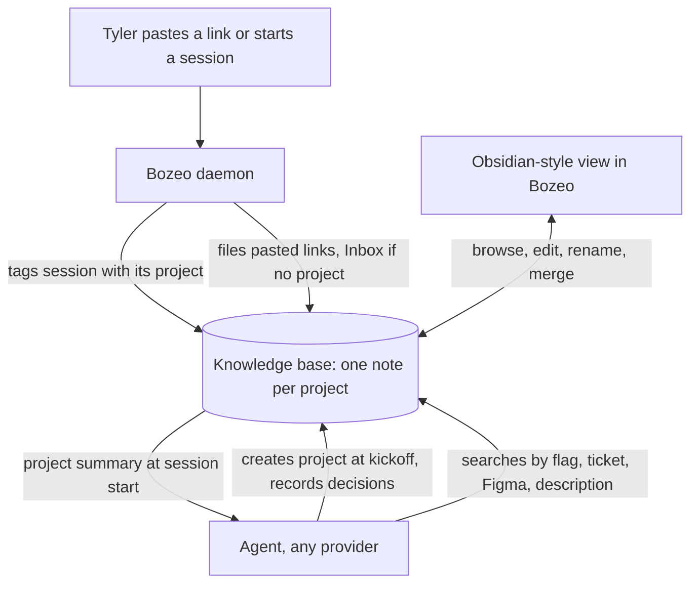
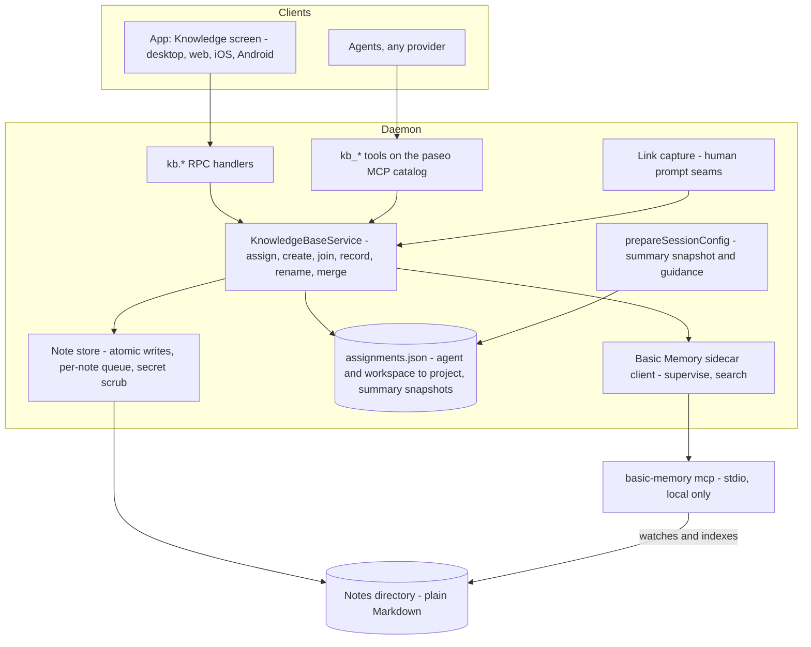
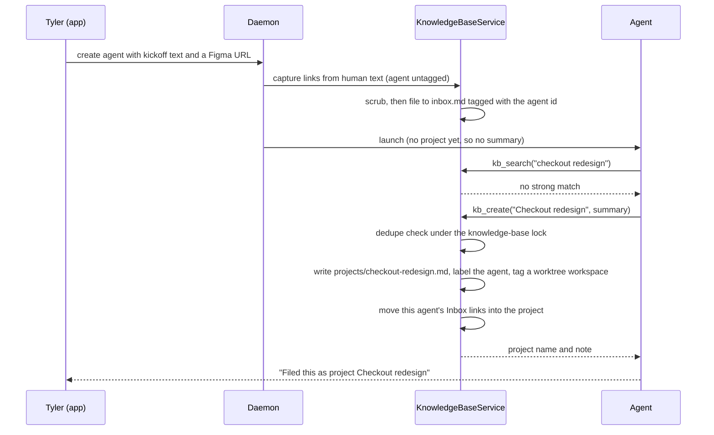
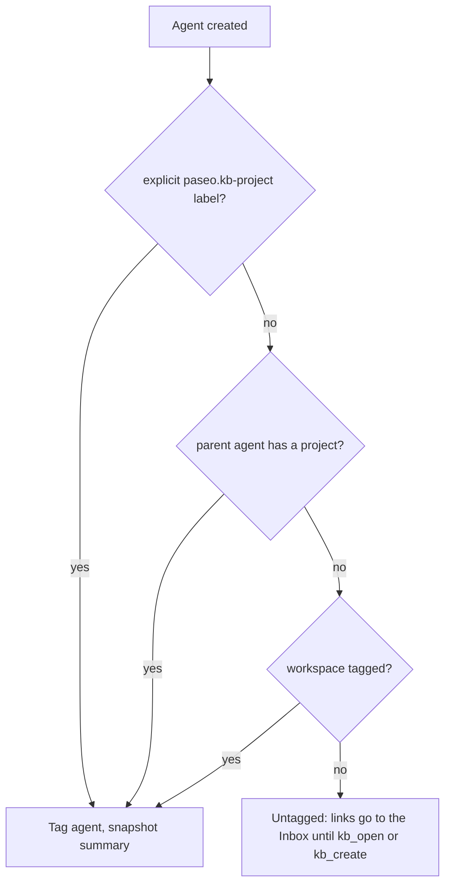
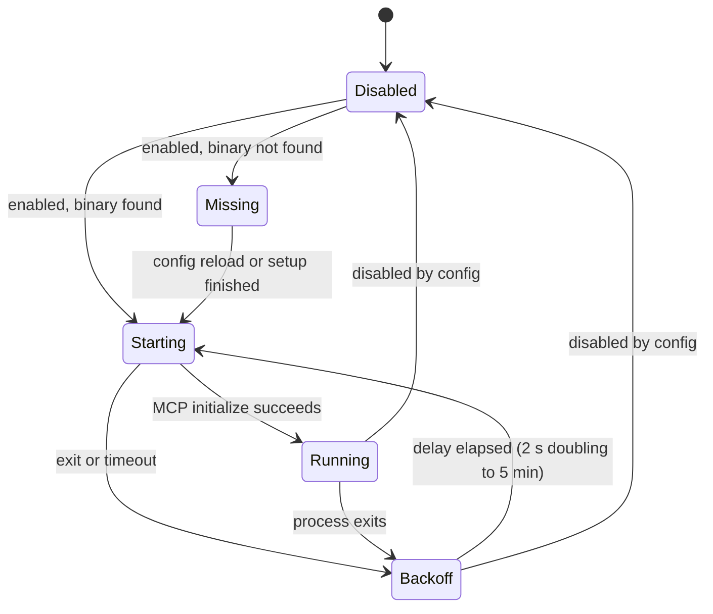

# Project Knowledge Base - Plan

## Goal Capsule

- **Objective:** a fresh agent on any provider can pick up a project Tyler started earlier from a loose reference, with its links, decisions and status, so he stops re-pasting background into new sessions.
- **Product authority:** Tyler.
- **Target repo:** the fork `funkmastert/paseo`; PR base `multi-account-orchestrator`.
- **Execution profile:** Deep. Server units first (U1 to U7), then the app (U8, U9), then CLI, seeding and docs (U10). U2 and U4 can run in parallel once U1 lands, and U3 once U2 lands; U8 and U10 can run in parallel once U7 lands.
- **Stop conditions:** stop and report if Basic Memory cannot run as a separate local process on macOS or Windows, if local-only operation cannot be enforced, or if a change would need editing `~/.paseo/config.json` or restarting the live daemon on port 6767.
- **Tail ownership:** the calling pipeline (`lfg`) owns review, commit, push, PR and CI. The build ships the feature switched off; Tyler's config change, Basic Memory install and seeding run happen after it.
- **Open blockers:** none.

---

## Product Contract

Product Contract unchanged except three planning additions: Outstanding Questions point at the decisions that resolve them, Dependencies / Assumptions point at the units that verify them, and Scope Boundaries gains a Deferred to Follow-Up Work list.

### Summary

One local knowledge base, built on Basic Memory (Markdown notes plus a knowledge graph), where every project Tyler kicks off becomes a note holding its links, decisions and status.
Bozeo does the filing: it tags each session with its project and files every link Tyler pastes, while agents record decisions.
Tyler browses and edits it in an Obsidian-style view inside Bozeo, and none of it leaves his Mac.

### Problem Frame

Tyler starts many agent sessions a day across several initiatives, and each new session starts without the background: the Figma file, the tickets, what was decided, what is in flight.
He either re-pastes links and explains again, or the agent digs through repos and history until it finds the context, which costs time and tokens every session.
The memory that exists today does not close the gap. Claude Code's auto memory is per repository and holds only what Claude chose to save, so links Tyler pasted are often missing. Codex and other providers never see it. Tyler's initiatives cross repos (on-site recording touches the mobile app and the backend).
He refers back to them loosely: "remember the project where we did this", a feature flag, a ticket.

### Actors

- A1. Tyler: kicks off projects, pastes links, refers back to projects loosely, edits notes.
- A2. Agents: any provider Bozeo runs (Claude, Codex and others). They create projects at kickoff, look them up, and record decisions.
- A3. Bozeo daemon: does the filing that needs no judgment. It tags sessions with their project, files pasted links, and hands a project's note to agents started on it.

### Key Decisions

- **Basic Memory is the store.** Plain Markdown that agents and Tyler both edit, indexed into a knowledge graph and reachable by any agent as an MCP server. (session-settled: user-directed — chosen over Graphiti's temporal graph, extending Claude Code's built-in memory, and Mem0/Letta/Cognee: an existing, maintained tool that matches "Markdown files per project" and works for every provider.)
- **A project is an initiative, not a repo.** It is what Tyler starts with an agent, typically with a Figma link and a brainstorm, and it can span repos. (session-settled: user-directed — chosen over one knowledge base per repo or per product: that is how Tyler thinks about and refers back to his work.)
- **One knowledge base holds every project.** A loose reference has to search all projects at once. (session-settled: user-approved — chosen over one base per repo: projects cross repos.)
- **Bozeo is the librarian.** Bozeo files links and tags projects itself, and agents write only decisions and rules. (session-settled: user-directed — chosen over agents doing all the writing, and over recalling from raw agent history: a link pasted into a busy session must not depend on that agent remembering it.)
- **Agents keep it current, and create projects on their own.** No approval step. (session-settled: user-directed — chosen over Tyler curating and over agents proposing changes for approval, and over asking before creating a project: lowest effort for Tyler.)
- **Recall comes first.** The first version must reliably find a project from a loose reference and return its links and decisions; status may lag. (session-settled: user-directed — chosen over always-current status with weaker recall.)
- **An Obsidian-style view lives inside Bozeo.** (session-settled: user-directed — chosen over using the Obsidian app alone, and over having no view.)
- **Seed the projects that are active now.** Without it, "the project where we did X" fails for everything before launch. (session-settled: user-approved — proposed at scope confirmation; Tyler confirmed.)
- **Local only.** Company (Wonderly) links and decisions stay on the Mac. (session-settled: user-approved — confirmed with the scope.)

### Requirements

**Projects and recall**

- R1. A project is an initiative Tyler starts with an agent; it may span several repos.
- R2. When an agent sees a project-shaped kickoff, it creates the project, names it, and tells Tyler the name in its reply.
- R3. Before creating a project, the agent looks for an existing match and joins it instead of creating a duplicate.
- R4. A fresh agent with no context finds a project from a loose reference: a description, a feature flag, a ticket, a Figma file or a PR.
- R5. All projects live in one knowledge base, so a loose reference searches every project.

**What a project holds**

- R6. Links: the Figma files, tickets, PRs, dashboards, docs and threads tied to the project.
- R7. Decisions and rules: what was decided and why, conventions, and things not to do.
- R8. Where work stands: what is in flight, shipped or blocked, and which agents, branches, PRs and worktrees belong to it. In the first version this may lag.
- R9. Credentials, tokens and keys are never written into the knowledge base.

**Bozeo does the filing**

- R10. Bozeo tags every agent and workspace with the project it belongs to.
- R11. Every link Tyler pastes into a session is filed into that session's project without depending on the agent.
- R12. A session that is not clearly part of a project files its links to an Inbox instead of guessing.
- R13. An agent started on a project begins with that project's note available, without Tyler pasting anything.
- R14. Agents record decisions and rules as they are made.
- R15. Every provider Bozeo runs can read and write the knowledge base.
- R16. Starting a session adds at most a short project summary to the agent's context; detail is read on demand.

**Viewing and editing**

- R17. Bozeo has an Obsidian-style view of the knowledge base: browse projects, read and edit notes, follow links between notes, and see the graph.
- R18. The view works on desktop and on the phone.
- R19. Tyler can rename and merge projects in the view.
- R20. The notes stay plain Markdown that the Obsidian app on the Mac can open.

**Storage and launch**

- R21. The knowledge base is stored locally; nothing syncs to a cloud service.
- R22. At launch, the projects active now are seeded from existing material: on-site recording v3, Yonderly files, the polish splits, and Bozeo itself.
- R23. It works on macOS and Windows.

### Key Flows

- F1. Kickoff
  - **Trigger:** Tyler starts an agent on something new, typically with a Figma link and a brainstorm.
  - **Actors:** A1, A2, A3
  - **Steps:** The agent looks for an existing matching project; finding none, it creates one, names it and tells Tyler. Bozeo tags the session with the project and files the Figma link into it.
  - **Covered by:** R2, R3, R10, R11
- F2. Recall
  - **Trigger:** A fresh agent hears "remember the project where we did X", a flag, or a ticket.
  - **Actors:** A1, A2, A3
  - **Steps:** The agent searches the knowledge base, opens the matching project and works from its links and decisions. Bozeo tags the session with that project from then on.
  - **Covered by:** R4, R5, R10, R13
- F3. Ongoing work
  - **Trigger:** Any session on a project.
  - **Actors:** A1, A2, A3
  - **Steps:** Links Tyler pastes are filed by Bozeo. Agents write decisions and rules as they happen. Tyler reads and edits in the view.
  - **Covered by:** R11, R12, R14, R17, R19

### Acceptance Examples

- AE1. **Covers R4, R5.** Given the on-site recording v3 project exists with its feature flag recorded, when Tyler tells a fresh agent in the backend repo "remember the project with that flag" and names it, the agent opens that project and lists its Figma link and key decisions without asking Tyler for them.
- AE2. **Covers R11, R12.** Given Tyler pastes a Figma link into a session tagged with project X, the link appears in X's note; pasted into a session with no project, it lands in the Inbox.
- AE3. **Covers R2, R3.** Given an iOS agent and an Android agent both receive the kickoff of the same feature, the knowledge base ends up with one project, not two.
- AE4. **Covers R9.** Given a message Tyler pastes contains an API token next to a link, the link is filed and the token is not.

### Success Criteria

- For any project in the knowledge base, Tyler no longer pastes its links or background into a new session.
- Given a loose reference like AE1, a fresh agent finds the right project in its first few tool calls.

### Scope Boundaries

**Deferred for later**

- Status kept current from what Bozeo already knows about agents, branches and PRs (step two).
- Setup and access details: repos, accounts, servers, devices and commands.
- Importing or replacing Claude Code's auto memory and the CLAUDE.md files; they keep doing what they do.

**Outside this product's identity**

- Embedding the real Obsidian app in Bozeo.
- Syncing the knowledge base to other machines or a cloud service.
- A temporal knowledge graph (Graphiti/Zep) or a vector-memory service (Mem0).

**Deferred to Follow-Up Work**

- A token-audit item that measures the session summary and the knowledge-base tool definitions (`docs/token-audit.md`, "Adding an item"). This plan caps the summary by length instead.
- An Inbox triage control in the view (move one link to a project with a tap). In this version Tyler edits the Inbox note, and a session's Inbox links move automatically when it joins a project.
- Filing links that agents produce (PRs they open, URLs they print). Agents record those with `kb_record` instead.
- Live push updates in the view. The view refetches on focus, after its own writes, and on a short interval while open.
- Showing and changing a session's or workspace's project from the app (for a worktree reused for another initiative). In this version the agent switches with `kb_open`.
- A "start an agent on this project" action in the view.

### Dependencies / Assumptions

- Basic Memory (Python, AGPL-3.0) runs as its own local process that Bozeo talks to and does not modify or redistribute; planning confirms the license has no effect on the fork. See KTD-1.
- Basic Memory's search, run locally, can resolve a loose description or a flag name to the right project; planning verifies this on real projects. U4 verifies it on a scratch knowledge base modelled on real projects with fake values; the seeding run (U10) repeats the check on Tyler's real projects.
- Claude Code's auto memory is per repository and shared across worktrees (its documentation), so per-repo learnings already have a home and are not this feature's job.

### Outstanding Questions

**Deferred to Planning (resolved)**

- How Bozeo decides which project a new session belongs to when it is not obvious: resolved by KTD-7 (deterministic resolution, no JEV call).
- Where the view sits in the app and how it looks on the phone: resolved by KTD-11.
- What counts as a link to file, and whether links agents produce are filed too: resolved by KTD-8.
- How Basic Memory is installed and kept running on macOS and Windows: resolved by KTD-3 and KTD-4.
- How much existing material the seed reads, and how its notes are checked: resolved by KTD-13.

### Sources / Research

- Claude Code memory documentation: auto memory is per repository, shared across worktrees, and loads the first 200 lines or 25 KB of its index per session (https://code.claude.com/docs/en/memory).
- Basic Memory: Markdown notes indexed into a local knowledge graph, separate projects, Obsidian-compatible, MCP server; about 3.4k GitHub stars, last release June 2026 (https://docs.basicmemory.com/start-here/what-is-basic-memory).
- Graphiti MCP server, the main knowledge-graph alternative considered (https://docs.falkordb.com/agentic-memory/graphiti-mcp-server.html).
- Mem0, Letta, Zep and Cognee comparison (https://mcp.directory/blog/mem0-vs-letta-vs-zep-vs-cognee-2026).
- `docs/token-audit.md`: how memory and system-prompt tokens are counted per session, relevant to R16.

---

## Planning Contract

### Key Technical Decisions

- KTD-1. **Basic Memory runs as a separate local process, installed by Tyler with `uv`, and Bozeo talks to it only by running its command line (`project add`, `--version`, `mcp`) and speaking MCP over stdio.** Bozeo neither vendors, imports, modifies, links nor redistributes Basic Memory, so AGPL-3.0 obligations attach to Basic Memory alone and the fork's license is unaffected: Bozeo is a separate program communicating at arm's length, and the AGPL network clause applies only to modified versions offered to others. The repo carries no Basic Memory code, only the command line that starts it. (session-settled: user-directed — chosen over vendoring or forking Basic Memory into the repo: keeps the fork's license unaffected.)
- KTD-2. **The daemon is the only writer of note files in Bozeo's own flows; Basic Memory indexes the directory and serves search.** Filing, agent writes, Tyler's edits in the view, rename and merge all go through one daemon write path (atomic write, per-note queue, secret scrub). Basic Memory watches the directory (`index_changes`, 1 s debounce) and answers `search_notes`; backlinks and the graph come from the daemon's own wiki-link scan. This keeps link filing working when Basic Memory is down (R11 does not depend on Python being up), puts the R9 scrub at one choke point for everything Bozeo writes, and lets filing and view tests run without Python. The Obsidian app can still edit the files, so every daemon write checks `modifiedAt` and preserves content it does not own; Basic Memory's frontmatter write-back is switched off (KTD-3) so it never writes. The notes stay in Basic Memory's format (frontmatter, `- [category] text` observations, `[[wiki links]]`), so Basic Memory remains the store's format, index and graph.
- KTD-3. **Basic Memory is a daemon-supervised stdio sidecar with an isolated config directory and cloud features forced off.** The daemon resolves the binary with `findExecutable` (or the `knowledgeBase.basicMemory.command` override), starts `basic-memory mcp --project <name>` through the MCP SDK's stdio client, restarts it with the gateway's backoff (2 s doubling to 5 min, reset after 60 s up), records it in the managed-process ledger, and stops it on shutdown. Its environment sets `BASIC_MEMORY_CONFIG_DIR` to a directory inside the knowledge base, `BASIC_MEMORY_FORCE_LOCAL=true`, `BASIC_MEMORY_CLOUD_MODE=false`, `BASIC_MEMORY_AUTO_UPDATE=false`, `BASIC_MEMORY_NO_PROMOS=true` and `BASIC_MEMORY_ENSURE_FRONTMATTER_ON_SYNC=false`. Stdio needs no port, so nothing binds to `0.0.0.0` (the HTTP transport's default host), and the daemon is the sole client. (session-settled: user-directed — chosen over Basic Memory cloud sync: company links and decisions stay on the Mac.)
- KTD-4. **Install is `uv tool install` of a pinned Basic Memory version, driven by `paseo kb setup`, never by the daemon.** The CLI finds `uv`, prints the per-OS install line when it is missing (Homebrew or the official script on macOS, `winget install astral-sh.uv` on Windows), installs the pinned version, and prints the config block to add. The daemon never installs software. `uv` manages its own Python, which removes the system-Python difference between macOS and Windows. The pin starts at the current release (0.23.2) and moves deliberately.
- KTD-5. **Agents reach the knowledge base through four tools on the `paseo` MCP catalog, not through Basic Memory's own MCP server.** The `paseo` catalog already reaches every provider (Claude, Codex, OpenCode, Pi with its adapter, Copilot over ACP, and in-process for OpenCode's bridge), while gateway-brokered servers reach Claude only (`clientAcceptsMcpGatewayServers`). Four tools (`kb_search`, `kb_open`, `kb_create`, `kb_record`) cost far fewer prompt tokens than Basic Memory's twenty, and wrapping them lets the daemon tag the caller (R10), refile its Inbox links, dedupe creates (R3) and scrub secrets (R9). The tools register only while the knowledge base is enabled. This still meets the Product Contract's "reachable by any agent": every provider reaches Basic Memory's index, through Bozeo.
- KTD-6. **A project is one note at `projects/<slug>.md` with fixed sections; the Inbox is one note at `inbox.md`.** Frontmatter carries `title`, `type: project`, `permalink`, `tags`, `aliases` and `created`. Sections are `## Summary`, `## Links`, `## Decisions`, `## Rules`, `## Status`, `## Sessions` and `## Related`. Entries are Basic Memory observations (`- [figma] <url> (2026-10-07)`, `- [decision] <text> — <why>`), so Basic Memory indexes each one and a flag name, ticket key or Figma URL is searchable (R4). The daemon preserves frontmatter keys and sections it does not own, so Tyler's Obsidian edits survive (R20).
- KTD-7. **A session's project is resolved deterministically, never by a model call.** At create, the first match wins: an explicit `paseo.kb-project` label, the parent agent's project, then the workspace's project. During a session the agent joins by calling `kb_open` or `kb_create`. With no match the session stays untagged and its links go to the Inbox (R12). A JEV call was considered and rejected: JEV is a hosted service, so sending a kickoff message and project names to it breaks local-only, and R12 prefers the Inbox to a guess.
- KTD-8. **The daemon files every `http(s)` URL in human-typed prompt text, and nothing else.** Human text is the app's send path and the app's create-with-initial-prompt path (`session.ts` beside `recordHumanPrompt`, and `create-agent/create.ts`). Agent-to-agent prompts are skipped: those links were Tyler's in the parent's session and were filed there. Links agents produce are recorded by agents with `kb_record` (deferred filing noted in Scope Boundaries). Loopback, private-network and `file:` URLs are skipped as noise. A link already present in the target note is not filed twice.
- KTD-9. **URL extraction and every pattern on agent or prompt text is linear.** Extraction is one global match of `https?://` followed by a single negated character class with no nested or optional-inside-repeated quantifier; trailing punctuation is trimmed by a loop, not a regex; wiki-link parsing is one bounded negated class between `[[` and `]]`. Each pattern gets a hostile-input timing test (640 KB under 100 ms), the convention from `docs/jev.md` and the 2026-10-06 freeze fixed in `71f9c9bfa`. (session-settled: user-directed — chosen over backtracking regexes: one froze the daemon on 2026-10-06.)
- KTD-10. **Secrets are scrubbed at the daemon's single write path.** A URL loses its userinfo and any query parameter whose name is secret-shaped (`token`, `key`, `secret`, `sig`, `signature`, `password`, `auth`, `code`, `X-Amz-*`); a URL still containing a token afterwards is dropped. Free text (agent records, Tyler's edits, summaries) has every token-shaped span replaced with `[redacted]`, using the token patterns from `agent/snapshot-secret-filter.ts` exported as a shared list. A write reports how many spans it removed, so the view can tell Tyler. Only URLs are filed from prompts, so a token pasted beside a link is never read into the note (AE4).
- KTD-11. **The view is a global, host-level Knowledge screen, reached from a sidebar row and the Command Center.** It follows the `/schedules` and `/jev` route pattern with separate list and detail routes (`docs/expo-router.md`), the JEV dashboard's host selection, and the Settings screen's split on desktop and push on phone. Row actions open from a header menu or long-press sheet, never on hover (`docs/hover.md`). Reading uses the file pane's Markdown preview (front matter as a table) with a `[[wiki link]]` rule, and shows `- [category] text` observations as a category tag before the text. Editing edits the whole file and reuses the file-pane editor model with autosave suspended: Tyler saves explicitly, a conflict offers Reload and Overwrite while keeping his draft, and the scrubbed text the daemon returns becomes the saved state. The editor view is a multiline `EditingTextInput` on native, where the CodeMirror view does not run. The screen needs only the feature to be enabled; the sidecar's state shows as a banner, because reading and editing do not depend on it.
- KTD-12. **App RPCs live under a new `kb.*` namespace, gated once on `server_info.features.knowledgeBase`.** The names follow `docs/rpc-namespacing.md` (`kb.notes.list.request` pairs with `kb.notes.list.response`), so they cannot clash with the existing repo-project RPCs (`project.list`, `project.rename`). Every new field is optional, the flag carries a `COMPAT(knowledgeBase)` tag, and the app shows "update the host" when the flag is absent. Reads need `workspace.read` and writes need `workspace.write`, the tier `docs/permissions.md` assigns to project and file content; `daemon.read` covers diagnostics and must not widen to note content. (session-settled: user-directed — chosen over unconditional new RPCs and fallback paths: app and daemon versions drift.)
- KTD-13. **Seeding is a command that starts one seed agent per named project; the run happens after the build, on Tyler's live daemon.** `paseo kb seed "<project name>" [--hint ...]` creates a standard-class agent with a fixed seed brief. The agent reads a bounded set of sources (the matching repos' `docs/plans` and auto-memory files, `~/bozeo-ops` briefs and state, and Bozeo agent history found through the `paseo` tools), files what it finds through the same `kb_*` tools (so R9 applies), cites a source on every entry, and ends with a recall self-check: a fresh `kb_search` on a loose reference must return the project. Project names are arguments, not code, so no Wonderly initiative names land in the repo. Tyler checks the result in the view.
- KTD-14. **The feature ships switched off under a new `knowledgeBase` config section, read leniently and reloadable.** Keys ship in code before Tyler sets any, the section joins `RELOADABLE_PATHS` so switching it on starts the sidecar without a restart, and it is added to `MACHINE_JOBS_OFF` for scratch daemons. The build never edits `~/.paseo/config.json` and never restarts the daemon on 6767. (session-settled: user-directed — chosen over editing the live config or restarting the daemon during the build: an unrecognised key makes the running daemon reject the whole file.)
- KTD-15. **The session-start summary is a capped snapshot taken once, at create, and kept stable across relaunches.** When KTD-7 resolves a project at create, the daemon builds a summary from the note (title, the `## Summary` paragraph, counts of links and decisions, and an instruction to call `kb_open` for detail), capped at 800 characters, stores it with the agent's assignment, and appends it on every launch through `prepareSessionConfig` beside `applyDaemonAppendSystemPrompt`. A stored snapshot keeps the system prompt identical across resume and reload, so the prompt cache survives. An agent that joins mid-session gets the note in the tool result instead and its system prompt is not changed. Copilot over ACP reads neither system-prompt field, so for it the snapshot rides on the first prompt through the prompt interceptor, chained after refocus rather than replacing it.
- KTD-16. **Agents learn when to use the tools from a short static guidance block plus the tool descriptions.** One fixed paragraph (under 120 tokens) goes into every agent's appended system prompt while the knowledge base is enabled: at a project-shaped kickoff call `kb_search` then `kb_open` or `kb_create`, tell Tyler the project name, and record decisions with `kb_record`. The text never varies per agent, so it costs no cache. Copilot gets the same guidance through the tool descriptions.
- KTD-17. **Platform parity holds on both axes.** (session-settled: user-directed — chosen over a Mac-only or desktop-only build: platform parity is non-optional.) The daemon side resolves executables and paths with the existing cross-platform helpers (`findExecutable`, `spawnProcess`, `terminateWithTreeKill`, `path` APIs) and is tested on the Windows CI job. The view runs on desktop, web, iOS and Android with no hover-only behaviour.

### High-Level Technical Design

Component boundaries. The daemon owns every write; Basic Memory is a read-side index the daemon talks to over stdio.

Kickoff with a pasted Figma link, the path AE2 and F1 depend on. The link is filed before the agent has a project, so it lands in the Inbox and moves when the agent creates the project.

Project resolution at agent create (KTD-7).

Sidecar lifecycle (KTD-3).

Dedupe on `kb_create` (R3, AE3), under one knowledge-base lock:

1. A `figma`, `ticket` or `pr` link the caller's session filed already sits in exactly one existing project: join it. A shared design file or ticket is the strongest same-initiative signal, and it is what AE3's two platform agents have in common.
2. A project's normalized title or alias equals the new title's (lowercased, punctuation and platform words such as iOS, Android, web, desktop and app removed): return it as a candidate and create nothing.
3. Basic Memory's hybrid search on the title and summary returns projects scoring at or above 0.6 (a code constant, calibrated in the U4 smoke run): return the top three as candidates and create nothing.
4. Otherwise create.

On candidates the agent either opens one or repeats the call with `confirmNew: true`, which skips rules 2 and 3. Shared parentage alone never joins: parents fan out unrelated work, and a child of a parent that has a project already inherits it at create (KTD-7).

### Assumptions

These are planning bets, not confirmed by Tyler.

- The knowledge-base entity is called "project" inside the Knowledge screen and in agent replies, and "knowledge project" in the glossary and code, to keep it apart from the existing repo-root **Project**.
- The default notes directory is `<PASEO_HOME>/knowledge`, configurable with `knowledgeBase.notesDir`. Scratch daemons then get their own knowledge base for free; Tyler can point it at a folder he opens in Obsidian.
- A workspace is tagged only when it is a `worktree` and has no tag yet. Local checkouts and plain directories host many initiatives, so tagging them would mis-file links.
- When an agent joins, the daemon appends one `## Sessions` line (agent title, provider, branch). That is the R8 "which agents and branches" record for this version; the status text itself is agent-written and may lag.
- Basic Memory's semantic search stays on. Its first use downloads a small embedding model from Hugging Face; that is an inbound download, and no note content leaves the machine. `knowledgeBase.basicMemory.semanticSearch: false` turns it off.
- When Basic Memory is missing or down, `kb_search` returns an error that names the cause plus the list of project titles, so an agent can still pick one. Filing, opening, creating, recording and the view keep working.
- The pinned Basic Memory version installs with `--prerelease=allow`, as its README specifies (its MCP SDK dependency is a pre-release). U4 confirms this.
- R13 is met at create when a label, the parent or a tagged worktree names the project. A session Tyler starts on an existing project any other way gets the note on its first `kb_open`, which F2 already describes; a "start an agent on this project" action in the view is follow-up work.
- The graph shows every note (projects, the Inbox and other notes, styled by type). Tyler creates notes in Obsidian or through agents; the view does not create notes in this version.

### Implementation Constraints

- Never restart, stop or reconfigure the daemon on port 6767, and never edit `~/.paseo/config.json`. Test against scratch daemons (`docs/ad-hoc-daemon-testing.md`): `env -i`, a pinned `PASEO_HOST`, jobs off, never the built-in `claude` provider.
- Install Basic Memory and `uv` for development into scratch directories only (`UV_INSTALL_DIR`, `UV_TOOL_DIR`, `UV_TOOL_BIN_DIR` pointed under a scratch root, with no PATH changes), and point Basic Memory at a scratch notes directory.
- No real email address, account id, hostname or token in code, tests, docs or commits. Fixtures use values like `someone@example.com` and `fake-figma-key-do-not-use`.
- Heavy steps (`build:*`, workspace typecheck, vitest, Metro, scratch daemons) run through `~/bozeo-ops/cpu-policing/heavy.sh`, at most two at once; vitest always with `--maxWorkers=2`, only the affected files.

### System-Wide Impact

- **Every agent's prompt.** While enabled, every agent gets four tool definitions and the guidance paragraph, and tagged agents get the summary snapshot. Switching the feature on changes running agents' system prompts at their next launch, one prompt-cache rebuild each; after that the text is stable (KTD-15, KTD-16).
- **Agent create flow.** Project resolution runs after labels are final (including the pool plugin's `before("agent.create")` hooks) and before the first launch, or the snapshot misses the first system prompt. It must not fail a create: any error leaves the agent untagged and is logged.
- **Account failover.** A move keeps the agent id and labels, so nothing changes. An import mints a successor with the predecessor's labels; because the successor arrives with an explicit `paseo.kb-project` label, KTD-7 rule 1 resolves it at create and builds a fresh snapshot (an import already rebuilds the prompt cache).
- **Restart recovery.** Snapshots and workspace tags are on disk, so resumed agents get the same snapshot. The sidecar restarts with the daemon; searches before it is `running` return `search_unavailable`.
- **Archive.** Archiving an agent or workspace leaves its snapshot, its tag and the note's `## Sessions` line in place as history.
- **Permissions and the phone.** The phone reaches the knowledge base over the relay through `kb.*` RPCs with the same `workspace.read` and `workspace.write` checks as other project content.
- **Prompt injection.** Notes feed future agents' context, so an agent may write only into a project it has joined or created this session (U6); editing any other note is Tyler's, through the view or Obsidian.
- **Scratch daemons and tests.** The section is off by default and in `MACHINE_JOBS_OFF`, so no scratch or test daemon starts Basic Memory unless a test asks for it.

---

## Implementation Units

### Unit Index

| U-ID | Title                                         | Key files                                                                                                                                           | Depends on |
| ---- | --------------------------------------------- | --------------------------------------------------------------------------------------------------------------------------------------------------- | ---------- |
| U1   | Config section, feature flag, label           | `packages/server/src/server/persisted-config.ts`, `packages/protocol/src/messages.ts`, `packages/protocol/src/agent-labels.ts`                      | none       |
| U2   | Note format and note store                    | `packages/server/src/server/knowledge-base/note-format.ts`, `note-store.ts`, `scrub.ts`                                                             | U1         |
| U3   | Link capture                                  | `packages/server/src/server/knowledge-base/link-capture.ts`, `packages/server/src/server/session.ts`                                                | U2         |
| U4   | Basic Memory sidecar and search client        | `packages/server/src/server/knowledge-base/basic-memory-sidecar.ts`                                                                                 | U1         |
| U5   | Knowledge base service and project assignment | `packages/server/src/server/knowledge-base/service.ts`, `assignments.ts`                                                                            | U2, U3, U4 |
| U6   | Agent tools, guidance and session summary     | `packages/server/src/server/agent/tools/knowledge-base-tools.ts`, `agent-manager.ts`                                                                | U5         |
| U7   | `kb.*` RPCs and client methods                | `packages/protocol/src/knowledge-base/rpc-schemas.ts`, `packages/server/src/server/session/knowledge-base/`, `packages/client/src/daemon-client.ts` | U5         |
| U8   | Knowledge screen: browse, read, edit, search  | `packages/app/src/knowledge-base/`, `packages/app/src/app/knowledge/`                                                                               | U7         |
| U9   | Graph, rename and merge in the view           | `packages/app/src/knowledge-base/graph/`, rename and merge sheets                                                                                   | U8         |
| U10  | Setup and seed commands, doctor check, docs   | `packages/cli/src/commands/kb/`, `packages/server/src/server/session/doctor/knowledge-base.ts`, `docs/knowledge-base.md`                            | U4, U6, U7 |

### U1. Config section, feature flag, label

**Goal:** the daemon accepts a `knowledgeBase` config section (off by default), advertises the feature, and has a label for an agent's project.

**Requirements:** R21, R23; KTD-12, KTD-14.

**Dependencies:** none.

**Files:**

- Modify `packages/server/src/server/persisted-config.ts` (new `KnowledgeBaseConfigSchema`: `enabled`, `notesDir`, `basicMemory { command, semanticSearch }`). The version pin, the Basic Memory project name and the 800-character summary cap are code constants.
- Create `packages/server/src/server/knowledge-base/config.ts` (lenient resolver with defaults, the JEV pattern in `jev/config.ts`).
- Modify `packages/server/src/server/daemon-config-store.ts` (`RELOADABLE_PATHS`).
- Modify `packages/protocol/src/messages.ts` and `packages/server/src/server/websocket-server.ts` (`features.knowledgeBase`, `COMPAT(knowledgeBase)` tag).
- Modify `packages/protocol/src/agent-labels.ts` (`KB_PROJECT_LABEL = "paseo.kb-project"`).
- Modify `scripts/install-instance.mjs` (`MACHINE_JOBS_OFF` gets `knowledgeBase.enabled: false`).
- Test: `packages/server/src/server/knowledge-base/config.test.ts`, `packages/server/src/server/bootstrap.smoke.test.ts`.

**Approach:** every field optional; the resolver supplies defaults (`enabled: false`, `notesDir: <PASEO_HOME>/knowledge`, `basicMemory.semanticSearch: true`, command resolved from PATH). A malformed section disables the feature with a logged reason instead of rejecting the whole config, following the `agents.jev` union. The feature flag is advertised whenever the daemon has the code, so the app can show setup state even when the section is off.

**Patterns to follow:** `AgentRemediationSchema` registration in `persisted-config.ts`; `jev/config.ts` lenient resolution; the usage-history feature flag in `websocket-server.ts`.

**Test scenarios:**

- Absent section resolves to disabled with the documented defaults.
- `{ enabled: true }` alone resolves `notesDir` under the given `PASEO_HOME` with semantic search on.
- A wrong-typed `notesDir` leaves the rest of the config loading and resolves the feature disabled with a reason.
- An unknown key inside `knowledgeBase` is reported and disables only this feature.
- Bootstrap smoke config with the new section boots.

**Verification:** server typecheck passes; a scratch daemon with the section absent behaves as today, and `server_info.features.knowledgeBase` is true.

### U2. Note format and note store

**Goal:** a pure note model in Basic Memory's format and a file store that is the daemon's single write path.

**Requirements:** R5, R6, R7, R8, R9, R20; KTD-2, KTD-6, KTD-9, KTD-10.

**Dependencies:** U1.

**Files:**

- Create `packages/server/src/server/knowledge-base/note-format.ts` (parse and serialize frontmatter and sections, slug and permalink, add an observation under a section with dedupe, wiki-link extraction, rewrite `[[Old]]` to `[[New]]`, merge two project notes).
- Create `packages/server/src/server/knowledge-base/note-store.ts` (list, read with `modifiedAt`, write with `expectedModifiedAt` conflict check, move, delete; atomic temp-file-and-rename writes; a per-note promise queue; Inbox note creation).
- Create `packages/server/src/server/knowledge-base/scrub.ts` (URL scrub and text scrub with a removed-span count).
- Modify `packages/server/src/server/agent/snapshot-secret-filter.ts` (export the token pattern list, behaviour unchanged).
- Test: `note-format.test.ts`, `note-store.test.ts`, `scrub.test.ts` beside the sources.

**Approach:** keep `note-format.ts` free of I/O so the rename and merge logic is testable on strings. Serialization preserves unknown frontmatter keys, unknown sections and their order, and the body's line endings. A project note created by the daemon carries full frontmatter (`title`, `type: project`, `permalink`, `tags: [project]`, `aliases: []`, `created`), so Basic Memory has nothing to add. Every write passes text through `scrub.ts` first. Paths use `path.join` and reject anything that resolves outside the notes directory.

**Execution note:** write the format tests first; rename and merge are where silent data loss would hide.

**Patterns to follow:** atomic writes in `docs/data-model.md`; the linear-regex timing test in `agent/device-install-commands.test.ts`.

**Test scenarios:**

- Round trip: parse then serialize an Obsidian-edited note (extra frontmatter key, a section the daemon does not own, CRLF line endings) and get identical bytes.
- Adding a `[figma]` link already present under `## Links` leaves the note unchanged.
- Adding a decision to a note with no `## Decisions` section creates the section in the canonical order.
- Wiki links: `[[A]]`, `[[A|alias]]` and `[[A#heading]]` resolve to target `A`; an unclosed `[[` yields nothing.
- Wiki-link parse and URL scrub each finish in under 100 ms on 640 KB of hostile input (`[[[[…`, a URL with no spaces).
- Rename rewrites `[[Old]]`, `[[Old|x]]` and `[[Old#h]]` in other notes and adds `Old` to the renamed note's `aliases`.
- Merge B into A: union of links without duplicates, decisions and rules concatenated with a `(from B)` marker, B's title in A's aliases, B's file removed, links to B rewritten to A.
- Covers AE4. Scrub: a URL with `?token=fake-...&id=7` keeps `id=7` and drops the token; `https://user:pw@host/x` loses userinfo; a URL containing a GitHub-token-shaped path segment is dropped.
- Text scrub replaces a fake `sk-ant-` key and a fake JWT with `[redacted]` and reports 2.
- A write with a stale `expectedModifiedAt` fails with a conflict and leaves the file untouched.
- Two concurrent writes to one note apply in order; neither is lost.
- A note path of `../x` is rejected.

**Verification:** the format and store tests pass on macOS and the Windows CI job; a written note opens cleanly in a Markdown viewer.

### U3. Link capture

**Goal:** every URL Tyler types into a session is filed to the session's project, or to the Inbox.

**Requirements:** R11, R12, R9; AE2, AE4; KTD-8, KTD-9, KTD-10.

**Dependencies:** U2.

**Files:**

- Create `packages/server/src/server/knowledge-base/link-capture.ts` (extract URLs from prompt input, classify each, skip loopback, private and `file:` URLs).
- Modify `packages/server/src/server/session.ts` (call capture next to `recordHumanPrompt` on the app's send path).
- Modify `packages/server/src/server/agent/create-agent/create.ts` (call capture for an app-supplied initial prompt).
- Test: `packages/server/src/server/knowledge-base/link-capture.test.ts`.

**Approach:** extraction walks structured prompt input and reads only text parts. Classification is a host and path table with plain string checks: `figma.com` to `figma`; Linear, Jira and forge issue paths to `ticket`; forge pull and merge-request paths to `pr`; Slack to `thread`; Google Docs and Notion to `doc`; Grafana, Datadog and Sentry to `dashboard`; anything else to `link`. Capture takes a sink callback; U5 supplies the knowledge-base service as the real sink, which picks the target note. Capture never blocks the prompt: it runs after dispatch, and a failure is logged with the link kind and host only, never the raw URL.

**Patterns to follow:** trailing-punctuation trimming in `packages/app/src/git/forge-refs.ts`; prompt-input shapes in `agent/agent-prompt.ts`.

**Test scenarios:**

- `See https://www.figma.com/design/fake123/Checkout?node-id=1-2.` yields one `figma` link without the trailing period.
- A URL in parentheses or followed by `),` is trimmed correctly.
- `http://localhost:8081`, `http://127.0.0.1/x`, `http://192.168.1.4` and `file:///tmp/a` are skipped.
- Image and attachment parts are ignored.
- A prompt with a fake API token next to a Linear URL yields only the scrubbed Linear URL (Covers AE4).
- 640 KB of `http://` repeated with no whitespace finishes in under 100 ms.
- Integration: a human send through `session.ts` hands each URL to a recording stub sink; a `send_agent_prompt` from another agent hands none.
- A sink that throws is logged without the URL, and the prompt is still delivered.

**Verification:** with a recording stub sink, a human send through the session path hands the extracted URLs to the sink and an agent-to-agent prompt hands none. U5 owns the end-to-end check that the link lands in a note.

### U4. Basic Memory sidecar and search client

**Goal:** the daemon starts, supervises and queries a local Basic Memory over stdio, on macOS and Windows.

**Requirements:** R4, R21, R23; KTD-1, KTD-3, KTD-4.

**Dependencies:** U1.

**Files:**

- Create `packages/server/src/server/knowledge-base/basic-memory-sidecar.ts` (binary resolution, environment lockdown, project registration, stdio MCP client, backoff, status, shutdown).
- Create `packages/server/src/server/knowledge-base/basic-memory-client.ts` (`search` with `output_format: "json"`, result mapping, timeout).
- Modify `packages/server/src/server/bootstrap.ts` (construct, start after listen, stop on shutdown, react to config reload).
- Test: `basic-memory-sidecar.test.ts`, `basic-memory-client.test.ts`, and `packages/server/src/server/knowledge-base/test-support/fake-basic-memory.ts` (a stdio MCP server stub with `search_notes`).

**Approach:** on enable, resolve the command, then make sure the Basic Memory project exists by running `basic-memory project add <name> <notesDir>` against the isolated config directory before starting `mcp`, treating "already exists" as success. The spawn environment is built from the daemon's external-command environment plus the KTD-3 variables, so daemon secrets do not leak to the child. Startup waits for the MCP `initialize` handshake with a timeout long enough for a Python cold start and initial index (60 s). Status (`disabled`, `missing`, `starting`, `running`, `backoff`, the last two carrying the last stderr lines) feeds the status RPC and the doctor check; every start failure goes through `backoff`, as the lifecycle diagram shows. Search calls time out at 10 s and never take the knowledge-base lock.

**Execution note:** build against the fake stdio server for the tests, then do one real smoke run: install the pinned Basic Memory with a scratch `uv` into scratch directories, seed a scratch notes directory with three project notes modelled on real ones (fake values), and check that a flag name, a ticket key and a loose description each return the right project as the top result. The same run records the scores of related and unrelated projects to calibrate the 0.6 dedupe threshold, and confirms Basic Memory leaves the note files byte-identical after indexing.

**Patterns to follow:** `mcp-gateway/gateway.ts` local-server supervision and backoff; `agent/providers/opencode/server-manager.ts` for `findExecutable`, the managed-process ledger and tree-kill shutdown.

**Test scenarios:**

- Binary missing: status is `missing` with a setup hint, and nothing retries in a loop.
- The fake server starts, status reaches `running`, and `search("checkout")` maps JSON results to `{ permalink, title, score, snippet }`.
- The fake server exits: the next start waits 2 s, then 4 s; 60 s of uptime resets the delay.
- Disabling through a config reload stops the child and records `disabled`.
- The child environment contains `BASIC_MEMORY_CONFIG_DIR`, `BASIC_MEMORY_FORCE_LOCAL=true`, `BASIC_MEMORY_CLOUD_MODE=false`, `BASIC_MEMORY_AUTO_UPDATE=false` and `BASIC_MEMORY_ENSURE_FRONTMATTER_ON_SYNC=false`, and no daemon secret variables.
- `project add` reporting that the project already exists does not block the start.
- A search that exceeds the timeout returns a typed error, and the sidecar stays up.
- Windows: a `.exe` command path with spaces resolves and spawns without `shell: true` (Windows CI job).

**Verification:** the real smoke run on a scratch knowledge base returns the right project for the three reference kinds, and no process outlives a scratch daemon stop.

### U5. Knowledge base service and project assignment

**Goal:** one service that resolves and records which project each agent and workspace belongs to, and performs every create, join, record, file, rename and merge.

**Requirements:** R2, R3, R5, R8, R10, R12, R14; AE2, AE3; KTD-2, KTD-7, KTD-15.

**Dependencies:** U2, U3, U4.

**Files:**

- Create `packages/server/src/server/knowledge-base/service.ts` (`KnowledgeBaseService`).
- Create `packages/server/src/server/knowledge-base/assignments.ts` (Zod-validated JSON at `<notesDir>/.bozeo/assignments.json`: each agent's summary snapshot and each workspace's project). The agent's `paseo.kb-project` label is the source of truth for its project, and Inbox entries carry their agent id in the note itself, so the file holds only what has no other home.
- Create `packages/server/src/server/knowledge-base/summary.ts` (deterministic summary builder, capped).
- Modify `packages/server/src/server/bootstrap.ts` (construct and wire to agent creation, link capture and the sidecar).
- Modify the agent create flow at the point labels are final and before the first launch (`packages/server/src/server/agent/create-agent/`), to run project resolution.
- Test: `service.test.ts`, `assignments.test.ts`, `summary.test.ts`.

**Approach:** the service holds one async lock for creates, merges and renames; ordinary appends use the store's per-note queue. `resolveAtCreate(agent)` applies KTD-7 and, on a match, writes the label and builds the snapshot from the note. `join(agent, project)` writes the label, records the project in the agent's session write set (the projects `kb_record` may target), tags a `worktree` workspace that has no tag, appends a `## Sessions` line, and moves the agent's Inbox entries into the project. `fileLink(agent, link)` picks the agent's project or the Inbox (entries carry the agent id in their context so a later join can move them). `create` runs the dedupe sequence from the High-Level Technical Design and returns `{ project, created | joined | candidates, reason }`. Rename and merge go through `note-format.ts` and also rewrite agent labels and workspace tags that point at the old permalink.

**Execution note:** start with a failing test for AE3 (two concurrent creates from sibling agents with the same pasted Figma link) and one for the AE2 Inbox-to-project move.

**Patterns to follow:** `setLabels` on `AgentManager`; file-based JSON persistence in `docs/data-model.md`; `workspace-labels/internal/service.ts` for inspect-then-apply.

**Test scenarios:**

- Covers AE2. A link filed for an untagged agent lands in `inbox.md`; after the agent calls `create`, the link sits under the project's `## Links` and is gone from the Inbox.
- Covers AE2. A link filed for a tagged agent goes straight to that project.
- Covers AE3. Two agents call `create("Checkout redesign")` and `create("Checkout redesign (Android)")` concurrently after the same Figma link was filed for both: one project exists, and both agents are labelled with it.
- Covers AE3. Without a shared link, the second `create` with a title that normalizes to an existing project's returns that project as a candidate and creates nothing.
- Two siblings under one parent creating unrelated titles with no shared links get two projects.
- A child created by an agent with a project inherits the project and label, and gets a snapshot built from the note at create.
- An agent created in a tagged worktree inherits the workspace's project; one created in a local checkout does not.
- `create` with a Basic Memory match scoring 0.6 returns candidates and creates nothing; at 0.59 it creates; repeating with `confirmNew: true` creates.
- Basic Memory down: `create` still applies the link and title rules and then creates.
- Record: a decision with a fake token is stored with `[redacted]` and the call reports one removal.
- Rename updates the note, the inbound links, agent labels and the workspace tag.
- Merge moves B's links and decisions into A, relabels B's agents and removes B.
- The summary for a note with a long Summary section is at most 800 characters and names `kb_open`.
- Restarting the service reloads snapshots and workspace tags, and a corrupt `assignments.json` is moved aside and rebuilt empty with a logged warning; agents keep their projects through their labels.
- An imported successor that arrives with the predecessor's `paseo.kb-project` label gets its own snapshot at create.
- A resolution error during create leaves the agent untagged and the create succeeds.
- A filing write that hits a `modifiedAt` conflict (the file changed on disk) re-reads and retries once, and the link lands.

**Verification:** the service tests pass; on a scratch daemon, a created child agent carries `paseo.kb-project` from its parent.

### U6. Agent tools, guidance and session summary

**Goal:** every provider can search, open, create and record, and an agent started on a project begins with its summary.

**Requirements:** R2, R4, R13, R14, R15, R16; AE1; KTD-5, KTD-15, KTD-16.

**Dependencies:** U5.

**Files:**

- Create `packages/server/src/server/agent/tools/knowledge-base-tools.ts` (`registerKnowledgeBaseTools`).
- Modify `packages/server/src/server/agent/tools/paseo-tools.ts` (register only while enabled).
- Modify `packages/server/src/server/agent/agent-manager.ts` (`prepareSessionConfig`: append the stored snapshot and the static guidance beside `applyDaemonAppendSystemPrompt`).
- Modify `packages/server/src/server/bootstrap.ts` where the refocus interceptor is installed: compose one interceptor that runs refocus first and then the Copilot first-prompt summary on refocus's result, merging their `settle` callbacks so each settles independently.
- Modify `packages/server/src/server/bootstrap.ts` (tool host dependencies).
- Test: `knowledge-base-tools.test.ts`, plus a case in the existing `agent-manager` session-config tests.

**Approach:** tool contracts, directional:

- `kb_search(query)`: top results across all notes, each with title, permalink, type and a one-line snippet; on sidecar failure, the error plus every project title.
- `kb_open(project, join = true)`: the note's Summary, Links, Decisions, Rules and Status (capped, with a pointer to the rest); joins the caller unless `join` is false.
- `kb_create(title, summary, confirmNew?)`: the U5 result, with an instruction to tell Tyler the project name.
- `kb_record(kind, text, project?)`: `kind` is `decision`, `rule`, `status` or `link`. `status` backs R8; `link` is for links agents produce, since the links Tyler pastes are Bozeo's to file (Key Decision "Bozeo is the librarian"). The target defaults to the caller's project and fails with a clear message when the caller has none. An explicit `project` must be in the caller's session write set (projects it joined or created this session); anything else is refused, so text an agent read from an untrusted page cannot be planted in an unrelated project's context.
  Tool descriptions say when to use each and keep the whole set short. The caller is the MCP `callerAgentId`.

**Patterns to follow:** `registerDeviceLeaseTools` in `agent/tools/device-lease-tools.ts`; `applyDaemonAppendSystemPrompt` in `agent-manager.ts`; the refocus interceptor in `agent-refocus.ts`.

**Test scenarios:**

- With the feature off, none of the four tools is in the catalog; with it on, all four are.
- Covers AE1. Given a seeded project whose Decisions hold a fake feature-flag name and whose Links hold a Figma URL, `kb_search("<flag name>")` returns it first, and `kb_open` returns the Figma link and the decisions.
- `kb_open` with `join: false` does not label the caller.
- `kb_record` from an untagged agent without `project` fails with guidance to open or create a project.
- `kb_record` naming a project the caller never joined or created is refused and writes nothing.
- `prepareSessionConfig` for an agent with a stored snapshot appends the identical text on create, resume and reload.
- An agent with no snapshot gets only the guidance paragraph; with the feature off it gets nothing.
- The Copilot fallback adds the snapshot to the first prompt only; refocus still runs on that prompt and later ones, and each interceptor's `settle` fires on its own.

**Verification:** on a scratch daemon with the fake or real sidecar, a `mock`-provider agent's launch config shows the summary and guidance, and the tools are listed through `/mcp/agents`.

### U7. `kb.*` RPCs and client methods

**Goal:** the app can read status, list, read, write, search, graph, rename and merge.

**Requirements:** R17, R18, R19; KTD-12.

**Dependencies:** U5.

**Files:**

- Create `packages/protocol/src/knowledge-base/rpc-schemas.ts` (`kb.status`, `kb.notes.list`, `kb.note.get`, `kb.note.write`, `kb.search`, `kb.graph.get`, `kb.project.rename`, `kb.project.merge` with `dryRun`).
- Modify `packages/protocol/src/messages.ts` (request and response unions).
- Create `packages/server/src/server/session/knowledge-base/knowledge-base-session.ts` and wire it in `packages/server/src/server/session.ts`.
- Modify `packages/server/src/server/authorization/operation-permissions.ts` (reads `workspace.read`, writes `workspace.write`).
- Modify `packages/client/src/daemon-client.ts` (one method per RPC).
- Test: `knowledge-base-session.test.ts`, protocol schema tests beside the schema file.

**Approach:** responses carry results under `payload` and errors as `rpc_error` with codes (`disabled`, `not_found`, `conflict`, `search_unavailable`). `kb.status` always answers, with `enabled`, the sidecar status, its last stderr lines and the setup hint, so the app can show setup state; every other handler returns `disabled` while the feature is off. `kb.note.get` returns content, `modifiedAt`, outgoing links and backlinks. `kb.graph.get` returns nodes (permalink, title, type, link count) and edges built from wiki links by the daemon, so the graph works without the sidecar. `kb.note.write` returns the new `modifiedAt` and the scrub count. `kb.project.merge` with `dryRun: true` returns what would move (links, decisions, agents, workspaces) for the confirm step. Wire schemas stay pure: no `.transform()`, `.catch()` or `.preprocess()`.

**Patterns to follow:** `packages/protocol/src/usage-history/rpc-schemas.ts` and `session/usage-history/usage-history-session.ts`; `getUsageHistory` in `daemon-client.ts`.

**Test scenarios:**

- Each request round-trips through the schema with only required fields, and with every optional field.
- With the feature disabled, `kb.status` returns `enabled: false` with the setup hint, and every other handler returns `disabled`.
- `kb.note.write` with a stale `expectedModifiedAt` returns `conflict`.
- `kb.search` with the sidecar down returns `search_unavailable`.
- `kb.project.merge` with `dryRun` changes nothing on disk and lists what would move.
- A principal with only `daemon.read` is refused `kb.notes.list`; one without `workspace.write` is refused `kb.note.write`.

**Verification:** `npm run build:client` succeeds and the app typechecks against the new client methods.

### U8. Knowledge screen: browse, read, edit, search

**Goal:** Tyler browses, reads, follows links in, edits and searches the knowledge base from desktop, web and phone.

**Requirements:** R17, R18, R20; KTD-11.

**Dependencies:** U7.

**Files:**

- Create `packages/app/src/app/knowledge/index.tsx` and `packages/app/src/app/knowledge/[noteId].tsx` (thin route files).
- Modify `packages/app/src/app/_layout.tsx` (register in the protected stack, show the app chrome).
- Modify `packages/app/src/utils/host-routes.ts` (route builders with `?host=`).
- Modify `packages/app/src/sidebar-nav/model.ts`, `packages/app/src/components/sidebar/sidebar-nav-rows.tsx` and `packages/app/src/command-center/root-registration.tsx` (entry points).
- Create `packages/app/src/knowledge-base/` (hooks over the client methods, list and detail models, wiki-link markdown rule, editor model adapter) and `packages/app/src/screens/knowledge-base-screen.tsx`, `knowledge-note-screen.tsx`, `knowledge-note-editor.tsx` with `.native.tsx` where the view differs.
- Add translations for new strings per `docs/i18n.md`.
- Create `packages/app/e2e/mobile/agent-device/knowledge-base.ios.ad` and `knowledge-base.android.ad` (native smoke flows, shared with U9), with stable test IDs on the screen's controls.
- Test: model tests beside the models (`knowledge-list-model.test.ts`, `wiki-link-rule.test.ts`, `note-editor-model.test.ts`).

**Approach:** the list shows the Inbox (with its entry count) first, then projects by last update, then other notes, with a search field calling `kb.search`. The detail renders the note with its front matter as a table, observations as a category tag plus text, tappable wiki links (resolved to permalinks; unresolved ones render plain) and backlinks. Edit opens the whole file in the editor with Save and Cancel; autosave is off. Saving shows the scrub count when it is not zero and adopts the daemon's returned text as the saved state. A conflict keeps the draft and offers Reload or Overwrite. Leaving a dirty note (another note, a wiki link, back, the graph) asks Save or Discard through `utils/confirm-dialog.ts`. On wide layouts list and detail sit side by side; on compact layouts the detail is pushed.

Screen states:

| Situation                                               | What Tyler sees                                                                                           |
| ------------------------------------------------------- | --------------------------------------------------------------------------------------------------------- |
| No `knowledgeBase` feature flag                         | "Update the host"                                                                                         |
| Feature off (`kb.status` `enabled: false`)              | How to turn it on, with the `paseo kb setup` command                                                      |
| Sidecar `missing`, `starting` or `backoff`              | The list as normal, plus a banner with the state, the last stderr line and the setup command when missing |
| Search while the sidecar is not `running`               | Notes filtered by title and alias, with a one-line "full-text search unavailable" notice                  |
| List loading, empty, error                              | Centred spinner; "No projects yet"; the error with Retry                                                  |
| Search in flight, no results                            | Inline spinner; "No results"                                                                              |
| Note loading, `not_found`, deleted under an open editor | Spinner; "Note not found" with a link back to the list; the editor model's `deleted` callout              |

**Patterns to follow:** `screens/jev-dashboard-screen.tsx` (focus gating, host selection, availability state); `screens/settings-screen.tsx` (split versus push); `file-pane/markdown-preview/` (front matter table), `components/markdown/renderer.tsx` and `utils/markdown-parser.ts`; `file-pane/editor/model.ts` (`suspendAutosave`, conflict and `deleted` callouts); `hooks/use-schedules.ts` and `usage-history/use-usage-history.ts`; `docs/hover.md`, `docs/unistyles.md`, `docs/design.md`.

**Test scenarios:**

- The list model orders the Inbox first, then projects by `modifiedAt` descending.
- The wiki-link rule turns `[[On-site recording]]` into a link to its permalink and leaves `[[Missing]]` plain.
- The editor adapter never saves without Save; Save moves dirty to saving to clean and adopts the returned scrubbed text without raising a conflict.
- A `conflict` error keeps the draft and offers Reload and Overwrite; Overwrite writes the draft without an `expectedModifiedAt` check.
- Leaving a dirty note asks Save or Discard; Cancel discards the draft.
- The availability model maps every row of the states table, including `starting` and `backoff` to the list plus a banner.
- Search with the sidecar down filters loaded notes by title and alias.

**Verification:** on a scratch daemon with a scratch knowledge base, web screenshots at desktop and phone widths show the list, a note with a working wiki link, an edit saved back to disk, search results, and the sidecar-missing banner; the native editor and pushed detail run in the native smoke flows (Verification Contract).

### U9. Graph, rename and merge in the view

**Goal:** Tyler sees the graph of notes and renames and merges projects from the view.

**Requirements:** R17, R19; KTD-11.

**Dependencies:** U8.

**Files:**

- Create `packages/app/src/knowledge-base/graph/graph-layout-model.ts` (deterministic force layout from `kb.graph.get`, fixed seed and iteration count) and `graph-view.tsx` (SVG drawing inside the existing `components/zoomable-viewport/`, which already provides pan, pinch, wheel zoom and reset on every platform).
- Create `packages/app/src/knowledge-base/rename-project-sheet.tsx` and `merge-project-sheet.tsx`, with plain-TypeScript form models per `docs/forms.md`.
- Modify `packages/app/package.json` (`d3-force`, ISC license, pure JavaScript).
- Test: `graph-layout-model.test.ts`, `rename-project-form-model.test.ts`, `merge-project-form-model.test.ts`.

**Approach:** a List / Graph segmented control sits in the screen header. On wide layouts Graph replaces the list pane and a node tap selects the note in the detail pane while the graph stays visible; on compact layouts Graph fills the screen, a node tap pushes the note, and back restores the previous pan and zoom. Nodes carry a truncated title label, projects, the Inbox and other notes look different, touch hit areas are at least 44 px, and each node has an accessibility label; the List view is the non-visual path. On-screen zoom in, zoom out and reset buttons sit on every platform. Layout runs in the model, never during render, and is memoized per graph revision. Rename and merge open from the header menu of `type: project` notes only, never the Inbox or other notes, and are disabled while the note is dirty. Merge has a two-step flow: pick the target, review the dry-run counts, confirm with the destructive confirm dialog. After a rename the route is replaced with the new permalink; after a merge the app opens the target project.

**Patterns to follow:** `components/zoomable-viewport/` and its use in `components/markdown/fence/mermaid/fullscreen-viewer.web.tsx`; `usage-history/agent-spend-sparkline.tsx` with its pure model; `components/project-edit-sheet.tsx`; `workspace-labels/manager-modal.tsx` for inspect-then-confirm; `utils/confirm-dialog.ts`.

**Test scenarios:**

- The same graph input produces the same node positions on every run.
- An empty graph and a single node lay out without NaN.
- Rename rejects an empty title and a title that collides with another project.
- The merge model refuses merging a project into itself and shows the dry-run counts before enabling confirm.
- Rename and Merge are not offered for the Inbox or a non-project note.
- After rename the model yields the new permalink as the route; after merge, the target's.

**Verification:** web screenshots show the graph with tappable, labelled nodes and the zoom buttons, a rename that updates the list and inbound links, and a merge that leaves one project; the native smoke flows tap a graph node.

### U10. Setup and seed commands, doctor check, docs

**Goal:** Tyler can install Basic Memory, check the setup, seed the active projects, and find the documentation.

**Requirements:** R22, R23; KTD-4, KTD-13.

**Dependencies:** U4, U6, U7.

**Files:**

- Create `packages/cli/src/commands/kb/index.ts`, `setup.ts`, `seed.ts`, `seed-brief.ts` (the fixed seed agent brief), registered with the CLI.
- Create `packages/server/src/server/session/doctor/knowledge-base.ts` and register it with the doctor checks.
- Create `docs/knowledge-base.md`; update the docs table in `CLAUDE.md`, `docs/glossary.md` (Knowledge base, Knowledge project, Inbox), `docs/install.md` (Basic Memory install on macOS and Windows), and `docs/doctor.md`.
- Test: `packages/cli/src/commands/kb/setup.test.ts`, `seed.test.ts`, `packages/server/src/server/session/doctor/knowledge-base.test.ts`.

**Approach:** `paseo kb setup` finds `uv`, prints the OS-specific `uv` install line when it is missing and exits non-zero, otherwise runs `uv tool install basic-memory==<pin> --prerelease=allow` and prints the absolute binary path and the config block to add. `paseo kb seed <name...> [--hint]` reads `kb.status` to check that the feature is enabled on the target daemon, then creates one agent per name with `paseo.task-class: standard`, a budget label, and the seed brief from KTD-13. The doctor check reports the binary, its version against the pin, whether the notes directory is writable, and the sidecar state. `docs/knowledge-base.md` owns the subject: the note format, the write path, project resolution, link capture rules, local-only enforcement, the AGPL boundary, and the post-build steps.

**Patterns to follow:** existing CLI command folders (`packages/cli/src/commands/schedule/`); `session/doctor/mcp-gateway.ts`; the doc voice rules in `CLAUDE.md`.

**Test scenarios:**

- Setup with no `uv` on PATH prints the macOS line on darwin and the winget line on win32, and exits non-zero.
- Setup with a fake `uv` on PATH invokes it with the pinned version and `--prerelease=allow`.
- Seed against a daemon with the feature disabled refuses and names the config key.
- Seed with two names creates two agents whose prompts contain the brief and the name.
- The doctor check reports `missing` when the binary is absent and a version mismatch when it differs from the pin.

**Verification:** `paseo kb setup` against a scratch `uv` installs into scratch directories; `paseo doctor` on a scratch home shows the knowledge-base check; the docs read cleanly and link from `CLAUDE.md`.

---

## Verification Contract

| Gate                               | Command or check                                                                                                                                                                                                                                                                                                                                                                                                                 | Applies to    |
| ---------------------------------- | -------------------------------------------------------------------------------------------------------------------------------------------------------------------------------------------------------------------------------------------------------------------------------------------------------------------------------------------------------------------------------------------------------------------------------- | ------------- |
| Toolchain                          | `export PATH="$HOME/.nvm/versions/node/v24.18.0/bin:$PATH"`                                                                                                                                                                                                                                                                                                                                                                      | every gate    |
| Build declarations                 | `~/bozeo-ops/cpu-policing/heavy.sh npm run build:server` before typechecking                                                                                                                                                                                                                                                                                                                                                     | U1 to U7, U10 |
| Typecheck                          | `~/bozeo-ops/cpu-policing/heavy.sh npm run typecheck`                                                                                                                                                                                                                                                                                                                                                                            | all units     |
| Lint                               | `npm run lint -- <changed files>`                                                                                                                                                                                                                                                                                                                                                                                                | all units     |
| Format                             | `npm run format:files -- <changed files>`, then `npm run format:check`                                                                                                                                                                                                                                                                                                                                                           | all units     |
| Unit tests                         | `~/bozeo-ops/cpu-policing/heavy.sh npx vitest run <affected test files> --maxWorkers=2` in one run without `--bail`; confirm the file list is not empty first                                                                                                                                                                                                                                                                    | U1 to U10     |
| Server test-file types             | scratch tsconfig over the touched `*.test.ts` files, diffed against the base error signatures                                                                                                                                                                                                                                                                                                                                    | U1 to U7      |
| Real Basic Memory smoke            | scratch `uv`, pinned Basic Memory, scratch notes directory: the three reference kinds return the right project                                                                                                                                                                                                                                                                                                                   | U4, U6        |
| Scratch daemon                     | `env -i`, pinned `PASEO_HOST`, machine jobs off, `mock` provider: link capture, Inbox move, child inheritance, summary in launch config                                                                                                                                                                                                                                                                                          | U3, U5, U6    |
| View screenshots                   | scratch daemon plus Metro web at desktop and phone widths                                                                                                                                                                                                                                                                                                                                                                        | U8, U9        |
| Native smoke                       | Agent Device flows `packages/app/e2e/mobile/agent-device/knowledge-base.ios.ad` and `.android.ad` (`docs/mobile-testing.md`) on a leased iOS simulator and Android emulator with the debug build against a scratch daemon: open the Knowledge screen, open a note, edit and save, open the header menu, tap a graph node. A platform that cannot be built or leased in the run is reported as unverified, never silently skipped | U8, U9        |
| CI (owned by the calling pipeline) | `gh workflow run ci.yml -R funkmastert/paseo --ref project-kb-plan`; compare failing job and test names against a run of the base `72fcf4f5a`                                                                                                                                                                                                                                                                                    | whole branch  |

---

## Definition of Done

- Every unit's test scenarios exist and pass; typecheck, lint and format are clean for changed files.
- The native smoke flows pass on iOS and Android, or the report names the platform left unverified and why.
- Owned by the calling pipeline after the build hands back: CI on the branch shows no failing job or test name that is not also failing on the base `72fcf4f5a`; new failures are fixed and pre-existing ones are listed in the report.
- With the `knowledgeBase` section absent, a scratch daemon behaves as before and exposes no `kb_*` tools.
- With it enabled on a scratch daemon: AE2 (Inbox then project), AE3 (one project from concurrent siblings) and AE4 (token not filed) are shown by tests, and AE1 by the real Basic Memory smoke run.
- Every new regex that runs on prompt or agent text has a hostile-input timing test.
- No real email address, account id, hostname or token appears in the diff; the pre-push scan passes without `--no-verify`.
- `docs/knowledge-base.md` exists and is linked from `CLAUDE.md`; the glossary, install and doctor docs are updated.
- Owned by the calling pipeline: the PR description lists what Tyler does after the build: run `paseo kb setup`, add the `knowledgeBase` config block, reload, run `paseo kb seed` for the active projects, and check them in the view.
- Abandoned-attempt code, debug logging and scratch files are removed from the diff.

Per unit: U1 to U10 are done when their Verification line holds.

---

## Risks

| Risk                                                             | Mitigation                                                                                                                                                                                                                                         |
| ---------------------------------------------------------------- | -------------------------------------------------------------------------------------------------------------------------------------------------------------------------------------------------------------------------------------------------- |
| Basic Memory changes its CLI or tool arguments between releases. | Pin the version (KTD-4); the doctor check flags a mismatch; the client maps results in one file.                                                                                                                                                   |
| Basic Memory writes to a file it indexes, racing a daemon write. | Its frontmatter write-back is off (`BASIC_MEMORY_ENSURE_FRONTMATTER_ON_SYNC=false`), the daemon writes complete frontmatter (KTD-6), the U4 smoke run checks files stay byte-identical after indexing, and every daemon write checks `modifiedAt`. |
| Obsidian edits a note while the daemon writes it.                | The `modifiedAt` check turns the race into a conflict, which filing retries once on fresh content and the view surfaces to Tyler.                                                                                                                  |
| Search quality is too weak for loose references.                 | Observations make flags, tickets and URLs exact-match tokens; hybrid search covers descriptions; the U4 smoke run and the seed self-check measure it.                                                                                              |
| Four more tools in every agent's prompt add tokens.              | Tools register only when enabled; descriptions stay short; measuring them is the deferred token-audit item.                                                                                                                                        |
| A slow Python cold start makes the first search time out.        | 60 s startup budget; searches before `running` return `search_unavailable` with the title list.                                                                                                                                                    |
| A merge or rename loses content.                                 | Format-level tests for both; merge has a dry run and a confirm step; the notes directory can sit under git or Obsidian's file recovery, noted in the doc.                                                                                          |
| Windows path, spawn or shell differences.                        | The existing cross-platform helpers only; Windows CI covers the store and sidecar tests.                                                                                                                                                           |
