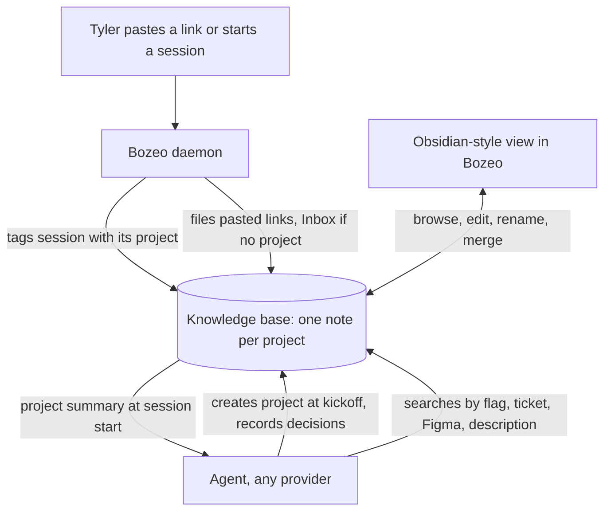

# Project Knowledge Base - Plan

## Goal Capsule

- **Objective:** a fresh agent on any provider can pick up a project Tyler started earlier from a loose reference, with its links, decisions and status, so he stops re-pasting background into new sessions.
- **Product authority:** Tyler.
- **Open blockers:** none.

---

## Product Contract

### Summary

One local knowledge base, built on Basic Memory (Markdown notes plus a knowledge graph), where every project Tyler kicks off becomes a note holding its links, decisions and status.
Bozeo does the filing: it tags each session with its project and files every link Tyler pastes, while agents record decisions.
Tyler browses and edits it in an Obsidian-style view inside Bozeo, and none of it leaves his Mac.

### Problem Frame

Tyler starts many agent sessions a day across several initiatives, and each new session starts without the background: the Figma file, the tickets, what was decided, what is in flight.
He either re-pastes links and explains again, or the agent digs through repos and history until it finds the context, which costs time and tokens every session.
The memory that exists today does not close the gap. Claude Code's auto memory is per repository and holds only what Claude chose to save, so links Tyler pasted are often missing. Codex and other providers never see it. Tyler's initiatives cross repos (on-site recording touches the mobile app and the backend).
He refers back to them loosely: "remember the project where we did this", a feature flag, a ticket.

### Actors

- A1. Tyler: kicks off projects, pastes links, refers back to projects loosely, edits notes.
- A2. Agents: any provider Bozeo runs (Claude, Codex and others). They create projects at kickoff, look them up, and record decisions.
- A3. Bozeo daemon: does the filing that needs no judgment. It tags sessions with their project, files pasted links, and hands a project's note to agents started on it.

### Key Decisions

- **Basic Memory is the store.** Plain Markdown that agents and Tyler both edit, indexed into a knowledge graph and reachable by any agent as an MCP server. (session-settled: user-directed — chosen over Graphiti's temporal graph, extending Claude Code's built-in memory, and Mem0/Letta/Cognee: an existing, maintained tool that matches "Markdown files per project" and works for every provider.)
- **A project is an initiative, not a repo.** It is what Tyler starts with an agent, typically with a Figma link and a brainstorm, and it can span repos. (session-settled: user-directed — chosen over one knowledge base per repo or per product: that is how Tyler thinks about and refers back to his work.)
- **One knowledge base holds every project.** A loose reference has to search all projects at once. (session-settled: user-approved — chosen over one base per repo: projects cross repos.)
- **Bozeo is the librarian.** Bozeo files links and tags projects itself, and agents write only decisions and rules. (session-settled: user-directed — chosen over agents doing all the writing, and over recalling from raw agent history: a link pasted into a busy session must not depend on that agent remembering it.)
- **Agents keep it current, and create projects on their own.** No approval step. (session-settled: user-directed — chosen over Tyler curating and over agents proposing changes for approval, and over asking before creating a project: lowest effort for Tyler.)
- **Recall comes first.** The first version must reliably find a project from a loose reference and return its links and decisions; status may lag. (session-settled: user-directed — chosen over always-current status with weaker recall.)
- **An Obsidian-style view lives inside Bozeo.** (session-settled: user-directed — chosen over using the Obsidian app alone, and over having no view.)
- **Seed the projects that are active now.** Without it, "the project where we did X" fails for everything before launch. (session-settled: user-approved — proposed at scope confirmation; Tyler confirmed.)
- **Local only.** Company (Wonderly) links and decisions stay on the Mac. (session-settled: user-approved — confirmed with the scope.)

### Requirements

**Projects and recall**

- R1. A project is an initiative Tyler starts with an agent; it may span several repos.
- R2. When an agent sees a project-shaped kickoff, it creates the project, names it, and tells Tyler the name in its reply.
- R3. Before creating a project, the agent looks for an existing match and joins it instead of creating a duplicate.
- R4. A fresh agent with no context finds a project from a loose reference: a description, a feature flag, a ticket, a Figma file or a PR.
- R5. All projects live in one knowledge base, so a loose reference searches every project.

**What a project holds**

- R6. Links: the Figma files, tickets, PRs, dashboards, docs and threads tied to the project.
- R7. Decisions and rules: what was decided and why, conventions, and things not to do.
- R8. Where work stands: what is in flight, shipped or blocked, and which agents, branches, PRs and worktrees belong to it. In the first version this may lag.
- R9. Credentials, tokens and keys are never written into the knowledge base.

**Bozeo does the filing**

- R10. Bozeo tags every agent and workspace with the project it belongs to.
- R11. Every link Tyler pastes into a session is filed into that session's project without depending on the agent.
- R12. A session that is not clearly part of a project files its links to an Inbox instead of guessing.
- R13. An agent started on a project begins with that project's note available, without Tyler pasting anything.
- R14. Agents record decisions and rules as they are made.
- R15. Every provider Bozeo runs can read and write the knowledge base.
- R16. Starting a session adds at most a short project summary to the agent's context; detail is read on demand.

**Viewing and editing**

- R17. Bozeo has an Obsidian-style view of the knowledge base: browse projects, read and edit notes, follow links between notes, and see the graph.
- R18. The view works on desktop and on the phone.
- R19. Tyler can rename and merge projects in the view.
- R20. The notes stay plain Markdown that the Obsidian app on the Mac can open.

**Storage and launch**

- R21. The knowledge base is stored locally; nothing syncs to a cloud service.
- R22. At launch, the projects active now are seeded from existing material: on-site recording v3, Yonderly files, the polish splits, and Bozeo itself.
- R23. It works on macOS and Windows.

### Key Flows

- F1. Kickoff
  - **Trigger:** Tyler starts an agent on something new, typically with a Figma link and a brainstorm.
  - **Actors:** A1, A2, A3
  - **Steps:** The agent looks for an existing matching project; finding none, it creates one, names it and tells Tyler. Bozeo tags the session with the project and files the Figma link into it.
  - **Covered by:** R2, R3, R10, R11
- F2. Recall
  - **Trigger:** A fresh agent hears "remember the project where we did X", a flag, or a ticket.
  - **Actors:** A1, A2, A3
  - **Steps:** The agent searches the knowledge base, opens the matching project and works from its links and decisions. Bozeo tags the session with that project from then on.
  - **Covered by:** R4, R5, R10, R13
- F3. Ongoing work
  - **Trigger:** Any session on a project.
  - **Actors:** A1, A2, A3
  - **Steps:** Links Tyler pastes are filed by Bozeo. Agents write decisions and rules as they happen. Tyler reads and edits in the view.
  - **Covered by:** R11, R12, R14, R17, R19

### Acceptance Examples

- AE1. **Covers R4, R5.** Given the on-site recording v3 project exists with its feature flag recorded, when Tyler tells a fresh agent in the backend repo "remember the project with that flag" and names it, the agent opens that project and lists its Figma link and key decisions without asking Tyler for them.
- AE2. **Covers R11, R12.** Given Tyler pastes a Figma link into a session tagged with project X, the link appears in X's note; pasted into a session with no project, it lands in the Inbox.
- AE3. **Covers R2, R3.** Given an iOS agent and an Android agent both receive the kickoff of the same feature, the knowledge base ends up with one project, not two.
- AE4. **Covers R9.** Given a message Tyler pastes contains an API token next to a link, the link is filed and the token is not.

### Success Criteria

- For any project in the knowledge base, Tyler no longer pastes its links or background into a new session.
- Given a loose reference like AE1, a fresh agent finds the right project in its first few tool calls.

### Scope Boundaries

**Deferred for later**

- Status kept current from what Bozeo already knows about agents, branches and PRs (step two).
- Setup and access details: repos, accounts, servers, devices and commands.
- Importing or replacing Claude Code's auto memory and the CLAUDE.md files; they keep doing what they do.

**Outside this product's identity**

- Embedding the real Obsidian app in Bozeo.
- Syncing the knowledge base to other machines or a cloud service.
- A temporal knowledge graph (Graphiti/Zep) or a vector-memory service (Mem0).

### Dependencies / Assumptions

- Basic Memory (Python, AGPL-3.0) runs as its own local process that Bozeo talks to and does not modify or redistribute; planning confirms the license has no effect on the fork.
- Basic Memory's search, run locally, can resolve a loose description or a flag name to the right project; planning verifies this on real projects.
- Claude Code's auto memory is per repository and shared across worktrees (its documentation), so per-repo learnings already have a home and are not this feature's job.

### Outstanding Questions

**Deferred to Planning**

- How Bozeo decides which project a new session belongs to when it is not obvious (inherited from the parent agent, the workspace, or a cheap JEV call).
- Where the view sits in the app and how it looks on the phone.
- What counts as a link to file, and whether links agents produce (PRs they open) are filed too.
- How Basic Memory is installed and kept running on macOS and Windows.
- How much existing material the seed reads, and how its notes are checked.

### Sources / Research

- Claude Code memory documentation: auto memory is per repository, shared across worktrees, and loads the first 200 lines or 25 KB of its index per session (https://code.claude.com/docs/en/memory).
- Basic Memory: Markdown notes indexed into a local knowledge graph, separate projects, Obsidian-compatible, MCP server; about 3.4k GitHub stars, last release June 2026 (https://docs.basicmemory.com/start-here/what-is-basic-memory).
- Graphiti MCP server, the main knowledge-graph alternative considered (https://docs.falkordb.com/agentic-memory/graphiti-mcp-server.html).
- Mem0, Letta, Zep and Cognee comparison (https://mcp.directory/blog/mem0-vs-letta-vs-zep-vs-cognee-2026).
- `docs/token-audit.md`: how memory and system-prompt tokens are counted per session, relevant to R16.
