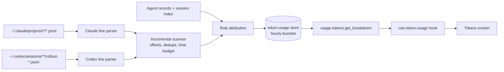

# Token Usage Screen - Plan

## Goal Capsule

- **Objective:** a "Tokens" screen, reached from its own sidebar entry, that shows how many tokens each model and each role (leader, worker, outside Paseo) used over 24h / 7d / 30d, in cost-weighted or raw tokens, with 30 days of history on the first day.
- **Authority:** this plan's Product Contract, then its Key Technical Decisions, then repo docs (`CLAUDE.md`, `docs/protocol-compatibility.md`, `docs/rpc-namespacing.md`, `docs/design.md`, `docs/expo-router.md`, `docs/data-model.md`, `docs/daemon-vitals.md`).
- **Execution profile:** two workers in parallel. Server worker owns U1, U2, U3. App worker owns U4, then U5 once U3 has landed. The wire contract in KTD-6 is fixed so neither waits on the other.
- **Stop conditions:** stop and report if a transcript fact this plan relies on is wrong (dedupe key, Codex model location, resumed-session copying), if the daemon's event loop wedges during a backfill, or if the leader-vs-worker split needs data that is not on disk.
- **Tail ownership:** workers commit locally and do not push or restart any daemon. The leader reviews, opens the PRs, merges, stages and relaunches.

---

## Product Contract

### Summary

A new top-level screen lists token usage per model as horizontal bars, each bar split by role, plus a per-role card. A toggle switches between cost-weighted tokens (default) and raw tokens, and a range control switches between the last 24 hours, 7 days and 30 days. The daemon builds the numbers from the Claude and Codex session transcripts already on disk, so the screen covers every session on the machine, including ones run outside Paseo, and has 30 days of history as soon as it ships.

### Problem Frame

Tyler runs a fleet of agents across three Claude accounts and Codex and has no view of where tokens go by model or by role. The daemon keeps one weighted total per agent for 8 days (`docs/usage-history.md`), attributed to the agent's configured model, with no category breakdown and nothing for sessions it did not start.

### Requirements

**Data**

- R1. Usage is counted per API response from transcripts: every Claude assistant response and every Codex response, each counted once.
- R2. Each response records provider, the model that served it, role, and four categories: fresh input, cache write, cache read, output.
- R3. Role is leader when the owning Paseo agent has no `paseo.parent-agent-id` label, worker when it has one, and outside when no Paseo agent owns the session. A Claude in-process subagent (sidechain) counts toward its session's role.
- R4. The first run backfills the last 30 days; after that the data stays current within about a minute.
- R5. Weighted tokens use `weighTokenUsage` ratios; raw tokens are the plain sum of the four categories.

**Screen**

- R6. The screen has its own sidebar entry, shown only when the host supports the feature.
- R7. A "Tokens by model" card lists one bar per provider/model, largest first, each bar split into role segments with a legend, value right-aligned in compact form (245M, 7.4M, 16K).
- R8. A "Tokens by role" card lists leader, worker and outside Paseo totals.
- R9. Controls switch the unit (Weighted default, Raw) and the range (24h, 7d default, 30d).
- R10. Responses with no known model show as an "Unattributed" row, and a footer says attribution is incomplete when that row is non-zero.
- R11. While the backfill runs, the screen shows its progress; with no data yet it shows an empty state rather than a blank card.
- R12. The screen works at compact (phone) and desktop widths on iOS, Android, web and Electron.

**Operations**

- R13. The scan never wedges the daemon's event loop and is bounded in disk and memory.
- R14. The feature can be turned off by config; off means no transcript reads.

### Scope Boundaries

- No push notifications, budgets or alerts on this data.
- No per-agent or per-account drill-down, and no classifier role taxonomy (reviewer, implementer). Only leader, worker and outside.
- No change to the token-burn monitor, usage history or the spend governor.
- Backfill window is 30 days and does not widen; older history is not read.

#### Deferred to Follow-Up Work

- Per-account split (the three Claude homes share one transcript directory; the account would come from the agent record).
- OpenCode, ACP, OMP and Pi providers (no transcripts this plan parses).

---

## Planning Contract

### Key Technical Decisions

- KTD-1. Transcripts are the single source for both backfill and live data. A daemon job tails `~/.claude/projects` and `~/.codex/sessions` with per-file byte offsets. One parser serves history and the present, covers sessions run outside Paseo, and reads the served model and category counts the API reported. The alternative, recording live from `token_burn_delta` plus a separate transcript backfill, means two code paths that must agree, and the live path only carries weighted totals.
- KTD-2. Unit: store all four categories, compute both weighted and raw. (session-settled: user-directed — chosen over raw-only and weighted-only: one screen shows both, weighted by default because it is what drains usage windows.)
- KTD-3. Role is structural: no parent label means leader, a parent label means worker, no agent means outside. (session-settled: user-directed — chosen over a leader/worker/subagent split and the task-class split: matches the account pool and is reconstructable from disk; the classifier's resolved role is not persisted.)
- KTD-4. Placement: its own top-level sidebar entry, mirroring `ask-jev`. (session-settled: user-directed — chosen over a section on the Settings host page.)
- KTD-5. History: backfill 30 days from transcripts. (session-settled: user-directed — chosen over starting fresh: the screen has data on day one.)
- KTD-6. Wire contract, fixed so both workers proceed in parallel. One RPC pair, gated on `server_info.features.tokenUsage` with a `COMPAT(tokenUsage)` tag:
  - Request `usage.tokens.get_breakdown.request`: `{ type, requestId, range: "24h" | "7d" | "30d" }`.
  - Response `usage.tokens.get_breakdown.response`: `{ type, payload: { requestId, generatedAt, range, rangeStartMs, rows, coverage } }`.
  - `rows[]`: `{ provider: string, model: string, role: "leader" | "worker" | "outside", input, cacheWrite, cacheRead, output, weighted, responses }`, all counts non-negative numbers, one row per provider x model x role with any usage in range. `model` is `"unknown"` when the response carried none.
  - `coverage`: `{ enabled: boolean, recordingSinceMs: number | null, backfill: { state: "pending" | "running" | "done" | "off", filesDone: number, filesTotal: number } }`.
  - Optional `error?: string` on the payload, as `usage.history.get` does. New fields stay optional; no `.transform()`.
- KTD-7. Storage under `$PASEO_HOME/token-usage/`: hourly buckets keyed by hour x provider x model x role, a scan-state file (per-file offset, size, mtime, recent message ids), and a session index. Zod-validated, `v: 1`, atomic writes, debounced flush, every axis bounded; a file that will not parse is replaced (pattern: `packages/server/src/server/usage-history/usage-history-store.ts`). Retention 31 days.
- KTD-8. Dedupe: a Claude response is identified by `message.id` (its lines repeat with identical usage while streaming). Ids are tracked per file in the scan and a bounded ring of recent ids per file persists across sweeps, so a duplicate written after a sweep boundary is still caught. Lines with model `<synthetic>` are skipped. Codex counts each `token_usage_record`'s `usage` object and never the cumulative `turn_token_usage` or `thread_token_usage`.
- KTD-9. Attribution happens at scan time from agent records (`persistence.sessionId`, `runtimeInfo.sessionId`, labels via `getParentAgentIdFromLabels`) plus a session index the daemon records from now on whenever it sees an agent's provider session id. A file whose session maps to no agent and was modified in the last 10 minutes is left unread for that sweep, so a just-started Paseo session is not booked as outside before its record lands.
- KTD-10. The scan runs on its own 60-second timer started after the daemon is listening, reads files sequentially as streams, yields to the event loop every few hundred lines, and stops each sweep after a time budget (about 1.5 s of work), resuming next sweep. The 30-day backfill therefore spreads over several sweeps. Config: `agents.tokenUsage.enabled` (default true, reloadable).
- KTD-11. Codex usage splits cached input out of input before weighing, as `docs/token-burn.md` already does: fresh input = `input_tokens - cached_input_tokens`, cache read = `cached_input_tokens`, cache write = `cache_write_input_tokens`, output = `output_tokens` (reasoning tokens are a subset of output).

### High-Level Technical Design

Scan lifecycle for one file per sweep: stat; skip when size equals the stored offset; if size is below the offset, treat the file as new; read from the offset to the last complete newline; parse, dedupe, attribute, add to buckets; store the new offset and recent ids. Backfill is the same loop over files modified in the last 30 days, with `filesDone`/`filesTotal` reported in coverage.

### Assumptions

- `~/.claude-personal/projects` and `~/.claude-leader/projects` stay symlinks to `~/.claude/projects`; the scanner resolves real paths and reads each directory once regardless.
- About 275 MB / 15.5K transcript files were touched in the last 30 days on this Mac, so the backfill is a few seconds of CPU spread across sweeps.
- Agent records are retained after archive, so historical sessions resolve to a role.
- Display labels are `provider / model` exactly as recorded (for example `claude / claude-opus-5-5`); the pool account is not shown.

### Sources

- `~/bozeo-ops/briefs/token-usage-grounding.md` (local research dossier with file:line evidence; not in the repo).
- Weighting: `packages/server/src/server/agent/token-rate-tracker.ts` (`weighTokenUsage`).
- Store, RPC, session controller and client hook to mirror: `packages/server/src/server/usage-history/`, `packages/protocol/src/usage-history/rpc-schemas.ts`, `packages/server/src/server/session/usage-history/usage-history-session.ts`, `packages/app/src/usage-history/use-usage-history.ts`.
- Sidebar entry to mirror: `packages/app/src/sidebar-nav/model.ts`, `packages/app/src/components/sidebar/sidebar-nav-rows.tsx`, `packages/app/src/components/sidebar/use-sidebar-jev-dashboard-target.ts`, `packages/app/src/app/jev.tsx`, `packages/app/src/screens/settings/appearance/sidebar-nav-section.tsx`, `packages/app/src/command-center/root-registration.tsx`.
- Segmented bar to borrow from: `packages/app/src/context-usage/context-usage-breakdown.tsx`.
- Parent label: `packages/protocol/src/agent-labels.ts` (`getParentAgentIdFromLabels`).

---

## Implementation Units

### U1. Transcript line parsers

**Goal:** pure functions that turn one transcript line into zero or one usage record.

**Requirements:** R1, R2, R5; KTD-8, KTD-11.

**Dependencies:** none.

**Files:** create `packages/server/src/server/token-usage/transcript-parsers.ts`, `packages/server/src/server/token-usage/transcript-parsers.test.ts`.

**Approach:** a Claude parser returns `{ messageId, sessionId, timestampMs, model, isSidechain, input, cacheWrite, cacheRead, output }` for assistant lines with `message.usage`, and nothing for other lines or `<synthetic>`. A Codex parser keeps per-file state for the current model (from whichever line type carries it; confirm the type against real files) and returns a record per `token_usage_record`, splitting cached input per KTD-11. Malformed JSON returns nothing and never throws. A cheap substring prefilter skips lines that cannot carry usage before `JSON.parse`.

**Execution note:** start from real lines copied from this Mac's transcripts, with every identifier replaced by fake values, as fixtures.

**Test scenarios:**

- A Claude assistant line yields its model, message id, session id and four categories.
- Two lines with the same `message.id` yield records with equal ids, so the caller can dedupe.
- A `<synthetic>` line, a user line and a malformed line yield nothing.
- A sidechain line yields a record flagged `isSidechain`.
- A Codex file: the model line sets the model; each `token_usage_record` yields fresh input = input minus cached, cache read = cached, and ignores `turn_token_usage` / `thread_token_usage`.
- A Codex record before any model line yields model `"unknown"`.

**Verification:** parsers are pure and covered; no file I/O in this unit.

### U2. Store, scanner, attribution and the recording service

**Goal:** a daemon service that backfills 30 days, keeps buckets current, and answers range queries.

**Requirements:** R1, R3, R4, R13, R14; KTD-1, KTD-7, KTD-8, KTD-9, KTD-10.

**Dependencies:** U1.

**Files:** create `packages/server/src/server/token-usage/token-usage-store.ts`, `token-usage-scanner.ts`, `token-usage-attribution.ts`, `token-usage-service.ts` and a test beside each (all under `packages/server/src/server/token-usage/`); modify `packages/server/src/server/bootstrap.ts` (construct, start after listen, stop on shutdown), `packages/server/src/server/persisted-config.ts` (`agents.tokenUsage.enabled`), `packages/server/src/server/agent/agent-manager.ts` (record session id to agent in the session index when an agent's provider session id is set or changes).

**Approach:** the store holds hourly buckets, scan state and the session index, flushes at most every five minutes and on shutdown, and drops buckets and scan entries older than 31 days. The scanner walks real paths (symlinks resolved once), reads only appended bytes up to the last newline, dedupes per KTD-8, and honors the time budget and yields per KTD-10. Attribution builds a session-to-role map from agent records and the session index each sweep and applies the 10-minute deferral for unknown recent sessions. `query(range, now)` sums buckets into KTD-6 rows and computes `weighted` with `weighTokenUsage`. With the config off, the service never starts a timer or touches transcripts.

**Execution note:** before trusting cross-file totals, resume and fork a real Claude session in a scratch directory and check whether the new transcript copies earlier lines. If it does, extend dedupe to message ids seen across files in the same project directory within the retention window, bounded, and note it in the doc.

**Test scenarios:**

- Appending lines to a file between two sweeps counts only the new responses.
- A partial last line is not consumed until its newline arrives.
- A duplicate `message.id` written after a sweep boundary is counted once.
- A file that shrinks is rescanned as new.
- A session whose agent has no parent label books as leader; with a parent label, worker; with no agent, outside.
- An unknown session in a file modified 2 minutes ago is deferred; the same file 11 minutes old books as outside.
- A sidechain response books under its session's role.
- A sweep that exceeds its time budget stops and the next sweep resumes where it stopped; backfill coverage reports `running` with progress, then `done`.
- Buckets older than 31 days are dropped; a corrupt store file is replaced without throwing.
- Config off: the service does no reads, and coverage reports `off`.
- `query` sums the right hours for 24h / 7d / 30d and returns one row per provider x model x role.

**Verification:** unit tests pass; a dry run of the scanner against this Mac's real transcripts into a temporary `PASEO_HOME` (never the live `~/.paseo`) completes without event-loop stalls longer than the budget, and its 30-day Claude total for one sampled session matches an independent sum over that session's transcript deduped by `message.id`.

### U3. Protocol, RPC, feature flag and client method

**Goal:** the KTD-6 RPC end to end from client call to store query.

**Requirements:** R6 (feature flag), R9, R11; KTD-6.

**Dependencies:** U2 for the real controller. Land the protocol schema first, since U5 depends on it.

**Files:** create `packages/protocol/src/token-usage/rpc-schemas.ts`; modify `packages/protocol/src/messages.ts` (request/response unions, `server_info.features.tokenUsage`), the protocol validation codegen inputs as `docs/protocol-validation.md` requires; create `packages/server/src/server/session/token-usage/token-usage-session.ts` and its test; modify the session RPC dispatch and server-info feature advertisement; modify `packages/client` to add `getTokenUsageBreakdown({ range })`.

**Approach:** mirror `usage.history.get` file for file. Permission `daemon.read`. The feature flag is advertised only when the service exists. The response always carries coverage, so the app can show backfill progress and the disabled state.

**Test scenarios:**

- The session controller returns the store's rows and coverage for each range and echoes `requestId`.
- An invalid range is rejected by the schema.
- With the feature off, the response carries `coverage.enabled: false` and no rows.
- An old client's messages and a new daemon's response both parse (protocol compatibility).

**Verification:** `npm run build:client` succeeds and the app can import the new client method and types.

### U4. Tokens screen, view model and sidebar entry

**Goal:** the screen and its navigation, built against the KTD-6 shape.

**Requirements:** R6, R7, R8, R9, R10, R11, R12; KTD-2, KTD-3, KTD-4.

**Dependencies:** none to start (codes against a local type matching KTD-6); U5 swaps in the real types and data.

**Files:** create `packages/app/src/token-usage/token-usage-model.ts` and `token-usage-model.test.ts`, `token-usage-screen.tsx`, `tokens-by-model-card.tsx`, `tokens-by-role-card.tsx` (all under `packages/app/src/token-usage/`), `packages/app/src/app/tokens.tsx`, `packages/app/src/components/sidebar/use-sidebar-token-usage-target.ts`; modify `packages/app/src/sidebar-nav/model.ts`, `packages/app/src/components/sidebar/sidebar-nav-rows.tsx`, `packages/app/src/screens/settings/appearance/sidebar-nav-section.tsx`, `packages/app/src/command-center/root-registration.tsx`, and every file in `packages/app/src/i18n/resources/` that the typed resources require.

**Approach:** the view model is pure: it takes rows, unit and range and returns model bars sorted by total (provider / model label, total, role segments as fractions of the largest bar, compact value), role totals, the Unattributed row last, and footer flags. The cards follow `docs/design.md` tokens and borrow the segmented bar from `context-usage-breakdown.tsx`; three role colors with a legend. Controls are segmented toggles. Read `docs/expo-router.md` before adding the route. No `useUnistyles()` (`docs/unistyles.md`); hover rules per `docs/hover.md`.

**Test scenarios:**

- Rows for two models and three roles produce bars sorted by total with role fractions summing to the bar's share.
- Weighted vs raw changes totals and order when cache reads dominate one model.
- Model `"unknown"` becomes a trailing "Unattributed" row and sets the incomplete-attribution footer flag.
- No rows plus backfill `running` produces the progress state; no rows plus `done` produces the empty state.
- Compact number formatting: 245_000_000 shows 245M, 7_400_000 shows 7.4M, 16_000 shows 16K, 900 shows 900.

**Verification:** view-model tests pass; the screen renders with fixture data on web at desktop and compact widths (screenshots attached to the report).

### U5. Integration: real data on the screen

**Goal:** the screen reads the live RPC and the sidebar entry follows the host feature.

**Requirements:** R4, R6, R11, R12.

**Dependencies:** U3, U4.

**Files:** create `packages/app/src/token-usage/use-token-usage.ts`; modify `packages/app/src/token-usage/token-usage-screen.tsx`, `packages/app/src/components/sidebar/use-sidebar-token-usage-target.ts`; replace U4's local type with the protocol types.

**Approach:** mirror `use-usage-history.ts`: `useFetchQuery` keyed on server and range, `staleTimeMs` 60 s, gated on `features.tokenUsage`. A host without the feature hides the sidebar entry; a deep link to the route on such a host says to update the host.

**Test scenarios:**

- The hook does not fetch when the feature flag is absent.
- Changing the range refetches; changing the unit does not.

**Verification:** against a scratch daemon running the U3 build (per `docs/ad-hoc-daemon-testing.md` or the scratch-daemon pattern), the screen shows non-empty bars for this Mac's transcripts at desktop and compact widths; screenshots attached.

---

## Verification Contract

- Targeted tests only, never a full suite: `npx vitest run <file> --bail=1 --maxWorkers=2` for each changed test file, from the owning package, wrapped in `~/bozeo-ops/cpu-policing/heavy.sh`.
- `npm run build:client` (or `npm run build:server` for server and CLI) before diagnosing cross-package type errors.
- `npm run typecheck`, `npm run lint -- <files>`, `npm run format:files -- <files>` after every unit.
- U2: the real-transcript dry run into a temporary `PASEO_HOME`, with the sampled-session cross-check.
- U4 and U5: screenshots at desktop and compact widths (`docs/qa.md` UI-proof bar).
- No live daemon on port 6767 is restarted by a worker.

## Definition of Done

- R1-R14 are met and each unit's test scenarios exist and pass.
- `docs/` gains one subject doc for token usage (what is read, dedupe, attribution, bounds, the RPC) with a row in the `CLAUDE.md` docs table, and `docs/usage-history.md` links to it instead of restating it.
- Typecheck, lint and format pass; no abandoned or experimental code remains in the diff.
- The leader has reviewed the change, merged it, staged a build and confirmed the screen shows real data on the live daemon.
