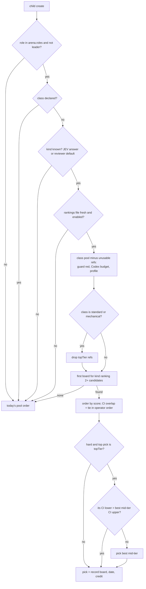

# Arena Model Picker For Workers, Codex Guards First - Plan

## Goal Capsule

- **Objective:** each worker child gets the best model for its kind of work, picked from Claude and OpenAI (Codex) models using the LMArena leaderboard. Top-tier models are used only for hard work where the leaderboard shows a real gap. Before any work goes to Codex, Codex agents get the guards Claude agents have.
- **Authority:** this plan, then `docs/jev.md`, `docs/catastrophe-gate.md`, `docs/device-leases.md`, `docs/protocol-compatibility.md`, `CLAUDE.md`. Grounding: `~/bozeo-ops/briefs/arena-model-picker-grounding.md` (local, researched at `a3148456f`).
- **Execution profile:** two PRs from two workers running in parallel.
  - PR A (U1–U5) makes Codex launchable and guarded.
  - PR B (U6–U8) builds the picker. It works on Claude-only pools without PR A, and `codex/` refs stay unusable until PR A's guard health is green.
- **Stop conditions:** stop and report if any of these hold:
  - Codex does not ask for approval before non-safe commands in guarded mode (U2's proof);
  - the self-test cannot tell a guard refusal from a model refusal;
  - a change would let ranking pick a leader's model.
- **Tail ownership:** workers commit locally. They never push, never restart the 6767 daemon, and never edit `~/.paseo/config.json`. The leader reviews, opens the PRs, merges, deploys and edits live config.

---

## Product Contract

### Problem Frame

On 2026-10-09 Tyler asked for two things: the classifier should consult arena.ai for the best model per job, and it may use OpenAI models through his ChatGPT subscription. Settled with him the same day:

- the picker serves workers only;
- it picks the best model for the job, using top-tier models only rarely;
- guards reach Codex first.

Where things stand today:

- **Worker pools are Claude-only.** Mechanical work runs Haiku 4.5, standard runs Sonnet 5, and hard runs Opus 5.5 or Opus 5.
- **Sonnet 5.5 is in no pool,** although the agent board scores it 2.4× Sonnet 5.
- **The daemon cannot launch Codex.** No `codex` is on PATH; the only copy is inside ChatGPT.app.
- **A Codex agent in Full Access has no guard.** The catastrophe gate is Claude-only, and the build, emulator and install gates fire only on approval requests, which Full Access never sends.

### Requirements

- R1. The daemon launches Codex on macOS and Windows without PATH setup, finding the copy bundled with the ChatGPT or Codex desktop app.
- R2. Four guards refuse a daemon-launched Codex child in the mode children run in, with no person in the loop: the catastrophe gate, the native build gate, the device cap and the physical-device install gate. Tyler's own Codex sessions behave as before.
- R3. Codex children are routable only while a recent self-test proves the guard denies commands. An unguarded command turns the guard red and stops new Codex routing.
- R4. Codex children stay within the Codex usage window and a concurrency cap, and never think above xhigh. A tool restriction is expressed in Codex's own terms; if it cannot be, the child is not routed to Codex.
- R5. A daily job fetches the LMArena leaderboard from the official Hugging Face dataset and caches it. A hand-kept alias table matches its names to our model refs; unmatched rows are dropped and counted, never guessed.
- R6. JEV labels each child's kind of work in the call it already makes.
- R7. For worker and reviewer children, the classifier orders each class's approved models by the board that fits the kind of work. Top-tier models never serve standard or mechanical work. They serve hard work only when they beat the best mid-tier model by more than both confidence intervals.
- R8. Any doubt falls back to today's pool order: no file, stale data, an unknown kind, no ranked candidate, a declared class, or a leader. Every ranked decision records its board, the publish date and the LMArena credit.

### Scope Boundaries

- Leaders never use rankings or Codex.
- No price model. Arena has no price column, so tiers come from our policy.
- No new UI. Labels the agent screen already shows carry the pick.
- No change to Tyler's Codex login, auth file or default model.
- The catastrophe gate's Windows PowerShell gap stays as `docs/catastrophe-gate.md` documents it.

### Deferred to Follow-Up Work

- A budget-aware tie-break between Claude and Codex, for when their scores tie.
- Gating Codex `apply_patch` and MCP calls beyond approving them.
- Adding newly ranked models to pools automatically. Pool membership stays an operator edit.
- Ranking for the advisor role.

---

## Planning Contract

### Key Technical Decisions

- KTD-1. **Workers only.** Ranking applies to roles listed in `arena.roles` (default `worker`, `reviewer`). The code refuses `leader` even if it is configured. (session-settled: user-directed — chosen over ranking every role: "1.. workers")
- KTD-2. **Top tier rarely.** Policy names its top-tier refs in `arena.topTier`.
  - They are removed from standard and mechanical candidates.
  - They win a hard pick only when their CI lower bound beats the best mid-tier candidate's CI upper bound on the same board.
  - JEV's `hard` floor stays the first gate.

  (session-settled: user-directed — chosen over ranking all tiers together: "workers shouldnt need to use the highest level models. only rarely")

- KTD-3. **Guards first.** PR B may merge before PR A, but no `codex/` ref enters a live pool until PR A is deployed and its self-test is green. (session-settled: user-directed — chosen over routing to Codex with approval-only gates: "3. yes")
- KTD-4. **Guard delivery: the daemon answers Codex's approval requests.** Revised 2026-10-09 after U2's proof against Codex 0.160 showed that no hook path runs unattended under `app-server`:
  - `-c` hook overrides are accepted and then silently skipped;
  - a hook written to `~/.codex/hooks.json` is skipped without a `trusted_hash`, and nothing documented computes that hash;
  - `--dangerously-bypass-hook-trust` exists only on `codex exec`.

  Instead, a Codex child runs with `approval_policy: "untrusted"`. Codex then asks for approval before every command outside its own read-only safe list (`ls`, `cat`, plain `git status` and similar). Each request already reaches the daemon in-process (`handleCommandApprovalRequest` in `codex-app-server-agent.ts`), where the device gate already answers. No hook, no trust file, no CLI hop, and nothing is written to `~/.codex`. `docs/codex-workers.md` records the three failed hook paths so a later Codex release can be rechecked.

  Rejected:
  - Hooks, for the reasons above.
  - A separate `CODEX_HOME` with a copied `auth.json`. A token refresh in either copy rotates the refresh token and can sign Tyler's own Codex out.
  - A managed `requirements.toml`. It is a machine-wide admin path, and its local activation is undocumented.

- KTD-5. **One guard decision, in the approval handler.**
  - **Order:** for a Codex agent in guarded mode (KTD-7), `handleCommandApprovalRequest` runs `checkCatastrophe` (the same function and branch lookup the Claude hook uses), then the composed `deviceLaunchGate`.
  - **Outcome:** a refusal declines with the reason, explained over steer as device refusals already are. A clean command is approved at once, per command (never "approve for session"), with no pending permission and no person in the loop.
  - **Failure:** an error inside the gates declines. Nothing runs until the daemon says yes, so the guard fails closed by construction.
  - **File changes:** `apply_patch` approval requests are approved in guarded mode. That matches Claude, whose catastrophe gate covers shell commands only.
  - **Modes left alone:** outside guarded mode, approvals keep today's behaviour: device gate first, then a person.
- KTD-6. **Guard health is proved, not configured.**
  - **The self-test:** a cheap Codex turn (a luna model at low effort, guarded mode, a temp cwd) runs two commands that are not on Codex's safe list.
    - `touch <tmp>/paseo-guard-ok-<nonce>` must be approved, and the file must then exist.
    - `touch <tmp>/paseo-guard-canary-<nonce>` must reach the approval handler and be declined by the canary rule, and the file must not exist.

    Health is green only when both approval requests were seen and both outcomes match.

  - **When it runs:** at daemon start, daily, and when the Codex binary version changes. The self-test agent does not count against KTD-9's cap.
  - **Live detection:** every command item a guarded Codex child runs is re-checked after the fact against the catastrophe gate and the device gate. A command that a gate would have refused but that ran without an approval request turns health red and cancels that agent's turn. Commands on Codex's safe list need no approval and pass this check.
  - Codex refs are unusable for children unless health is green.

- KTD-7. **Codex children run in a new guarded mode:** `sandbox_mode: "danger-full-access"` with `approval_policy: "untrusted"`, answered by the daemon (KTD-5), and only behind a green guard. Full Access (`approval_policy: never`) would bypass the guard. Workspace-write would block the caches builds write and stall on escalations nobody answers.
- KTD-8. **Tool profiles and instructions on Codex.**
  - **Settings:** `enforceToolDecision` writes Claude-shaped `settings.permissions` only for the Claude family. The read-only profile maps to `sandbox_mode: read-only`. When a role's profile cannot be expressed on Codex, its `codex/` refs are ineligible and the decision gives a reason.
  - **Prompt text:** per-agent prompt text the classifier adds (restriction notices and similar) goes into the session `systemPrompt`, which Codex receives as developer instructions.
  - **Already covered:** two channels reach Codex today. The daemon's own policy text already arrives as developer instructions (`codex-app-server-agent.ts` composes `daemonAppendSystemPrompt` into them). Repo conventions arrive through `AGENTS.md`, which in this repo links to `CLAUDE.md`.
- KTD-9. **Codex budget.** Codex refs are usable only while all of these hold:
  - the `codex` `session` window reading is under 60%;
  - that reading is under 2 hours old;
  - fewer than 3 Codex children are running.

  These limits live in a new optional `codex` key on `agentModelPolicy`: `maxWindowPct` (60), `maxReadingAgeHours` (2) and `maxChildren` (3). Tyler's own Codex use draws on the same window, so the reserve is his.

- KTD-10. **Data source.**
  - **Where:** the Hugging Face datasets-server JSON API for `lmarena-ai/leaderboard-dataset` (CC-BY-4.0), split `latest`, with retry and backoff.
  - **When:** one refresh a day. The classifier never waits on the network.
  - **Output:** `$PASEO_HOME/arena-rankings.json`, written atomically. Rows below a vote floor are dropped.
- KTD-11. **One board per decision.**
  - Each kind of work lists its boards in preference order. The classifier uses the first board that ranks at least two usable candidates, and never mixes scores across boards.
  - Candidates whose CIs overlap are tied and keep operator order.
  - Unranked candidates go after ranked ones.
  - The row at our planned effort is preferred. If there is none, the nearest effort is used and recorded as a proxy. Arena mostly ranks max or xhigh variants, so a proxy row overstates what our run gets. A top-tier candidate on a proxy row must therefore clear the KTD-2 bar by one extra CI width.

  | Kind            | Boards, in order                                                  |
  | --------------- | ----------------------------------------------------------------- |
  | coding          | `agent` overall, then `text_style_control` coding                 |
  | frontend        | `webdev` webdev-react, then `webdev` overall, then `agent`        |
  | research        | `text_style_control` expert, then hard_prompts                    |
  | review          | `text_style_control` hard_prompts, then instruction_following     |
  | writing         | `text_style_control` creative_writing, then instruction_following |
  | ops             | `agent_bash_recovery_steps`, then `agent` overall                 |
  | other / unknown | none: today's order                                               |

- KTD-12. **JEV supplies the kind.**
  - A `work_kind` choice question rides the spawn-hint call.
  - A reviewer with no answer gets `review`.
  - When JEV is unavailable the kind is unknown, and today's order applies (R8). There is no keyword guessing.
  - A child with a declared `paseo.task-class` gets its kind recorded in shadow and keeps today's order, because a declared label always wins (`docs/jev.md`).
- KTD-13. **Policy shape.** `agentModelPolicy` gains an optional `arena` key with these fields:
  - `enabled`, `shadow`, `roles` and `topTier`;
  - `topTierMarginCi`, default 0: extra CI widths a top-tier pick must clear;
  - `maxAgeHours`, default 72.

  The existing class pools (`models`, `mechanicalModels`, `hardModels`) stay the approved candidate lists, and ranking only reorders inside them. KTD-11's table is the only board mapping. The key is optional, so old configs parse unchanged. Shadow records the would-be pick without applying it, as JEV's spawn hint did before it went live.

### High-Level Technical Design

**Codex guard, one command (guarded mode):**

```mermaid
sequenceDiagram
  participant C as Codex app-server (child, approval_policy untrusted)
  participant A as Daemon approval handler (in-process)
  participant G as checkCatastrophe + deviceLaunchGate
  C->>A: item/commandExecution/requestApproval {command, cwd}
  A->>G: gate(agent, cwd, command)
  G-->>A: allow | refuse + reason
  A-->>C: decision accept (allow) or decline (refuse, or any gate error)
  Note over A: refusal reason goes to the agent over steer
  Note over A: after each command item, re-check it; a refused command that ran unasked turns health red
```

**Worker model pick:**



---

## Implementation Units

### U1. Codex launchable on macOS and Windows (PR A)

**Goal:** the daemon finds and launches the Codex bundled with the desktop apps.

**Requirements:** R1.

**Dependencies:** none.

**Files:**

- `packages/server/src/server/agent/providers/codex-app-server-agent.ts` (`findDefaultCodexBinary` and its candidate helpers)
- `packages/server/src/server/agent/providers/codex-app-server-agent.test.ts`
- a new `docs/codex-workers.md`, and its row in `CLAUDE.md`'s docs table

**Approach:**

- Probe in this order: PATH; the ChatGPT.app bundle (`/Applications/` and `~/Applications/`, `Contents/Resources/codex-cli/bin/codex`); the existing `OpenAI.Codex_` Microsoft Store package; and the Windows ChatGPT desktop package, if it bundles Codex. The implementer checks that layout.
- If neither Windows package bundles a discoverable binary, report that rather than closing U1. Windows then relies on the Store package or `agents.providers.codex.command`, and `docs/codex-workers.md` says so.
- The not-found error names the places searched.
- `agents.providers.codex.command` still wins.

**Test scenarios:**

- PATH has `codex`: PATH wins.
- No PATH copy, and the macOS bundle exists: the bundle is used.
- The bundle exists only under `~/Applications`: found.
- On Windows the Store candidate still resolves.
- Nothing is found: the error lists every path searched.
- A configured command overrides discovery.

**Verification:** after deploy, `list_providers` shows `codex` available and `list_models codex` lists the subscription's models.

### U2. Guarded mode and its proof (PR A)

**Goal:** a daemon-launched Codex child can run in guarded mode, and every non-safe command it runs reaches the daemon's approval handler first.

**Requirements:** R2; KTD-4, KTD-7.

**Dependencies:** U1.

**Files:**

- `packages/server/src/server/agent/providers/codex-app-server-agent.ts` (`MODE_PRESETS`: a `guarded` preset)
- `packages/server/src/server/agent/providers/codex-app-server-agent.test.ts`
- `docs/codex-workers.md` (replace "Guard hook: blocked" with the guarded-mode design; keep the three failed hook paths as the recheck list)

**Approach:**

- Add a `guarded` mode preset: `danger-full-access` sandbox and `approval_policy: "untrusted"`. It is selectable only by the daemon for children, not offered to people in the mode picker.
- Confirm against the real binary that `untrusted` still asks under `danger-full-access`.

**Execution note:** start with a proof against the Codex 0.160 binary, the same way U2's hook proof ran. Use a scratch `app-server` in guarded mode, the cheapest model at low effort, and a temp cwd. Ask for `touch <tmp>/x`, and confirm that an `item/commandExecution/requestApproval` arrives before anything runs. Also note which of `ls`, `git status` and `echo` arrive without a request, for the docs. If `untrusted` does not ask under `danger-full-access`, try `granular` approvals. If neither asks, stop and report.

**Test scenarios:**

- The `guarded` preset maps to `danger-full-access` plus `untrusted`, and passes `CodexProviderOptionsSchema`.
- The preset is not listed among the user-facing modes.

**Verification:** the proof output shows the approval request arriving before the command runs.

### U3. Guard decision in the approval handler (PR A)

**Goal:** the daemon refuses catastrophic, over-cap and blocked device commands from guarded Codex children, and approves everything else without a person.

**Requirements:** R2; KTD-5.

**Dependencies:** U2.

**Files:**

- `packages/server/src/server/agent/providers/codex-app-server-agent.ts` (`handleCommandApprovalRequest`, `handleFileChangeApprovalRequest`)
- a new `packages/server/src/server/agent/codex-guard.ts` and its test (the gate composition, kept out of the 7,000-line provider)
- `packages/server/src/server/bootstrap.ts` (pass the catastrophe check and branch lookup to the Codex client, as it does for Claude)
- `packages/server/src/server/agent/device-launch-enforcement.ts` and its test
- `docs/catastrophe-gate.md` ("Where it runs", "Other providers")
- `docs/device-leases.md` (Enforcement table)

**Approach:**

- **Decision:** guarded mode only. Run the catastrophe gate, then the device gate. Decline with the reason, or approve. Any thrown error declines.
- **File changes:** `apply_patch` requests are approved in guarded mode.
- **Other modes:** unchanged.
- **Enforcement table:** Codex moves to `refuses` "in guarded mode", with a gap clause: other Codex modes still only ask, and interactive input typed into a running shell is not re-gated.

**Test scenarios:**

- In guarded mode, `git push --force origin main` is declined with the catastrophe reason, and the reason reaches the agent.
- A native build while another holds the build slot is declined with the build-gate reason.
- An emulator boot over the cap is declined.
- A physical-device install that the install gate blocks is declined.
- `npm test` is approved with no pending permission created.
- A gate that throws gives a decline.
- An `apply_patch` request is approved in guarded mode.
- In `auto` mode, a clean command still becomes a pending permission, as today.

**Verification:** after deploy, a guarded Codex test child's `git push --force origin main` is refused with the gate's message.

### U4. Guard health (PR A)

**Goal:** Codex routing depends on proof that the guard works.

**Requirements:** R3; KTD-6.

**Dependencies:** U3.

**Files:**

- a new `packages/server/src/server/agent/codex-guard-health.ts` and its test
- `packages/server/src/server/agent/providers/codex-app-server-agent.ts` (report approval decisions, and re-check executed command items)
- `packages/server/src/server/bootstrap.ts` (schedule, plugin wiring)
- `plugins/claude-account-pool/server/role-availability.ts` (health input)

**Approach:**

- **States:** `unknown`, `green` or `red`, with a reason and a timestamp.
- **Self-test:** run per KTD-6.
- **Detection:** per KTD-6. The post-run re-check reuses the U3 gate composition.
- **Logging:** state changes go to `daemon.log` and the remediation ledger. They never push; machine and ops health stay quiet by policy.

**Test scenarios:**

- The ok file exists and the canary is declined by the canary rule: green.
- The canary is declined for another reason, or the ok command is declined: not green.
- The canary ran (its file exists): red.
- No approval request arrived for either command: red.
- The self-test errors or times out: stays `unknown`, and Codex is unusable.
- A child's command item that a gate refuses and that ran without an approval request: red, and that turn is cancelled.
- A safe-list command (`ls`) that ran without a request: no change.
- The binary version changes: the self-test re-runs.
- `unknown` and `red` both make every `codex/` ref unusable for children.

**Verification:** after deploy, `daemon.log` shows the self-test turn green.

### U5. Codex child plumbing in the classifier (PR A)

**Goal:** routing a worker to Codex produces a valid, bounded launch.

**Requirements:** R4; KTD-7, KTD-8, KTD-9.

**Dependencies:** only the health input waits for U4; the rest of U5 can be built alongside U1–U4.

**Files:**

- `plugins/claude-account-pool/server/role-router.ts` (`enforceToolDecision`, mode, per-agent prompt routing)
- `plugins/claude-account-pool/shared/tool-profiles.ts`
- `plugins/claude-account-pool/server/role-availability.ts` (Codex usability: health, window, cap)
- `plugins/claude-account-pool/server/classifier.ts` (thinking clamp, reasons)
- `plugins/claude-account-pool/shared/thinking-levels.ts`
- `plugins/claude-account-pool/shared/role-policy-schema.ts` (the `codex` key)
- tests beside each

**Approach:**

- **Tool profiles and prompts:** follow KTD-8.
- **Mode:** a Codex child gets guarded mode (KTD-7).
- **Thinking:** for Codex children only, any effort above xhigh becomes xhigh: `max`, `ultra`, and any id outside Paseo's ladder. Claude children's levels are unchanged, and `subagent-no-ultracode` stays as it is.
- **Budget:** read the `codex` `session` window from the daemon's provider usage, against the `codex` policy key (KTD-9). A missing or stale reading counts as unusable. This is deliberately stricter than Claude's "no reading is fine", because Codex is the extra capacity, not the default.
- **Seam for PR B:** put every Codex gate inside the usability check `selectModel` already applies (`isRefUsable` and its callers). PR B's ranking then gets them without its own code.

**Test scenarios:**

- A worker routed to `codex/gpt-6-sol` launches with no Claude `permissions` or `appendSystemPrompt` keys, and passes `CodexProviderOptionsSchema`.
- Its developer instructions carry both the daemon policy text and the classifier's per-agent notice.
- A read-only reviewer on Codex gets `sandbox_mode: read-only`.
- A role whose profile denies specific tools skips `codex/` refs with a reason.
- A Codex child asked for `max` gets xhigh. So does one asked for `ultra`.
- A Claude child asked for `max` keeps `max`.
- An old policy without the `codex` key uses the defaults.
- At 60% window use, Codex is unusable and the next ref wins.
- A reading over 2 hours old makes Codex unusable.
- With 3 Codex children running, the next child goes to Claude.
- With guard health red, Codex is skipped.
- A leader is never routed to Codex.

**Verification:** a scratch-daemon create with a `codex/` worker pool launches a Codex child that passes options parsing (`docs/ad-hoc-daemon-testing.md`).

### U6. Arena rankings job (PR B)

**Goal:** a fresh, matched leaderboard sits on disk for the classifier.

**Requirements:** R5; KTD-10.

**Dependencies:** none.

**Files:**

- a new `plugins/claude-account-pool/server/arena-rankings.ts` and its test
- a new `plugins/claude-account-pool/shared/arena-aliases.ts` and its test
- the plugin startup that starts `jev-availability.ts`'s poller, using `interval-poller.ts`
- small captured datasets-server fixtures

**Approach:**

- **Fetch:** the boards in KTD-11's table, split `latest`, with retry and backoff.
- **Normalize:** names go through the alias table, which maps an Arena name to a ref plus an effort.
- **Filter:** drop rows below the vote floor. Keep rating, CI bounds, votes and the publish date.
- **Write:** the file is written atomically, with `fetchedAt`, `publishDate`, per-board rows, and unmatched counts per board.
- **Failure:** a failed refresh keeps the old file, and the classifier's age check retires it.
- **Credit:** the file and the docs carry the LMArena CC-BY-4.0 credit.

**Test scenarios:**

- The fixture rows map to the right refs and efforts. `claude-sonnet-5.5-xhigh` maps to `claude-sonnet-5-5` at xhigh, and `gpt-6-sol-max` maps to `codex/gpt-6-sol` at max.
- An unknown name is dropped and counted, never fuzzily matched.
- A row below the vote floor is dropped.
- A transient error on one board retries, and then succeeds.
- If every attempt fails, the previous file is kept.
- The write is atomic: an interrupted write leaves the old file whole.
- An agent-board row (`score`, `score_ci_*`) and a text-board row (`rating`, `rating_lower/upper`) normalize to one shape.

**Verification:** after deploy, `$PASEO_HOME/arena-rankings.json` exists with today's publish date, and the unmatched counts appear in `daemon.log`.

### U7. JEV work kind (PR B)

**Goal:** each child carries a kind of work.

**Requirements:** R6; KTD-12.

**Dependencies:** none.

**Files:**

- `plugins/claude-account-pool/server/jev-hint.ts` (`buildSpawnHintQuestions`, `planSpawnHint`) and its test
- `plugins/claude-account-pool/server/role-router.ts` (the `paseo.work-kind` label) and its test
- `docs/jev.md` Feature 2

**Approach:**

- **Question:** add `work_kind`, a choice of coding, frontend, research, review, writing, ops or other.
- **Skip check:** the `no-effect` skip now asks whenever the kind could change the model, that is whenever ranking is on (live or shadow) and a class has two or more candidates.
- **Fallbacks:** the reviewer default follows KTD-12. When JEV is unavailable, the kind is unknown.
- **Declared children:** the kind is recorded with applied 0, as the declared-label audit already does.

**Test scenarios:**

- An unlabelled worker's call includes `work_kind`, and the answer lands in the label.
- With ranking on and multiple candidates, `no-effect` no longer skips.
- With ranking off, today's skip is unchanged.
- JEV is unavailable: the kind is unknown, and no label value is invented.
- A reviewer with no answer: review.
- A declared child: the kind is recorded with applied 0, and the model is unchanged.

**Verification:** after deploy, new child agents show `paseo.work-kind`, and the JEV audit log shows the question.

### U8. Ranked pick in the classifier (PR B)

**Goal:** worker and reviewer children get the best-ranked approved model for their kind, with top tier kept rare.

**Requirements:** R7, R8; KTD-1, KTD-2, KTD-11, KTD-13.

**Dependencies:** U6, U7.

**Files:**

- `plugins/claude-account-pool/server/classifier.ts` (`ClassifierWorldBase.arenaRanking`, `decideModel`) and its test
- `plugins/claude-account-pool/shared/role-policy-schema.ts` (the `arena` key) and its test
- `plugins/claude-account-pool/server/decision-log.ts` (`model.ranking`) and its test
- the plugin cache that feeds the world (beside `catalogCache` and `poolCache`)
- a new `docs/arena-ranking.md`, plus a row in `CLAUDE.md`'s docs table

**Approach:**

- Follow the worker model pick diagram.
- `classifyAgent` stays pure: rankings arrive as world data.
- **Usable refs:** "usable" is the same check `selectModel` applies (`role-availability.ts`). PR A adds its Codex gates there, so U8 needs no Codex code. Tests inject usability.
- **Shadow:** with `arena.shadow`, the decision records the would-be pick and the model stays today's.
- **Record:** the decision line and a `paseo.arena-pick` label record the board, the publish date, the scores used, any effort proxy, whether the pick was applied, and the credit "LMArena leaderboard dataset (CC-BY-4.0)".
- **Shared files:** both PRs touch `classifier.ts`, `role-router.ts` and `role-policy-schema.ts`, in different functions. The leader merges whichever lands second onto the first.
- The doc names the vocabulary and the fail-open rules. It does not restate the code.

**Test scenarios:**

- A frontend standard worker: `webdev` ranks `claude-sonnet-5-5` above `codex/gpt-6-sol` above `claude-sonnet-5`, and Sonnet 5.5 is picked.
- A standard worker never gets a `topTier` ref, even when that ref ranks first.
- A hard coding worker: Opus 5.5's agent CI overlaps Sonnet 5.5's, so the best mid-tier model is picked.
- A hard frontend worker whose top-tier CI clears the best mid-tier: the top-tier model is picked.
- CI overlap between two mid-tier candidates: operator order decides.
- An unranked candidate sorts after ranked ones.
- The only board has one ranked usable candidate: the next board is tried, and with none left, today's order.
- Every fallback case gives today's order with a reason: a leader, a declared class, an unknown kind, a stale or missing file, ranking disabled, and a role not in `arena.roles`.
- A `topTier` entry that is not in any pool is ignored.
- An old policy without `arena` parses, and behaves exactly as before.
- The effort-proxy row is used and recorded when no row exists at our effort.
- A top-tier candidate on a proxy row that clears the CI bar by less than one extra CI width loses to the best mid-tier.
- `topTierMarginCi: 1` turns a narrow top-tier win into a mid-tier pick.
- With shadow on, the label shows the would-be pick, applied 0, and the model is today's.
- A ref the usability check rejects (injected) is never picked, and does not count toward the two-candidate board rule.

**Verification:** after deploy, two test workers, one with a frontend brief and one with a coding brief, show `paseo.arena-pick` labels and decision lines naming the board and the credit.

---

## Verification Contract

- Run targeted vitest only, through `nice -n 10 ~/bozeo-ops/cpu-policing/heavy.sh npx vitest run <file> --bail=1 --maxWorkers=2`.
  - Check `uptime` first, and wait while load1 is above 16.
  - Never a full suite, never e2e, never a native build.
- Run `npm run build:server` before diagnosing cross-package types. Then run `npm run typecheck`, `npm run lint -- <files>` and `npm run format:files -- <files>`.
- U2's proof and U4's self-test may run the real Codex binary for a few cheap turns. Nothing else touches `~/.codex`, and any write to it is backed up first.
- No worker touches the live daemon on 6767 or writes under `~/.paseo`. Scratch daemons follow `docs/ad-hoc-daemon-testing.md`.

## Operational Notes (leader, after merge)

1. Merge, build and relaunch through `relaunch-bozeo.sh`, which waits for idle agents.
2. Confirm `codex` is available and the guard self-test is green in `daemon.log`. If it is not green, stop here: pools stay Claude-only.
3. Edit the live policy, with a config backup first:
   - Put `claude-sonnet-5-5` and the mid-tier `codex/` refs in the worker and reviewer standard pools.
   - Put `codex/gpt-6-luna` in mechanical.
   - Put top tier plus mid tier in hard.
   - Set `arena.topTier` to Opus 5.5, Opus 5, `codex/gpt-6-astra` and `codex/gpt-6.1-sol`.
4. Rewrite the MODEL POLICY text in `daemon.appendSystemPrompt`. It names the classes and says the daemon picks models by kind of work. It no longer maps classes to models.
5. Turn on `arena` with `shadow: true`. Spawn the two U8 test workers, and read their decision lines and an hour of real spawns. If the would-be picks are sane, set `shadow: false`.
6. After a day live, check from the decisions log that top-tier picks are at most about 15% of worker spawns. If they are higher, raise `arena.topTierMarginCi` by one, or trim `topTier` refs from the hard pools, then re-check after the next refresh. Tell Tyler the share either way.

## Definition of Done

- R1–R8 are met, each unit's tests pass, and the docs are updated in place: `docs/codex-workers.md` and `docs/arena-ranking.md` are new; `docs/jev.md`, `docs/catastrophe-gate.md` and `docs/device-leases.md` are updated.
- After deploy:
  - The Codex guard self-test is green.
  - A Codex child's `git push --force origin main` is refused.
  - Ranked picks appear on new worker children.
  - No leader decision carries a ranking.

---

## Risks

| Risk                                                                              | Mitigation                                                                                                              |
| --------------------------------------------------------------------------------- | ----------------------------------------------------------------------------------------------------------------------- |
| A Codex release changes what `untrusted` asks for                                 | U4's daily self-test and the post-run re-check keep Codex unusable unless the guard is proved                           |
| Interactive input typed into a running Codex shell gets no new approval request   | The same gap Claude has; documented in `docs/codex-workers.md`                                                          |
| A wrong alias ranks the wrong model                                               | Exact aliases only; unmatched rows are dropped and counted                                                              |
| Text and webdev votes are not agentic work in our harness                         | The agent board leads for coding and ops; CI overlap counts as a tie; ranking only reorders operator-approved pools     |
| Codex children drain the window Tyler uses himself                                | KTD-9's 60% ceiling, freshness check and cap of 3                                                                       |
| HF is slow or down                                                                | A daily job with retries, the previous file kept, the 72 h age check, and no network wait in the classifier             |
| Arena ranks max/xhigh variants while standard work runs high                      | A row at our effort is preferred; a proxy is recorded, and a top-tier proxy must clear an extra CI width                |
| A daemon error or event-loop wedge while a Codex child works                      | Approval waits or declines; nothing runs unapproved                                                                     |
| Windows Codex is not exercised on this Mac                                        | Unit tests cover the Windows binary paths; the first Windows run is a manual check, recorded in `docs/codex-workers.md` |
| A leader that still labels `paseo.task-class` sends its children to today's order | The MODEL POLICY text says not to label; the decisions log shows declared children, so the leader can check             |

## Assumptions

Inferred while planning, and not confirmed with Tyler:

- Reviewer children count as workers. The advisor role is excluded.
- Codex limits: a 60% window ceiling, a 2-hour freshness limit and at most 3 concurrent Codex children.
- Ranking runs in shadow for about an hour after deploy before it goes live.
- The kind list is coding, frontend, research, review, writing, ops and other.
- Codex children run in guarded mode: full disk access, with every non-safe command approved by the daemon.
- The self-test costs one cheap Codex turn at each daemon start and once a day.

## Sources

- `~/bozeo-ops/briefs/arena-model-picker-grounding.md` (local research, 2026-10-09)
- https://huggingface.co/datasets/lmarena-ai/leaderboard-dataset (CC-BY-4.0) and https://arena.ai/blog/arena-leaderboard-dataset/
- https://learn.chatgpt.com/docs/hooks (Codex hooks: PreToolUse, trust, sources; rejected per KTD-4)
- `docs/jev.md` (Feature 2, thresholds and precedence), `docs/catastrophe-gate.md`, `docs/device-leases.md`
